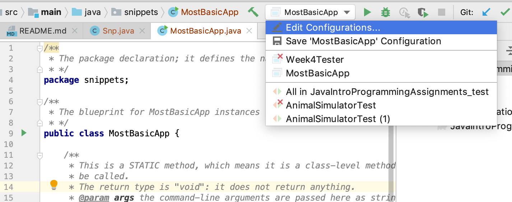
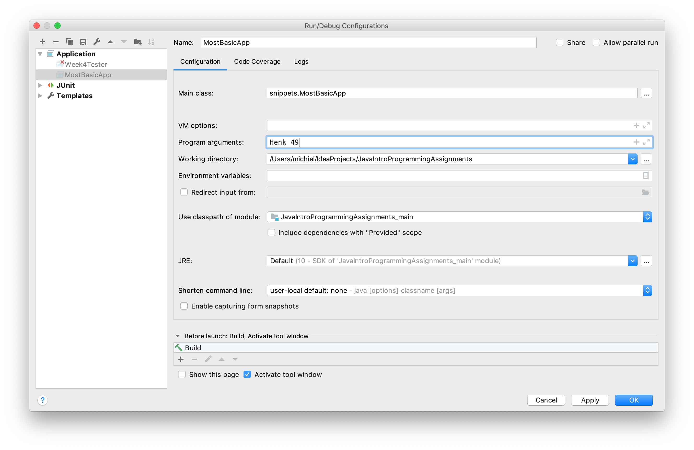

# Basic program structure and flow

Basic program structure and some flow control. 
Advanced flow control (switch etc) will be described later.

## Basic program structure

As stated before, a Java program must have a `main()` method as starting point. 
This `main()` method needs to reside in a class, because _all_ Java code needs to live inside a class.

```java
/**
 * The package declaration; it defines the namespace of this class
 * */
package snippets;

public class MostBasicApp {
    /**
     * This is a STATIC method, which means it is a class-level method and needs no object/instance to
     * be called.
     * The return type is "void": it does not return anything.
     * @param args the command-line arguments are passed here as string array
     */
    public static void main(String[] args) {
        System.out.println("Basic App has started");
        System.out.println("...and ended");
    }
}
```

This is a very uninteresting app of course, since it doesn't do anything. Let's extend it with a bit 
of functionality. We'll pass the program 2 arguments: one for age and one for user name. If no 
arguments are provided, we'll print some usage information.

To pass command-line arguments within IntelliJ, you need to create or edit a **_run configuration_**.
If you have run the main before (by clicking on the green triangle), you 
click on the toolbar run configurations box and select "Edit configurations"- see screenshot.



The only thing yu need to do now is enter two "Program arguments". Here, I filled out "Henk" and "49", with a space between them.



An array (which is kind of a list) of String elements called `args` will be passed to `main()` as `String[] args`. This array will hold the command line arguments when next running the program, as demonstrated below.

```java
public static void main(String[] args) {
    for (String arg : args) {
        System.out.println("arg = " + arg);
    }
}
```

This will output 

<pre class="console_out">
arg = Henk
arg = 49
</pre>

Here you hae seen the first program flow construct in action: the **_foreach loop_**. It is equivalent to for-loops in any programming language: it iterates a collection of some sort. Here the collection is an array. Note it does not have a counter; there is a different variant of the for loop for that.

Let's introduce one other flow construct: **_decisions with if/else_**.

Suppose you want to give your user some uplifting message, depending on their age. First the age argument needs to be converted from String to int:

```java
/**
  * Use indexing to access array elements
  */
String name = args[0];
/**
  * Parse String into int
  */
int age = Integer.parseInt(args[1]);
System.out.println("Hi " + name + ", your age is " + age);
```

Next, the choice of message needs to be made.

```java
if(age < 18) {
    System.out.println("ahh the energy of youth");
} else if (age < 50) {
    System.out.println("nice to meet somebody in the prime of their life!");
} else {
    System.out.println("hey, don't worry - every day brings you closer to retirement");
}
```

The classic elements of the if/else decision block.

Finally, let's bring a dedicated object into play: the message maker. The class looks like this:

```java
package snippets;

public class MessageMaker {
    private final String name;
    private final int age;

    /**
     * Constructor makes it mandatory to instantiate with name and age arguments.
     * @param name
     * @param age
     */
    public MessageMaker(String name, int age) {
        this.name = name;
        this.age = age;
    }

    public void printMessage() {
        System.out.println("Hi " + name + ", your age is " + age);

        if(age < 18) {
            System.out.println("ahh the energy of youth");
        } else if (age < 50) {
            System.out.println("nice to meet somebody in the prime of their life!");
        } else {
            System.out.println("hey, don't worry - every day brings you closer to retirement");
        }
    }
}
```

And this is how you instantiate and use an object of such a class.


```java
public class MostBasicApp {
    public static void main(String[] args) {
        String name = args[0];
        int age = Integer.parseInt(args[1]);

        /*A first object is instantiated and a method is called on it.*/
        MessageMaker messageMaker = new MessageMaker(name, age);
        messageMaker.printMessage();
    }
}
```

So, here we have a two-class application. Both source files are in the same package (namespace). The first is the so-called "main class" which is the entry point of the application: `MostBasicApp` in source file `MostBasicApp.java`. The main method receives the command-line arguments and parses one of them into an integer. Next, it instantiates a `MessageMaker` object and calls its `printMessage()` method.

## Summary

You have seen the basic structure of a Java program. It needs at least one source file with one class. There needs to be a `main()` method of this signature to be executable as program:

```java
public static void main(String[] args) {
  //startup code
}
```

Two flow control structures were shown: the for-each loop and if/else decisions:

```java
//foreach
for(item : collection) {}
//if/else
if(conditionIsTrue) {}
else if(alternativeConditionIsTrue){}
else {/*default logic*/}
```


That's it. Next up: Data Types.
