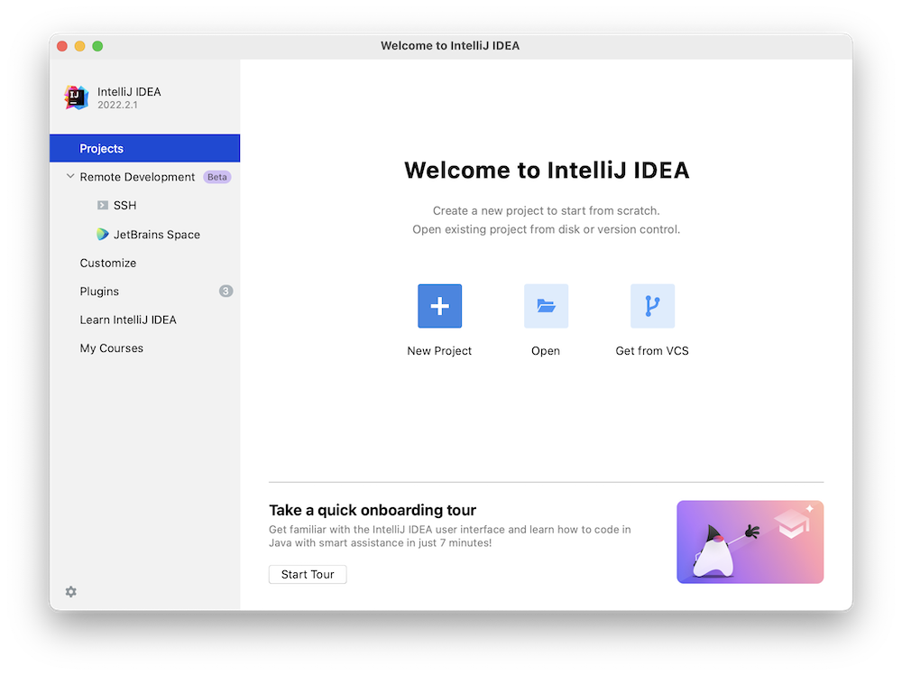
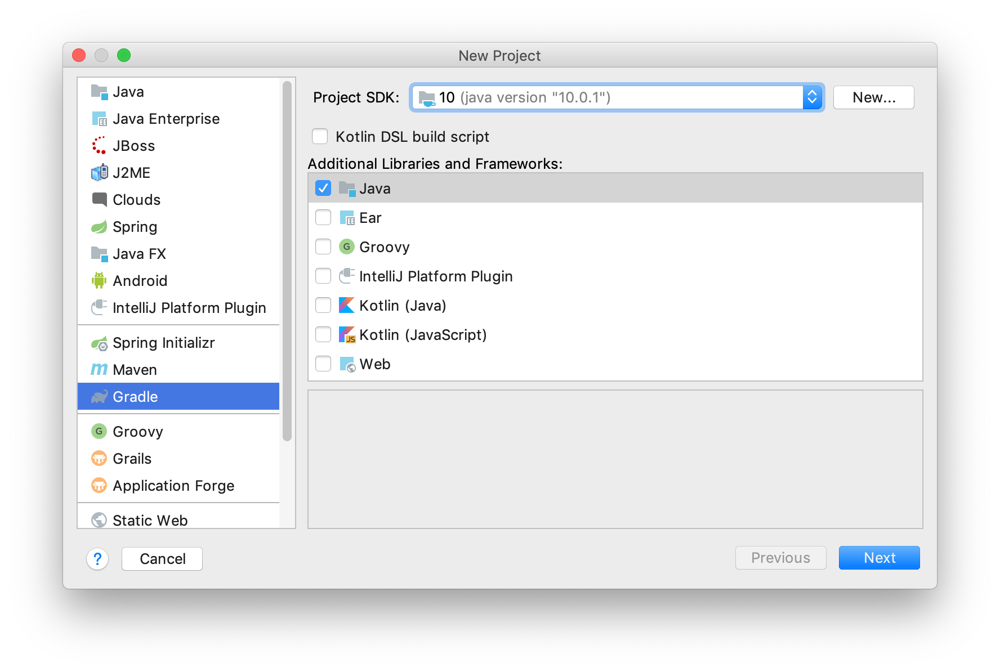
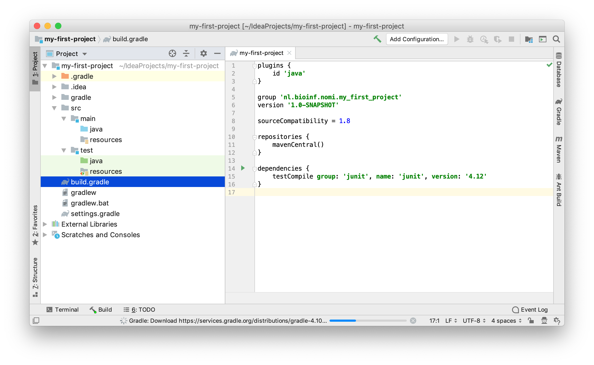
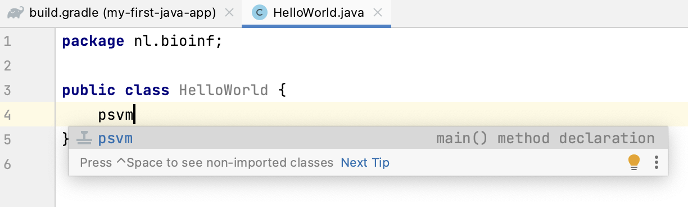
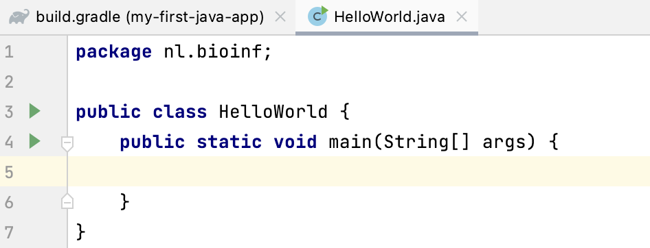
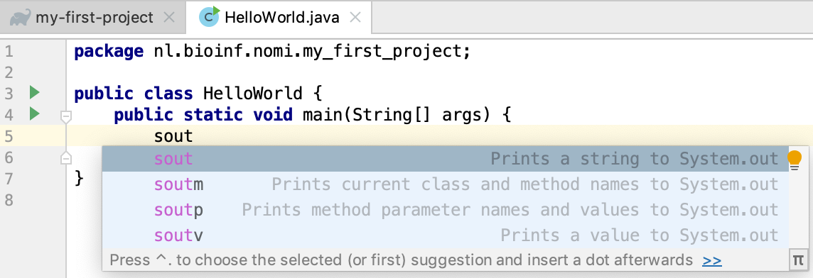
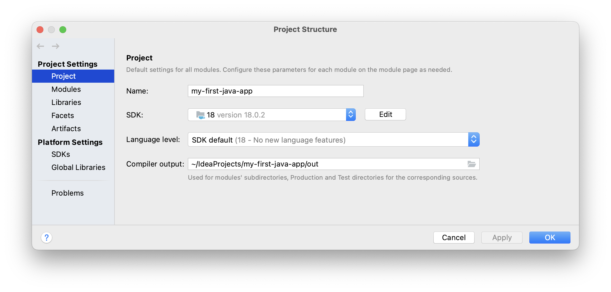
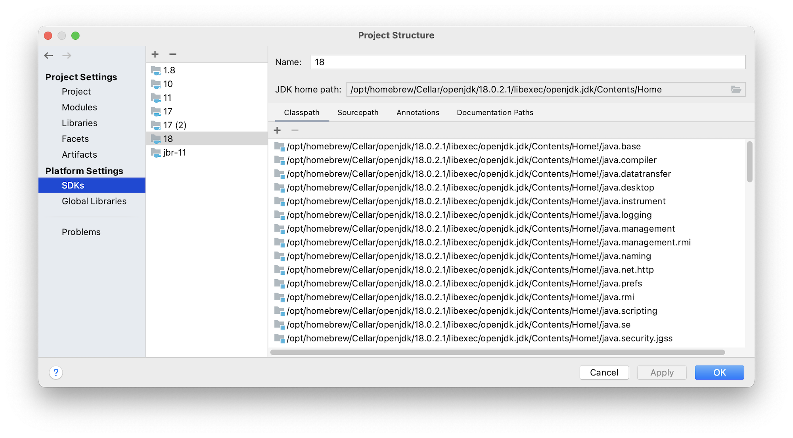

# A first IntelliJ project

This course uses the IntelliJ Idea Integrated Development Environment (IDE) to develop Java programs. 
In this chapter a walk-through is presented on how to use IntelliJ Idea to create Java applications.
It is assumed you have a Java Development Kit (JDK) installed on your machine.

## Dependency management

As you probably already know by now, code you write is always
dependent on other code. This can be code native to the platform (such as the `integer` "class" in R, or the `str` class in Python) but it can also be code that is not distributed with the standard platform (such as `ggplot2` in R, or `numpy` in Python).  

These "non-core" dependencies need to be managed. Many tools exist for dependency management; in Python this can be `pip` or `conda` and in R you use `install.packages()`. For Java there are also several approaches for dependency management. In this course we'll use **_Gradle_** ([website](https://gradle.org/)). It does much more than dependency management but for now this is the only relevant aspect.

## A first project
Let's dive in and see the different players in a Java coding project work together.

Start IntelliJ and select "`New Project`" from the start screen (or New &rarr; Project from the File menu). 



In the New Project wizard, enter a name (e.g. "my-first-java-app") select Java for "Language" and Gradle for "Build system". Choose a JDK (a Java Development Kit) that is installed (the number indicates which Java version you are going to use - this example shows Java 18). Leave Gradle DSL on Groovy (the scripting language used to configure your project).
Expand "Advanced Settings" section which is hidden by default and give your project a **_GroupId_** which is your webdomain reversed. Leave the **_ArtifactId_** the same as your project name.  

The group ID should be a unique identifier; in Java this is usually the web domain of you or your employer, reversed and with a project name appended. It is a way to guarantee a unique _name space_. Note the underscores; in Java you specify package names with underscores and lowercase letters. The artifact ID is the name of your project, also in lowercase but usually with hyphens between words.



Click "Create". You may get a warning like this 


```{image} figures/IntelliJ_create_Gradle_project_2.png
:alt: Unsupported Project SDK Warning
:width: 400px
:align: center
```

But don't worry we can fix that if it causes problems. Click Yes.  

A brand new Gradle-managed Java project will be created with a layout as shown below.



Several folders and files have been created. The `src` folder is where the magic is going to happen of course: that's where your Java code is going to live. The other folders (`./.gradle`, `./gradle`, `./.idea`) and files (`build.gradle`, `settings.gradle`, `gradlew`, `gradlew.bat`) are for project management and deployment (`./build` - which is not present yet).

At the root of the project there is a file called `build.gradle`. It contains the configuration of your project. It will probable already be opened. One dependency has been added: JUnit 5, which is a [unit testing framework](https://en.wikipedia.org/wiki/Unit_testing). 

Here is mine. Your versions may differ of course.

```groovy
//I am using Gradle to manage a Java project
plugins {
    id 'java'
}

//The group ID
group 'nl.bioinf'
//my version
version '1.0-SNAPSHOT'

//This is where dependencies should be found
repositories {
    mavenCentral()
}

//the actual dependencies of my project, besides the Java SDK:
// only the JUnit 5 test framework in this course
dependencies {
    testImplementation 'org.junit.jupiter:junit-jupiter-api:5.8.1'
    testRuntimeOnly 'org.junit.jupiter:junit-jupiter-engine:5.8.1'
}

//this says: use Gradle for test management, not IntelliJ
test {
    useJUnitPlatform()
}
```

As you can see this is programming code (Groovy) that configures a programming project (Java).

Whenever you make changes to `build.gradle` you should refresh your project via the small pop-up that appears in the top right corner of your editor pane, or via the Gradle Tool Window tab on the right (Re-import All Gradle Projects).


Finally, let's create some Java code. Right-click on the `src/main/java` folder in the Project panel (left side) and select "New" &rarr; "Package" and give it the same name as your group ID (it is also in `build.gradle`).

```{image} figures/new_package.png
:alt: New package
:width: 400px
:align: center
```

Press "enter". Next, select the package `nl.bioinf` which appeared in the left project panel, right-click it and select "New" -> "Java Class". Name it `HelloWorld` (do not give any file extension!).

```{image} figures/new_java_class_1.png
:alt: New Java class
:width: 400px
:align: center
```

Press "enter" again.  

The class file will open in an editor. Within the class, put the caret below the line `public class HelloWorld`. Next, type "psvm" and press tab.



The shortcut `psvm` can be used to create an entry point for your app, a function with the signature `public static void main(String[] args){}`.



A brand new `main()` method is created using this _keyboard shortcut_. Here is another extremely useful shortcut, assuming the caret is within `main()`. Type "sout" followed by the tab. 



The statement `System.out.println();` appears. Within this print call, type "Hello, World". Your class should look like this, except that your package will be named differently:

```java
package nl.bioinf;

public class HelloWorld {
    public static void main(String[] args) {
        System.out.println("Hello, World");
    }
}
```

Click the green triangle within the editor border and select "run 'HelloWorld.main()' Note there is also a shortcut for running `main()`: `^ + shift + R`.

```{image} figures/run_main.png
:alt: Run the app
:width: 600px
:align: center
```

In the console output on the lower pane, you will see this output, including the "Hello, World" message:

<pre class="console_out">
12:01:50: Executing ':HelloWorld.main()'...

> Task :compileJava
> Task :processResources NO-SOURCE
> Task :classes

> Task :HelloWorld.main()
Hello, World

BUILD SUCCESSFUL in 114ms
2 actionable tasks: 2 executed
12:01:50: Execution finished ':HelloWorld.main()'.
</pre>

The "Tasks" are gradle stuff. It says, amongst others, that the source is compiled (Java is a compiled language!) and main() is run. You may notice that a new folder has appeared at the root of your project: `build`. Have a look at what's inside.

If you get any errors, you need to make sure your specified Java version in build.gradle corresponds to the one configured for your project in IntelliJ (sometimes they get mixed up). Go to File &rarr; Project Structure and check under `Project Settings/Project` and `Platform Settings/SDKs`. The project SDK should have a version at least as high as the language level specified (in this case, Java 18):





## Distribute an executable

The final step is getting the app to your users. In Java you use a `jar` (Java ARchive) for that.

Gradle can do the whole build-to-executable process. You first need to specify where your "main class" is located: the class which contains the `main()` method that you want to use as "entry point" of your application.

Since we use Gradle for the build process, the place to do this is the `build.gradle` file; open it again and add this section at the bottom:

```groovy
jar {
    manifest {
        attributes(
                'Main-Class': 'nl.bioinf.HelloWorld'
        )
    }
}
```

The `Main-Class` line specifies for the JVM -when your application is going to be executed- to go look in class `HelloWorld` for a `main()` method to run when the application starts up. You can in fact have many `main()` methods in your application, but only one can serve as entry point in an executable. This way you can make different executables with a single code base by simply specifying different entry points!  


Refresh your project as before. 
Next, Go to the right Gradle Tool Window on the right (make it visible if required: View &rarr; Tool Windows &rarr; Gradle) and expand the panel. 

Select Tasks &rarr; build &rarr; double click "jar". Your jar will be build under `build/libs`; go there with a terminal application (IntelliJ also has one) and type `java -jar my-first-java-app-1.0-SNAPSHOT.jar`. 

You should see as output 

```bash
~$ cd /Users/michielnoback/IdeaProjects/my-first-java-app/build/libs 
~$ ls -la
total 8
-rw-r--r--  1 michielnoback  staff   944B Apr 12 12:09 my-first-java-app-1.0-SNAPSHOT.jar
~$ java -jar my-first-java-app-1.0-SNAPSHOT.jar 
Hello, World

```

## Wrap-up

That's it. This is how you create, run and build a Gradle-managed Java project.

These are the keyboard shortcuts you should remember:

- **`psvm`** - create main()
- **`sout`** - create print statement
- **`^ + shift + R`** - run main()

Next up: some basic about-Java stuff to get a feel for the language.

