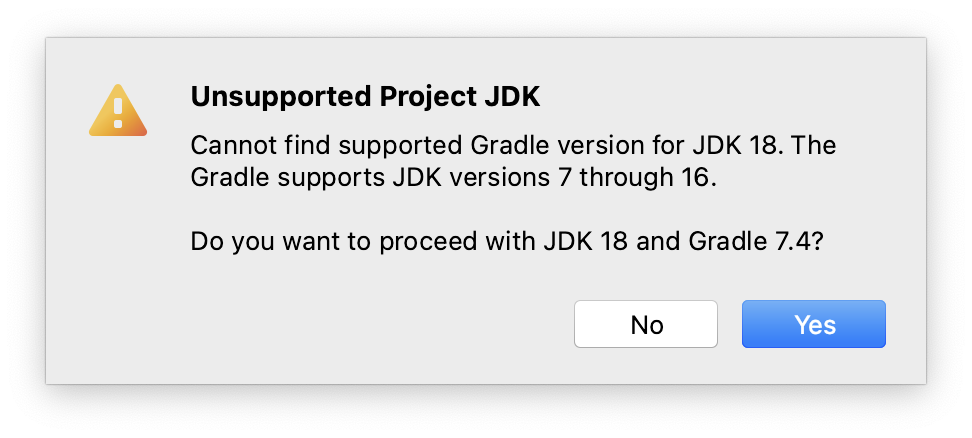

# A first IntelliJ project

This course uses the IntelliJ Idea Integrated Development Environment (IDE) to 
develop Java programs. This chapter deals with using IntelliJ Idea to create 
Java applications.

## Dependency management
As you probably already know by now, code you write is always
dependent on other code. This can be code native to the platform (such as the 
`integer` "class" in R, or the `str` class in Python) but it can also be code 
that is not distributed with the standard platform (such as `ggplot2` in R, or `numpy` in Python).
These "non-core" dependencies need to be managed. Many tools exist for dependency management; in Python this can be `pip` or `conda`, in R you use `install.packages()` and in Java there are also several technologies for this. In this course we'll use **_Gradle_**. It does much more than dependency management but for 
 now this is the only relevant aspect.

Let's dive in and see the different players in a Java coding project work together.

## A first project
Start IntelliJ and select "`+ Create New Project`" from the start screen (or New &rarr; Project from the File menu). 


In the New Project wizard, select Gradle on the left menu and then a project SDK (Standard Development Kit) - this example 
shows Java 10. Only check Java in the Additional Libraries section.


Click "Next". In the next window, give your project a Name and Location. Expand the Artifact Coordinates section which is hidden by default and give your project a **_GroupId_**, an **_ArtifactId_** and a **_Version_**. 



The group ID should be a unique identifier; in Java this is usually the web domain of you or your employer, reversed and with a project name appended. It is a way to guarantee a unique _name space_. Note the underscores; in Java you specify package names with underscores and lowercase letters. The artifact ID is the name of your project, also in lowercase but usually with hyphens between words. Give it version 0.0.1.

Click "Finish". A brand new Gradle-managed Java project will be created with a layout as shown below.


Several folders and files have been created. The `src` folder is where the magic is going to happen of course: that's where your code is going to live. The other folders are for project management (`./.gradle`, `./gradle`, `./.idea`) and deployment (`./build` which is not present yet).

At the root of the project there is a file called `build.gradle`. It contains the configuration of your project. One dependency has been added: JUnit 4, which is a [unit testing framework](https://en.wikipedia.org/wiki/Unit_testing). Since JUnit 4 is an older version, we'll immediately change this into JUnit 5. You should modify the `build.gradle` file so it looks exactly like this (except for the `group` declaration):

```javascript
//I am using Gradle to manage a Java project
plugins {
    id 'java'
}

//The group ID
group 'nl.bioinf.nomi.my_first_project'
//my version
version '0.0.1'
//working with Java 11 as target
sourceCompatibility = JavaVersion.VERSION_11

//This is where dependencies should be found
repositories {
    mavenCentral()
}

//the actual dependencies of my project, besides the Java SDK:
// only the JUnit 5 test framework in this course
dependencies {
    testImplementation("org.junit.jupiter:junit-jupiter-api:5.6.2")
    testRuntimeOnly("org.junit.jupiter:junit-jupiter-engine:5.6.2")
}

//this says: use Gradle for test management, not IntelliJ
test {
    useJUnitPlatform()
}
```

As you can see this is programming code (Groovy) that configures a programming project (Java).

Whenever you make changes to `build.gradle` you should refresh your project via the small pop-up that appears in the editor pane, or via the Gradle Tool Window on the right (Re-import All Gradle Projects).


Finally, let's create some Java code. Right-click on the `src/main/java` folder in the Project panel (left side) and select "New" &rarr; "Package" and give it the same name as your group ID (it is also in `build.gradle`).


Select the new `package`, right-click it and select "New" -> "Java Class". Name it `HelloWorld` (do not give any file extension!).


Click "OK".


The class file will open in an editor. Within the class, put the caret below the line `public class HelloWorld`. Next, type "psvm" and press tab.


A brand new `main()` method is created using this _keyboard shortcut_. Here is another extremely useful shortcut, assuming the caret is within `main()`. Type "sout" followed by the tab. 


The statement `System.out.println();` appears. Within this print call, type "Hello, World". Your class should look like this, except that your package will be named differently:

```java
package nl.bioinf.nomi.my_first_project;

public class HelloWorld {
    public static void main(String[] args) {
        System.out.println("Hello, World");
    }
}
```

Click the green triangle within the editor border and select "run 'HelloWorld.main()' Note there is also a shortcut for running `main()`: `^ + shift + R`.


In the console output on the lower pane, you will see this output, including the "Hello, World" message:

<pre class="console_out">
20:38:51: Executing task 'HelloWorld.main()'...

> Task :compileJava
> Task :processResources NO-SOURCE
> Task :classes

> Task :HelloWorld.main()
Hello, World

BUILD SUCCESSFUL in 0s
2 actionable tasks: 2 executed
20:38:52: Task execution finished 'HelloWorld.main()'.
</pre>

The "Tasks" are gradle stuff. It says, amongst others, that the source is compiled (Java is a compiled language!) and main() is run. You may notice that a new folder has appeared at the root of your project: `build`. Have a look at what's inside.

If you get any errors (e.g. `Error: LinkageError occurred while loading main class nl.bioinf.nomi.my_first_project.HelloWorld`), you need to make sure your specified Java version in build.gradle corresponds to the one configured for your project in IntelliJ (sometimes they get mixed up). Go to File &rarr; Project Structure and check under `Project Settings/Project` and `Platform Settings/SDKs`. The project SDK should have a version at least as high as the language level specified in build.gradle (in this case, Java 11):


## Distribute an executable

The final step is getting the app to your users. In Java you use a `jar` (Java ARchive) for that.

Gradle can do the whole build-to-executable process. You first need to specify where your "main class" is located: the class which contains the `main()` method that you want to use as "entry point" of your application.

Since we use Gradle for the build process, the place to do this is the `build.gradle` file; open it again and add this section at the bottom:

```groovy
jar {
    manifest {
        attributes(
                'Main-Class': 'nl.bioinf.nomi.my_first_project.HelloWorld'
        )
    }
}
```
The `Main-Class` line specifies for the JVM -when your application  is going to be executed- to go look in class `HelloWorld` for a `main()` method to run when the application starts up. You can in fact have many `main()` methods in your application, but only one can serve as entry point in an executable. (Yes, you can make different executables with a single code base by simply specifying different entry points!)  

Refresh your project as before. 
Next, Go to the right Gradle Tool Window on the right (make it visible if required: View &rarr; Tool Windows &rarr; Gradle) and expand the panel. 

Select Tasks &rarr; build &rarr; double click "jar". Your jar will be build under `build/libs`; go there with a terminal application (IntelliJ also has one) and type `java -jar my-first-project-0.0.1.jar`. 

You should see as output 

```
~/IdeaProjects/my-first-project$ 
~/IdeaProjects/my-first-project$ cd build
~/IdeaProjects/my-first-project/build$ cd libs
~/IdeaProjects/my-first-project/build/libs$ java -jar my-first-project-0.0.1.jar 
Hello, World
```

## Wrap-up

That's it. This is how you create, run and build a Gradle-managed Java project.

These are the keyboard shortcuts you should remember:

- **`psvm`** - create main()
- **`sout`** - create print statement
- **`^ + shift + R`** - run main()

Next up: some basic about-Java stuff to get a feel for the language.

