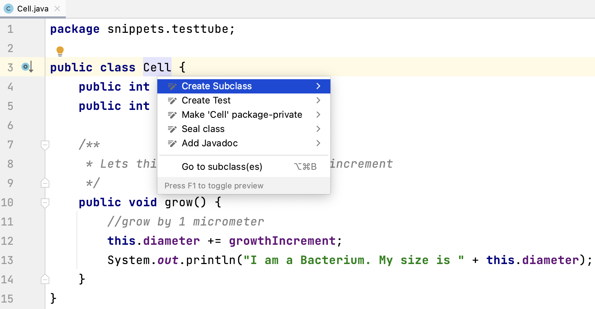

# Objects and classes

This chapter presents two independent reviews of what classes and objects are.
The first part, named "Ninjas", focuses on what an object is and does, and how it relates to a class.
The second part, "Cells", also discusses object relationships and testing.

## Ninjas

Suppose you are creating a game with ninjas, trolls and all other sorts of nasty creatures.
In an Object-Oriented Programming (OOP) environment such as Java you will start by defining the _entities_ that play a role in the app you are developing.

In this case, `Ninja` will be one of the entities, or ***Types*** populating the application.
Other types in this game may be `Troll`, `Game`, `Player`, `Weapon`, `ScoreBoard`, and so on.
Each of these Types will have ***properties*** and ***behavior***: things they *have* and things they *can do*.

A Type is represented by a blueprint, its ***class***.
In Java, a class resides in a single source file *with the same name as the class*.
This is unlike for instance Python in which there is no such enforced rule.
The class of a type specifies how it should be created and initialized when needed.  

:::{admonition} A class defines a type

A class is a blueprint; it represents a type. Types can have properties in the form of instance or class variables - variables attached to the scope of the class body (not in method scope). Types can also have behavior in the form of methods.

These properties and methods can have object-scope or class-scope. In the latter case the keyword `static` is used.
:::

Here is a simple class that is defined within source file `Ninja.java`.

```java
class Ninja {
    String name;
    
    void fight() {
        System.out.println(name + " is fighting. Hack hack swoosh.");
    }
}
```

And we can create an instance of the Ninja type like this:

```java
Ninja silentKiller = new Ninja();
```

Although the code is simple enough, a lot is going on here, some visible and some invisible.

1.  We defined a type (blueprint) using the keyword `class`, followed by the name of the type (`Ninja`).
2.  Class `Ninja` resides in file `Ninja.java`.
3.  Every `Ninja` that will ever be created will have a `name` property (also called instance variable) and `fight()` behavior. The `fight()` behavior will be "dependent" on its `name`.
4.  An instance of a class is created using the `new` keyword, followed by the class name with a pair of parentheses: `Ninja()`. The expression `Ninja()` is *calling the constructor*. This is a special kind of method. There is no constructor present here, but we get a default implementation for free from the compiler. It's the same with Python; you can give a class an `__init__()` method but if your don't the objects will still be constructed. The Java default constructor is
    `public Ninja() {}`
6.  Whenever an instance is created, its properties are initialized to their default values, unless specified otherwise. A `String` property will be `null`, and an `int` will be `0`. If you want properties to have other initial values you can specify that within the class:

```java
class Ninja {
    String name = "The Black One";
    
    void fight() {
        System.out.println(name + " is fighting. Hack hack swoosh.");
    }
}
```

:::{note}
Class names shuold be nouns starting with uppercase; variables should be nouns starting with lowercase. Method names should be verbs starting with lowercase. All Java names are in ***CamelCase***.
:::

In the Java core packages many types are predefined.
There are basic types, for instance `Integer` (representing whole numbers) and `String` (representing character data) but there are also more complex Types, such as `LocalDate`.
When programming you will create custom types all the time.  
A `Ninja` type for instance.

:::{note}
Unlike Python, Java also has non-object types.
These are the *primitive* types representing numbers and booleans (logical values).
They are easily recognized because there are only a few and their names start with lowercase: `int`, `double` etc.
They are discussed in detail in chapter {doc}`/02_syntax/data_types`
:::

Next, we'll have a another look at the `Ninja` type and create a slightly more realistic blueprint for it.  

In our game, Ninjas can do what you would expect of them: they have a name and an energy level (0 means they're dead, 100 is freshly spawned), they have a position in the game and they can move, and attack their opponents.

Given the above description, this is a second version of the Ninja class.

```java
package nl.bioinf.nomi.ninjas;

class Ninja {
    String name;
    int energyLevel = 100;
    double topCoordinate;
    double leftCoordinate;

    void move(double top, double left) {
        this.topCoordinate += top;
        this.leftCoordinate += left;
    }

    void attack(int power, GameCharacter opponent) {
        //energy is drawn from its own reserve for an attack
        this.energyLevel -= power;
        //but has double effect on its opponent
        opponent.drainEnergy(power * 2);
    }
}
```

I kept this class really minimal - no access modifiers (`public`, `private`, `static`, etc) that will distract from the key points being made here.

At the top of the file there is a ***package declaration***.
This defines the namespace this class lives in.
Since nobody in their right mind would use my web domain, I'm pretty sure the *fully qualified name* `nl.bioinf.nomi.ninjas.Ninja` will uniquely point to this class.  

:::{note}
Think about it: how many `User` classes will have been designed over the world, and how can you make distinction between those, especially when you use more than one in a single code base?  
This is the importance of the package declaration. More on this in chapter {doc}`/02_syntax/packages_imports`
:::

Next, there is the line `class Ninja {` which delimits the actual **class body**.
No code except for the package declaration and import statements can live outside the class body - it will not compile.

Below the class name declaration you find its instance variables.
You can see only one of the instance variables has an assigned value: `energyLevel`.
This means that every Ninja will have an energy level of 100 once it is constructed.
The other variables will get the default value of the type.
For object types this is `null`, for boolean it is `false` and for numeric types it is `0`.
So this:

```java
    String name;
    int energyLevel = 100;
    double topCoordinate;
    double leftCoordinate;
```

is exactly te same as this:

```java
    String name = null;
    int energyLevel = 100;
    double topCoordinate = 0;
    double leftCoordinate = 0;
```


:::{admonition} Default values
:class: warning

Default values of ***instance variables*** are

- **objects**: `null`
- **numbers**: `0` (zero)
- **booleans**: `false`

***Local variables have no default***; they must be explicitly initialized!
:::

Within the class body, no statements are allowed other than declaration and assignment of its instance variables.
All other statements should reside within methods.  

These are allowed: `double leftCoordinate;` and `int energyLevel = 100;`, but a `for`-loop is not.
For example, the following is illegal and will not compile (although the error message may be less than straightforward):

```java
class Ninja {
    String name;
    
    System.out.println("Roaming the Ninja class body");
    
    void fight() {
        System.out.println(name + " is fighting. Hack hack swoosh.");
    }
}
```

Finally, there are two methods defined: `move()` and `attack()`.  
Method `move()` is pretty straightforward.

```java
    void move(double top, double left) {
        this.topCoordinate += top;
        this.leftCoordinate += left;
    }
```

It changes the location of the Ninja object on which the method is called -the *current* object- by the given lateral and vertical offsets. Note the use of the `+=` operator. The statement `x += 2` is the same as `x = x + 2`.
The use of `this.` indicates we are accessing the current objects' instance variables and methods.
Use of `this.` is not required unless there is a naming conflict, but strongly encouraged.
The method does not return anything; this is declared by the `void` return statement.

:::{note}
The `this.` reference is used to access a variable or method on the _currently executing object_. It is similar to the Python `self.` reference. In Python the method would ook like this:
```python
    move(self, top, left) {
        self.topCoordinate += top;
        self.leftCoordinate += left;
    }
```
In Java you do not need to specify this self reference in every method though, you get it implicitly. 
:::


The next method, `attack()` is a little more complex.
Here it is again.

```java
void attack(int power, GameCharacter opponent) {
    this.energyLevel -= power;
    opponent.drainEnergy(power * 2);
}
```

It signature (`void attack(int power, GameCharacter opponent)`) says it should receive a `power` value for its attack as well as an instance of the `GameCharacter` class (below) which will be the subject of the attack. This method does not return anything either.  
Here is the `GameCharacter` class:

```java
package nl.bioinf.nomi.ninjas;

public class GameCharacter {
    public int energyLevel = 100;

    public void drainEnergy(int amount) {
        this.energyLevel -= amount;
    }
}
```

So, not only does `attack()` operate on its own instance variables, it also also ***calls*** a method on the object it is attacking: `opponent.drainEnergy(power * 2);`.


Here is some example code usages within a class called `Game`.  
The `main()` method is the _entry point_ of this application elsewhere.
This is the second place we see the `new` keyword.  
Whenever you see the `new` keyword, it means a new object is instantiated of the type specified after `new`.
So `new Ninja();` means a new Ninja instance (object) has been created, in which the instance variables have been created and given their specified values, or the default values discussed above.
See the section later in this chapter for more details on object construction.

```java
package nl.bioinf.nomi.ninjas;

public class Game {
    public static void main(String[] args) {
        //spawn (instantiate) a Ninja
        Ninja ninja = new Ninja();

        //change its name
        ninja.name = "Rogue Bastard";
        //print some values of the ninja
        System.out.println("Ninja name     = " + ninja.name);
        System.out.println("Ninja energy   = " + ninja.energyLevel);
        System.out.println("Ninja position = ["
                + ninja.topCoordinate
                + ":"
                + ninja.leftCoordinate
                + "]");

        //spawn an opponent
        GameCharacter opponent = new GameCharacter();
        opponent.name = "Delirious Troll";

        //change position twice
        ninja.move(2, 9);
        ninja.move(-6.4, 3.5);
        System.out.println("Ninja position  = ["
                + ninja.topCoordinate
                + ":"
                + ninja.leftCoordinate
                + "]");

        //attack opponent
        ninja.attack(5, opponent);

        //energy of both has changed
        System.out.println("Ninja energy    = " + ninja.energyLevel);
        System.out.println("Opponent name   = " + opponent.name);
        System.out.println("Opponent energy = " + opponent.energyLevel);
    }
}
```

The terminal output, when `main()` is run, will be:

<pre class="console_out">
Ninja name      = Rogue Bastard
Ninja energy    = 100
Ninja position  = [0.0:0.0]
Ninja position  = [-4.4:12.5]
Ninja energy    = 95
Opponent name   = Delirious Troll
Opponent energy = 90
</pre>

:::{warning}
Printing objects like above is very inefficient. You should implement (override) the `toString()` method. 
This is discussed in chapter {doc}`/03_apis/class_object_methods`
:::

This concludes a first acquaintance with classes and objects. We have used the core Java class `String`, and defined three of our own: `Ninja`, `GameCharacter` and `Game`.
Besides this, we have used the _primitive types_ `int` and `double`.

Next up: Cells and TestTubes in a second round of getting to know objects.
As extra layer, JUnit testing will be introduced as a more structured means of verifying and demonstrating use of your created code.

## Growing cells

This sections already peeks ahead to some more advanced topics, such as exceptions and flow control, to create a more realistic application. Don't worry if you don't get everything at once. They will be discussed in length later in the book. All code can be found in the `snippets` package of the JavaIntroProgrammingAssignments [repository](https://bitbucket.org/minoba/javaintroprogrammingassignments). 

Suppose you want to build a cell growth simulation application.
After careful analysis of the domain you decided that this involves three entities: A simulator that controls the simulation process, a test tube that will hold the cells that are growing, and the cells themselves.

The next step in the modeling process is to determine the ***relationships*** between the different entities.
In this case the relationships / interactions are as follows.
The simulator will receive configuration arguments (e.g. how many cells to grow) from the command-line, _start_ the simulation process and _instantiate a test tube_.
The test tube will be responsible for _instantiating the initial cell population_.
Finally, there will be cells _growing_ within the test tube.

Three separate source files are created (within a single package), each holding one class:

-   `CellGrowthSimulator.java`
-   `TestTube.java`
-   `Cell.java`

Each of these will be discussed in more detail.

### Cell.java

Let's start with the simplest one: Cell.
It has an instance variable `size` which has a default value of 5 when Cell objects are instantiated.
Every call of the `grow()` method makes it increase its size by one.

```java
package snippets.testtube;

class Cell {
    /**
     * Instance variable "size"; 5 micrometer is the default diameter when Cell objects are instantiated
     */
    int diameter = 5;
    /**
     * Lets this cell grow in a single 1-micrometer increment
     */
    void grow() {
        //grow by 1 micrometer
        this.diameter += 1;
        System.out.println("I am a Cell. My size is " + this.diameter);
    }
}
```

To test the logic and correctness of this class we will have to wait until other components are developed, such as TestTube and CellGrowthSimulator.
***Unless you use (J)Unit testing***.

#### JUnit testing

JUnit is a [unit testing](https://en.wikipedia.org/wiki/Unit_testing) framework for Java.
Its main purpose is to have a suite of test methods guaranteeing the correctness of your ***production code*** methods. Unit tests only test methods, not variables.
To create JUnit a test method, you need to have the JUnit libraries defined as dependencies on your ***class path***.
This piece should be in your `build.gradle` file:

```groovy
dependencies {
    testImplementation("org.junit.jupiter:junit-jupiter-api:5.6.2")
    testRuntimeOnly("org.junit.jupiter:junit-jupiter-engine:5.6.2")
}
```

See the post ["A first IntelliJ project"](intellij) for more details on dependency management.

Next, you need to create a test class.
In the editor, place the cursor on the class name (`Cell`) and press `alt+enter`.
Select "Create Test".



Select the method(s) you want to create test(s) for and press "OK".


```{image} figures/create_junit_test_class_2.png
:alt: Create JUnit class
:width: 600px
:align: center
```

The test class opens in the editor and looks something like this:

```java
package snippets.testtube;

import org.junit.jupiter.api.Test;
import static org.junit.jupiter.api.Assertions.*;

class CellTest {

    @Test
    void grow() {
    }
}
```

Let's put some testing code in it to see whether our program logic works as intended:

```java
    @Test
    void grow() {
        Cell cell = new Cell();
        //the initial diameter is supposed to be 5
        assertTrue(cell.diameter == 5);
        cell.grow();
        //the diameter should have increased by one
        assertTrue(cell.diameter == 6);
    }
```

The `assertTrue()` method call is key here. This and many related `assertXxxx()` methods are the core of the testing framework. Essentially, it comes down to specifying what you _expect_ the code to do. If that is not the case, the method will throw an error and your test fails.

When you click on the little green triangle in the editor margin, the test will be executed and you get output like this on the lower panel of IntelliJ (it opens automatically):


The green checks indicate the test ***assertions*** passed. You should really experiment with this a little bit: change the test (e.g. `assertTrue(cell.diameter == 7)`) or the production code, rerun the test and see what happens.

For now, knowing the Cell class is OK, let's proceed to class TestTube.

#### TestTube.java

TestTube is slightly more complex.
Note that much of the code is actually API documentation (called _Javadoc_) that describes in a formal way how a method should be used.

```java
    /**
     * Constructs with an initial cell count.
     * An exception is thrown when the initial cell count is below 1 or above 10e4.
     *
     * @param initialCellCount the initial cell count
     * @throws IllegalArgumentException ex
     */
```

Here is the complete class.

``` java
package snippets.testtube;

class TestTube {
    //an array of cells to be initialized later
    Cell[] cells;

    /**
     * Constructs a TestTube with an initial cell count.
     * An exception is thrown when the initial cell count is below 1 or above 10e4.
     *
     * @param initialCellCount the initial cell count
     * @throws IllegalArgumentException ex
     */
    TestTube(int initialCellCount) {
        if (initialCellCount == 0 || initialCellCount > 10e4) {
            throw new IllegalArgumentException("initial cell count should be above 1 and below 10e4: " + initialCellCount);
        }
        //initialize the array with new Cells
        cells = new Cell[initialCellCount];
        for (int i = 0; i < initialCellCount; i++) {
            cells[i] = new Cell();
        }
    }

    /**
     * Grows all the cells withing this testtube in a single iteration.
     */
    void growCells() {
        for (Cell cell : cells) {
            cell.grow();
        }
    }
}
```

Class `TestTube` defines a ***constructor***, `TestTube(int initialCellCount) {...}`, that makes it mandatory to provide an initial number of cells.
It will throw an error -specifically an `IllegalArgumentException`- when a wrong value is passed for the `initialCellCount` parameter.
You again see the use of the keyword `new` to instantiate Cell objects.

There are two for-loops present in this class representing the two ways to perform iteration in Java. Here is the first, with a counter:

``` java
for (int i = 0; i < initialCellCount; i++) {
    cells[i] = new Cell();
}
```

It has three elements between the parentheses:

    for (<LOOP INITIALIZATION>; <EXIT CONDITION>; <ITERATION INCREMENT>)

The for-loop itself will be dealt with in the post ["Flow control structures"](/02_syntax/flow_control).

The other for-loop does not use a counter - it simply iterates a collection:

```java
    void growCells() {
        for (Cell cell : cells) {
            cell.grow();
        }
    }
```

Here are two JUnit test to verify the construction of the TestTube:

```java
class TestTubeTest {
    @Test
    void growCells() {
        TestTube testTube = new TestTube(10);
        assertTrue(testTube.cells.length == 10);
    }
    
    @Test
    void growCells_withZeroInput() {
        assertThrows(IllegalArgumentException.class, () -> new TestTube(0));
    }    
}
```

The first verifies that the array of cells has the size that was specified in the constructor and the second verifies that an exception is actually thrown when a zero size is passed.

#### CellGrowthSimulator.java

The last class of the system is `CellGrowthSimulator`.
Here is a first version:

``` java
package snippets.testtube;
/**
 * "Controller" class
 */
class CellGrowthSimulator {
    /**
     * @param args command-line args should be length one, 
     * containing an initial cell number.
     */
    static void main(String[] args) {
        if (args.length != 1) {
            System.err.println("You must provide an initial cell count. Aborting.");
        }
        //args[] is a String array, so the item at index [0] 
        //should be converted into and `int` first.
        int initialCellNumber = Integer.parseInt(args[0]);
        startSimulation(initialCellNumber);
    }

    static void startSimulation(int initialCellNumber) {
        TestTube testTube = new TestTube(initialCellNumber);
        //do one iteration of growing
        testTube.growCells();
    }
}
```

The `String[] args` argument to `main()` is the argument array passed from the terminal when you start the application.

(Be aware that this type of use of command-line arguments is discouraged; you should implement and support a standards-adhering command-line syntax, e.g. `java -jar GrowthSimulator --initial_count 5`).

The final model now has this chain of relationships:

***CellGrowthSimulator HAS-A TestTube and TestTube HAS one or more Cells***.

## Object construction 

You have seen the `new` keyword used several times now.
But what does happen, exactly, when you type

``` java
Cell cell = new Cell();
```

The `new` keyword combined with the class name followed by parentheses calls the *constructor* method of that class.
The constructor instantiates an instance of the class and returns the reference to the object.
The parentheses `()` enclose the argument list for the constructor method, which is empty in this case.
In class `TestTube` we *did* see a constructor argument however - one specifying the number of cells to grow.

The three steps of object construction are ***declaration***, ***creation*** and ***assignment***:

1.  The code `Cell cell` ***declares*** a variable of type Cell.
2.  The code `new Cell()` ***instantiates*** an object of type Cell, stores this in memory and returns a reference to this stored object.
3.  The equals sign `=` ***assigns*** (couples) the returned reference to the declared variable.

So...where is this constructor method in class Cell and what does it do?
If you look at the class you don't see a constructor, as we have seen in class `TestTube`.
It is created by the Java compiler if you don't specify it yourself.
The compiler-processed code will have something like this inserted:

``` java
public Cell() {}
```

More on constructors in later chapters.

## Inheritance 

Inheritance is one of the key features of object-oriented programming.

This is a very powerful mechanism to introduce new or adjusted behavior in a software system because subclasses inherit all properties and methods of their superclass.
For example, the `CancerCell` class below `extends Cell` and thus declares itself to be a ***subclass*** of `Cell`.
It not only extends itself with new functionality (`move()`), but also modifies the behavior of the `grow()` method by changing the `growthIncrement` property of its *supertype part*.

``` java
//Cell.java
class Cell {
    int diameter = 5;
    int growthIncrement = 1;

    /**
     * Lets this cell grow in a single increment
     */
    void grow() {
        //grow by 1 micrometer
        this.diameter += growthIncrement;
        System.out.println("I am a Cell. My size is " + this.diameter);
    }
}
```

``` java
//CancerCell.java
public class CancerCell extends Cell {
    CancerCell() {
        growthIncrement = 3;
    }

    void move() {
        System.out.println("Moving through the body");
    }
}
```

``` java
//usage within GrowthSimulator
Cell cell = new Cell();
cell.grow();
cell.grow();
System.out.println("..........");
CancerCell cCell = new CancerCell();
cCell.grow();
cCell.grow();
cCell.move();
```

output:

```html
<pre class="console_out">
I am a Cell. My size is 6
I am a Cell. My size is 7
..........
I am a Cell. My size is 8
I am a Cell. My size is 11
Moving through the body
</pre>
```
This is of course not the only place where we'll see inheritance discussed.
