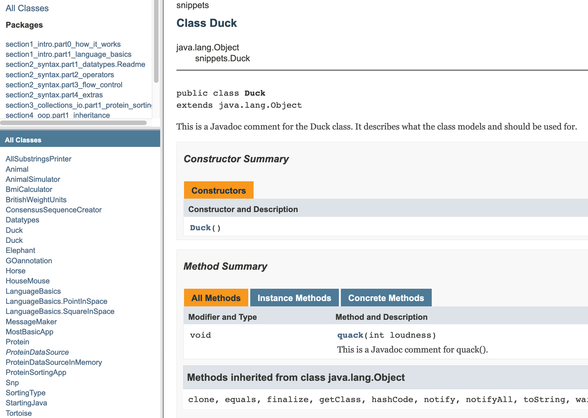

# Naming and commenting stuff

Anyone who knows me (as a teacher) knows that (a) I really like Java and (b) I really really hate it when stuff gets named in the wrong way.

## Naming

Experienced programmers can read code as if it is a nice book. When doing this, we rely on 
some conventions, just like in real language. For instance, in regular human text, names start with a 
capital, and sentences have a certain grammatical structure that makes it possible to read quickly without too much confusion. Whenever texts do not adhere to these rules or conventions, reading becomes very difficult.  
Programming languages are no different, and naming and layout-conventions help human readers to makes sense of it really quickly. 

Java has a concise set of naming rules that you should adopt from your first endeavors. Here are the most important ones.

For all names -classes, methods, variables- the single most important rule is that they should **_describe what they model in a precise and concise way_**.  For instance, a valid counter for te number of logins in a system could be `c`, `count`, `counter` or `loginCounter`, but only the last is really informative to anyone reading te code.  

The second general rule is that Java identifiers are always in **_CamelCase_**, with the exception of certain types of constants. Also, never start names with a number and do not use special characters! These are illegal and will not compile: `1forTheMoney`, `k#ller`.

### Classes

Class names should be a noun, in camel case, with the first letter capitalized. Here are a few good and bad examples for names of a class reading GFF data from a file:

```java
class Read {} //bad - no noun and vague
class Reader {} //bad, vague
class DataReader {} //bad, still vague
class dataReader {} // bad - starts with lowercase
class Data_Reader {} // bad - underscore is not camelcase
class GffRead {} //bad, not a noun
class GffReader {} //good: a noun and specific
```

### Methods

Method names should be a verb, in camel case. Here some examples for a method name calculating the Euclidean distance between two Point objects:

```java
double d(Point otherPoint) {} //bad - no verb and vague
double distance(Point otherPoint) {} // bad - no verb and still slightly vague
double euclidean_distance(Point otherPoint) {} //bad, no camel case
double EuclideanDistance(Point otherPoint) {} // bad - starts with uppercase character
double euclideanDistance(Point otherPoint) {} // almost good, but no noun
double getEuclideanDistance(Point otherPoint) {} //finally OK
```

### Variables

Variable names should be nouns as well, but starting in lowercase:

```java
double r; //plain bad
double ratio; //bad - what ratio?
double Ratio; //bad - starts with uppercase
double screen_ratio; //bad - underscore
double screenAspectRatio; //good: noun and descriptive
```

## Commenting

There are three ways for commenting:  

- Javadoc style: `/**\<LINE(S)\>*/` these are the most important because they end up in your documentation!
- multiline comment `/*\<LINE(S)\>*/`
- single line comment `//\<SINGLE LINE\>`

Here are some examples:


```java
/**
 * This is a Javadoc comment for the class: it describes what the class models and should be used for.
 * Also, version and author information can be put here.
 * @author Michiel
 * @version 0.1
 * */
public class Duck {
    /**
     * This is a Javadoc comment for a method.
     * It should include tags for method arguments, exceptions and return types.
     * @param loudness
     */
    public void quack(int loudness) {
        //single-line logic comment
        System.out.println("Quacking at level " + loudness);
        /*I can write a multiline block of
        * comment like this*/
    }
}
```

Here is a screenshot of part of the the corresponding Javadoc html:



I strongly encourage you to try this out for yourself: create a class, put some javadoc 
comments in it and run "Tasks -> documentation -> javadoc" from the Gradle tool window.
The javadoc folder will be located in the `build/docs/` folder.
The javadoc tool will issue warnings but proceed for some inconsistencies, but errors and abort for others. The warnings and errors are pretty clear, fortunately.


## Demo case: the power of naming

As a lecturer I am often confronted with code that does the job it was written 
and intended for, but still makes me want crawl in a corner and weep. 
This often has to do with either one of these two aspects:

- **Coding style**  
- **Naming**

The first, coding style, has to do with how you organize/layout your 
code, preferably in accordance with the conventions of your programming 
language. The second aspect is how you name your variables, methods, 
classes and packages (and projects). These two actually overlap to 
quite some extend, since coding style also has some things to say 
about naming. 

Let’s have a look at some sample code that could have come straight 
from my classroom:  

```java
package my_tool;
public class main {
    public static void main(final String[] a) {
        int Arg = Integer.parseInt(a[1]);
        double opt=Double.parseDouble(a[2]);
    parse p = new parse_impl();
    Data d= p.reading(args[0]);
    Calculate c = new Calculate();
    c.Making(d,Arg, opt);
  }
}
```

Take a minute and figure out what this code might do (I assure you it 
compiles and executes correctly).

Take another minute to figure out how many things are wrong with this 
code. Hint: It is a **_lot_**.

This code is almost as cryptic as those nice little 
minified Javascript libraries. You know, when you refactor code to 
have no comments, no whitespace except where absolutely 
necessary, and have variables of 1 or 2 characters long. Below is 
the same Java code minified:  

```java
package my_tool;public final class M{public static void m(final String[]a)
{int r=Integer.parseInt(a[1]);double o=Double.parseDouble(a[2];P p=new pi();D
d=p.r(args[0]);C c=new C();c.m(d,r,o);}}
```

Although this is really unintelligible, the first code fragment does not do a much better job at informing you. And that is exactly what good naming practice brings you: information. It informs you about

1. What the classes are about (what they model)  
2. What contract interfaces define  
3. What the methods will likely be doing, and what the role of their arguments will have  
4. What the purpose is of variables  
5. What kind of entities everything refers to (classes, methods, variables)  

Whenever you write code that should have meaning to others, or to yourself a 
few months from now, use the above list as a mental review on your code.

So, what actually is wrong with the first code snippet? The coding style 
violations are a pain to my eyes, so let’s get these out of the way 
first. Classes should start with an uppercase letter, be in camel case 
and be nouns, while methods should start with a lowercase letter, be 
verbs and also be in camel case. When you are into a programming language 
as much as I am into Java, you get really, really **REALLY** confused 
whenever a class name starts with a lowercase letter! I’ll clean that 
up a little bit (and insert some much needed whitespace as well):  

```java
package my_tool;
public final class Main {
    public static void main(final String[] args) {
        int arg = Integer.parseInt(args[1]);
        double opt = Double.parseDouble(args[2]);
        Parser p = new ParserImpl();
        Data d = p.read(args[0]);
        Calculator c = new Calculator();
        c.make(d, arg, opt);
    }
}
```

None of the names give any clue about what the entities they refer 
to might be doing, except on the most generic level. Yes, “arg” is an 
argument and yes, `ParseImpl` is an implementation of the interface 
`Parser`, but this tool may equally likely deal with interstellar dust 
readings as with intracranial ultrasound measurements. Especially with the 
style abuse and the absence of comments, there is no way you can tell. 
So let’s continue with making this code a bit more revealing of its purpose.

```java
package nl.michielnoback.sequence_analysis;
public final class ConservationAnalyserApp {
    public static void main(final String[] args) {
        int maximumIntraGroupDistance = Integer.parseInt(args[1]);
        double sequenceRejectThreshold = Double.parseDouble(args[2]);
        
        SequenceFileParser sequenceParser = new FastaSequenceFileParser();
        SequenceCollection sequenceCollection = sequenceParser.readSequenceFile(args[0]);

        DnaConservationAnalyzer sequenceConservationAnalyzer = new DnaConservationAnalyzer();
        sequenceConservationAnalyzer.makeConservationPattern(
                sequenceCollection,
                maximumIntraGroupDistance,
                sequenceRejectThreshold);
    }
}
```

Now I know what you do! You analyze sequences (in this case, apparently 
DNA sequences) and determine conservation in some way! Apparently, there 
are also some parameters that will be applied to sequence groups and 
on sequences individually. You might be skeptical about 
the long class and -especially- variable names, but who in their 
right mind does not use an advanced IDE with code completion nowadays? I rarely type more than three or four letters before using autocomplete.
Also note the correct use of package name and structure here. 
By the way, since DNA is an acronym, should it 
be `DnaConservationAnalyzer` or `DNAconservationAnalyzer`? There is no 
general rule for this but I suggest you stick with `DnaConservationAnalyzer`.

Are we finished? No! There is no comment at all. Your public API should be commented very well,
and code that is not entirely self-explanatory (in this case: none).

```java
package nl.michielnoback.sequence_analysis;

/**
 * Conservation analyzer app will determine the level of conservation between a provided set of sequences.
 * This is the main class of the application.
 * @author Michiel Noback [*********@gmail.com]
 * @version 0.0.1
 */
public final class ConservationAnalyserApp {
    /**
     * Primary entry point of the application.
     * It expects these command-line arguments to be provided:
     * args[0] the sequence file, Fasta formatted
     * args[1] the maximum intra group distance (an integer between 0 and 100)
     * args[2] the sequence reject threshold (a double between 0 and 1)
     * @param args the command line arguments
     */
    public static void main(final String[] args) {
        String sequenceFile = args[0];
        int maximumIntraGroupDistance = Integer.parseInt(args[1]);
        double sequenceRejectThreshold = Double.parseDouble(args[2]);

        SequenceFileParser sequenceParser = new FastaSequenceFileParser();
        SequenceCollection sequenceCollection = sequenceParser.readSequenceFile(sequenceFile);
        DnaConservationAnalyzer sequenceConservationAnalyzer = new DnaConservationAnalyzer();
        
        sequenceConservationAnalyzer.makeConservationPattern(
                sequenceCollection,
                maximumIntraGroupDistance,
                sequenceRejectThreshold);
    }
}
```

You must agree, take a look at this code any time in the future and you immediately know what is going on and who is doing what.


