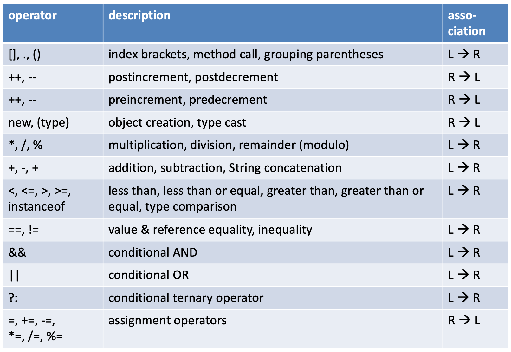

# Operators

Operators are the syntax elements that bind, change and combine the data, classes and methods of your program.  
Although they are extremely important, they are not very interesting in the sense that 
they are just what they are, almost the same in any programming language.

Therefore, this post is quite small. It starts with an overview of all operators and ends 
with a more detailed description of the less obvious ones.

## Overview 

Operators can be classified as **_assigning_** (e.g. `=` and `-=`), **_modifying_**, as in `count++` and they can be **_comparing_**, as in `count < maximum`. 
Another way to classify them is to look at the number of operands they work on. They 
can have one (**_unary_** - `count++;`), two (**_binary_** - `count < maximum`) or 
three (**_ternary-** - `boolean old = (age > 65 ? true : false);`) operands.

Operators can be ordered by their **_precedence_**, which is the priority (order) in 
which they will be evaluated. 

```java
int x = 41;
int count = 1;
int y = x + ++count;
System.out.println("count=" + count + "; y=" + y);
```

This snippet will output `count=2; y=43` because the pre-increment operator has 
precedence over `+`, and the assignment operator.

Here is the complete listing. The associativity (Left-to-Right or Right-to-Left) of an operator is a property that determines how operators of the same precedence are evaluated in the absence of 
parentheses. 



:::{admonition} Feel free to use parentheses
:class: note

Use the rule **always use parentheses when in doubt about precedence"** as a general guideline.
They always have the highest precedence, and improve readability a lot. Compare these 
with respect to readability:

```java
x = y + z * 2 / Math.PI;
x = y + ((z * 2) / Math.PI);
```
:::


## The operators

### Assignment operators

Not all languages have such an extended set of assignment operators. 

When you want to change the value of a variable, you can use these shorthand assignment operators  

> `x = x + 2;` is the same as `x += 2;`  
> `x = x + y;` is the same as `x += y;`  
> `x = x * 3;` is the same as `x *= 3;`  
> `x = x / 3;` is the same as `x /= 3;`  
> `x = x % 3;` is the same as `x %= 3;`  

The last three are a bit esoteric in my opinion and I do not use them because they 
lower the readability of the code (especially `%=`).


### Modulo: `%`

The modulo operator is also called the remainder operator; it gives the remainder of a division.

`10 % 3` returns 1 (one)  
`8 % 5`	returns 3  

This operator is often used when even/uneven items need to be identified, or other periodicity cases. This will address every hundredth item:

```java
if (x % 100 == 0) {
    /*deal with every hundredth item
}
```

### Ternary operator

The ternary operator is actually a condensed if..else block but can give more comprehensive code. 

```java
if (age < 18) {
    minor = true;
}
else {
    minor = false;
}
```

is the same as

```java
minor = (age < 18 ? true : false);
```

It is often used for processing String tags, such as this one.

```java
String academicTitle = employee.getTitle();
String name = employee.getName();

name += (academicTitle == null ? ", " + academicTitle : "");
```

### `instanceof`

The `instanceof` operator (keyword) is a boolean operator that will yield `true` of the left operand 
is the type of the right operand, _or a subtype of it_. Defining inheritance (subtypes) is done using the `extends` keyword. Here is an example.

```java 
class Animal{}
class Wolf extends Animal{}
class Dog extends Animal{}
class Chihuahua extends Dog{}

Dog dog = new Dog();
Wolf wolf = new Wolf();
Chihuahua chihuahua = new Chihuahua();

System.out.println("dog instanceof Animal = " + (dog instanceof Animal));
System.out.println("dog instanceof Object = " + (dog instanceof Object));
//System.out.println("wolf instanceof Dog = " + (wolf instanceof Dog)); //does not compile
System.out.println("chihuahua instanceof Dog = " + (chihuahua instanceof Dog));
System.out.println("chihuahua instanceof Animal = " + (chihuahua instanceof Animal));
System.out.println("chihuahua instanceof Chihuahua = " + (chihuahua instanceof Chihuahua));
```

outputs

<pre class="console_out">
dog instanceof Animal = true
dog instanceof Object = true
chihuahua instanceof Dog = true
chihuahua instanceof Animal = true
chihuahua instanceof Chihuahua = true
</pre>

### bitwise operators

Java also has some bitwise operators. They are out of scope for this course. If you want to know about them you can chack out this [link](https://www.geeksforgeeks.org/bitwise-operators-in-java/) or [here](https://www.baeldung.com/java-bitwise-operators).

