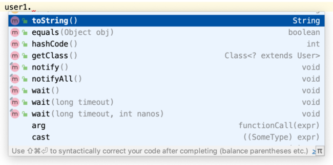
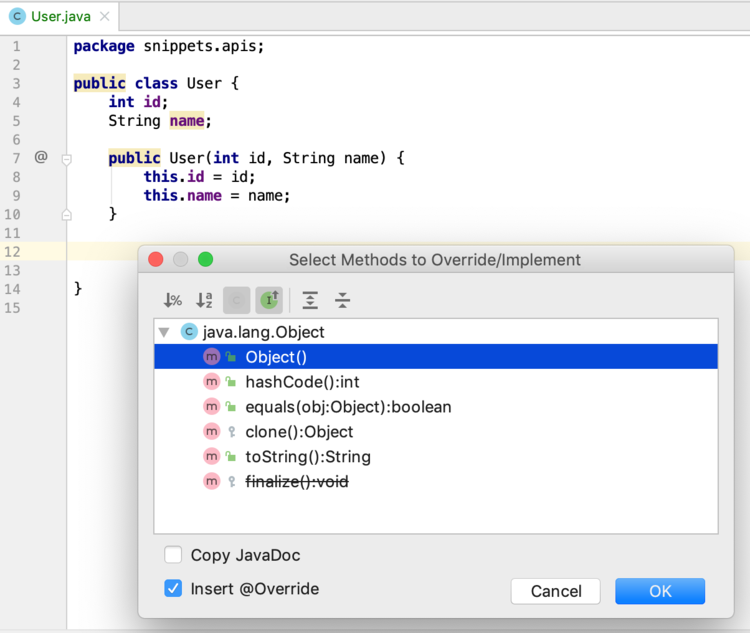
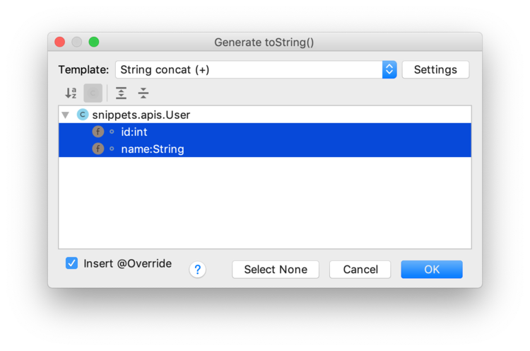

# Methods of class Object

## Introduction

Previously you have seen some collection types: List, Map and Set. 
One of the methods that is universal to all collection types is `contains()`. 
How does the JVM determine that two objects are equal?
This is through the `equals()` method.


When you use the statement `myCollection.contains(myObject)`, you get `true` returned if at least one of the elements in myCollection returns `true` for `element.equals(myObject)`.

The method `equals()` is there, even though you did not implement it. This is because they are declared and implemented in class `Object`, 

:::{admonition} Every class extends from Object
In Java, every class extends from class Object _implicitly_. 
Whenever you create a class, such as this:

```java
class User {
    //class code
}
```

you get this implicitly:

```java
class User extends Object {
    //class code
}
```
:::

Since User extends Object, it inherits all Object properties and methods. If you create an object (of any type), type the variable name followed by a dot, and IntelliJ (and most other IDEs) will show you the methods of class Object:



The `notify..()` and `wait..()` methods have to do with multithreading and are not dealt with here, and neither are the things in grey (e.g. `arg` and `lambda`). 
The ones of interest are

The methods below are always inherited and also provide a default implementation that you may or may not wish to keep using.

- `toString()` returns a String representation of the current object. Implemented in class Object as the objects' memory hash.
- `equals()` returns a boolean indicating whether the argument 
is logically the same as the current object. Implemented in class Object as: `true` if both refer to the same object in memory (the object heap).
- `hashCode()` returns the hashCode (an int) of the current object. Implemented in class Object to return an integer representing the objects memory address.
- `getClass()` returns the class of the current object

## `toString()`: an object string representation

If you want to see a nice textual representation of an object during software development, you use toString(). 
In IntelliJ, type `ctrl + O` if you want to override a super class method.



If you choose toString(), you will get something like this:

```java
@Override
public String toString() {
    return super.toString();
}
```

Note the `@Override` **_annotation_**. 
Annotations are syntactic sugar in Java, and this one communicates to the compiler: 
"please check whether this override is correct, else fail compilation".
Correct with respect to toString() means: take no arguments and return a String.
The statement `return super.toString();` simply states: call the super class toString (of Object in this case) and return its result. Which means you get the uninformative default implementation:

`snippets.apis.User@78b1cc93`

To make toString useful, you'll need te redefine its logic, for instance:

```java
@Override
public String toString() {
    return "A user with name " + name;
}
```

which outputs `A user with name Henk`

Although this is logically correct, and will compile just fine, there are some conventions used in Java to be informative. To get a toString() which follows this rule, use another IntelliJ shortcut: `ctrl + N` (for generate code), and select toString().



Then, select the instance variables you want included in the string representation, click OK and you have something like this

```java
@Override
public String toString() {
    return "User{" +
            "id=" + id +
            ", name='" + name + '\'' +
            '}';
}
```

outputting `User{id=15, name='Henk'}`, which is a good textual representation of the underlying object.

## `equals()` determining logical similarity between objects

Consider these three User objects, where the first constructor argument is the user ID and the second the username.

```java
User user1 = new User(15, "Henk");
//same, equal?
User user2 = user1;

User user3 = new User(21, "Dirk");
//same, or equal User as user3?
User user4 = new User(21, "Dirk");
```

Is `user1` equal to `user2`? Is `user1` equal to itself, `user1`? Is `user3` equal to `user4`?  

:::{admonition} equality versus sameness
Two references are considered the same if they both _point to a single object on the heap_. 
On the other hand, equality is a more fuzzy concept. In general, we consider 
two references to be equal if they point either to one single object,
or to two distinct objects that are logically similar.
Thus, _same_ object references are always _equal_ but not all _equal_ objects are _same_.
:::


So, in the above code snippet, `user1` is definitely the same as `user2` two since they refer to the same object. 
And since they are the same, they are therefore also equal.  
On the other hand, `user3` and `user4` are two distinct objects (not the same - the constructor has run twice), but **_logically similar_** because they have exactly the same internal data.

:::{note}
In Java, `==` tests for sameness and `equals()` for logical similarity.
:::

Therefore, we would like our User class to behave like this.

```java
System.out.println("user1 == user1 -- " + (user1 == user1));         //should be true
System.out.println("user1.equals(user1) -- " + user1.equals(user1)); //should be true
System.out.println("user1 == user2 -- " + (user1 == user2));         //should be true
System.out.println("user1.equals(user2) -- " + user1.equals(user2)); //should be true
System.out.println("user1.equals(user3) -- " + user1.equals(user3)); //should be false
System.out.println("user3.equals(user4) -- " + user3.equals(user4)); //should be true!
```

but in actuality this is what we get

<pre class="console_out">
user1 == user1 -- true
user1.equals(user1) -- true
user1 == user2 -- true
user1.equals(user2) -- true
user1.equals(user3) -- false
user3.equals(user4) -- false
</pre>

Up to the last test, everything works out fine. Why does the last test return false? Because Java doesn't not know about logical similarity between User objects! We have to tell it. Therefore, by default this is what the `Object.equals()` default implementation does:

```java
@Override
public boolean equals(Object other) {
    return (this == other);
}
```

Let's change the `equals()` method to reflect (my opinion of) similarity:

```java
@Override
public boolean equals(Object other) {
    User otherUser = (User) other;
    return (this.id == otherUser.id && this.name == otherUser.name);
}
```

Although this is conceptually a correct implementation, there is a lot to say about it. 
Can you spot the flaws?

There are several, so maybe it is better to let IntelliJ handle this for us, via `ctrl + N` (generate) &rarr; `equals() and hashCode()` &rarr; choose template (IntelliJ Default), choose name and ID --> next, next next, Create:

```java
@Override
public boolean equals(Object o) {
    // shortcut if they are the same!
    if (this == o) return true;

    // not the same class -- not possibly equal
    if (o == null || getClass() != o.getClass()) return false; 

    //cast to correct class to finally check properties
    User user = (User) o; 

    //short-circuited if statement on id property
    if (id != user.id) return false;

    // delegate other objects' equality to their respective implementations
    return Objects.equals(name, user.name);
}
```

The `equals()` method must exhibit the following properties:  
- **_Symmetry_**: For two references, a and b, a.equals(b) if and only if b.equals(a) as well
- **_Reflexivity_**: For all non-null references, a.equals(a)
- **_Transitivity_**: If a.equals(b) and b.equals(c), then a.equals(c)
- **_Consistency with hashCode()_**: Two equal objects must have the same hashCode() value

:::{warning}
When you implement `equals()`, you should always also implement `hashCode()`.
:::

## `hashCode()`: required when `equals()` is implemented

The `hashCode()` method is kind of the mysterious sister of `equals()`. You implement them together, but only equals() is easily understood. 

The `hashCode()` method is used for **_bucketing_** in Hash implementations like HashMap, HashTable, HashSet, etc.
The value received from `hashCode()` is used as the bucket "number" for storing elements of the set/map. 
This bucket number is the address of the element inside the set/map.
When you do `contains()` it will take the hash code of the element, then look for the bucket where hash code points to. 
If more than 1 element is found in the same bucket (multiple objects can have the same hash code), then it uses the `equals()` method to evaluate if the objects are equal, and then decide 
if `contains()` is true or false, or decide if element could be added in the set or not.
(_This paragraph is copied from a post on [Stackoverflow](https://stackoverflow.com/questions/3563847/what-is-the-use-of-hashcode-in-java)_)

The general contract of hashCode() states:  

- Whenever it is invoked on the same object more than once, `hashCode()` must consistently return the same value, provided no information used in equals comparisons on the object is modified. This value needs not remain consistent from one execution of an application to another execution of the same application

- If two objects are equal according to the `equals(Object)` method, then calling the `hashCode()` method on each of the two objects must produce the same value

- It is not required that if two objects are unequal according to the `equals(java.lang.Object)` method, then calling the hashCode method on each of the two objects must produce distinct integer results. However, developers should be aware that producing distinct integer results for unequal objects improves the performance of hash tables

Of course, we let IntelliJ do the hard work (`ctrl + N`):

```java
@Override
public int hashCode() {
    // delegates to a utility method from class Objects
    return Objects.hash(id, name);
}
```

:::{note}
Class `Objects` should not be confused with class `Object`. Class `Objects` contains a variety of utility methods such as the one above, as well as methods for efficient error checking. Here are a few examples.

- `requireNonNull()`
- `checkIndex()`
- `compare()`

See [Javadoc](https://docs.oracle.com/en/java/javase/18/docs/api/java.base/java/util/Objects.html)
:::

## `getClass()` gives meta-information on the objects' class

Example code is best here:

```java
System.out.println("user1.getClass().getSimpleName() = " + user1.getClass().getSimpleName());
System.out.println("user1.getClass().getName() = " + user1.getClass().getName());
System.out.println("user1.getClass().getPackageName() = " + user1.getClass().getPackageName());
```

outputs

<pre class="console_out">
user1.getClass().getSimpleName() = User
user1.getClass().getName() = snippets.apis.User
user1.getClass().getPackageName() = snippets.apis
</pre>

There are a lot more methods in class `java.lang.Class`, but they serve difficult stuff, like introspection.

