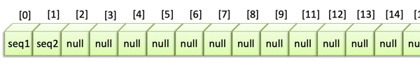
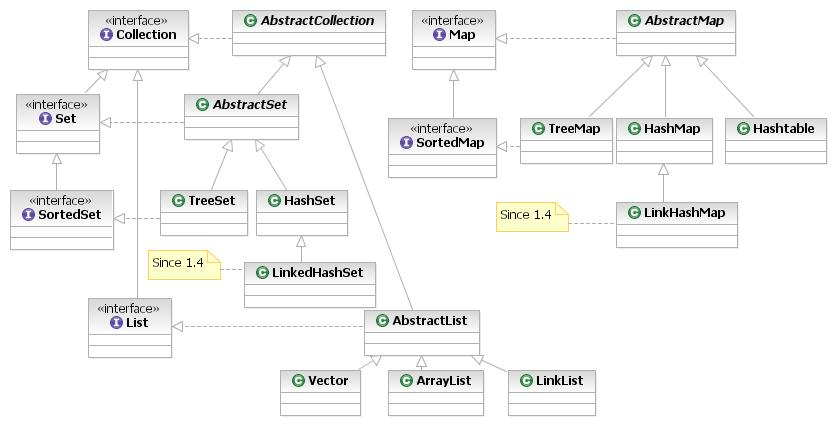

# The Collections API

Storing variables collectively is extremely useful. 
Althought they are most efficient, doing so in Arrays is usually not so nice, simply because they are static and cannot be extended or shortened or inserted within.
The Java Collections API offers a wealth of other ways to store data.  
The basic collection type you find in all other modern programming languages are available: Lists, Sets and Dictionaries (Maps). However, for different applications there are variations and hybrid solutions each with their own strengths and weaknesses.

You will also see a nice way to deal with changeable String data: class StringBuilder. It is not really a collection (strictly speaking it is a collection of characters) but it needs to be discussed and this seems to me the best place for that.


## The old way
In a previous chapter (see {doc}`/02_syntax/arrays`) you have seen the most basic collection type: array.
Arrays store a fixed number of elements; their size needs to be specified at declaration and this size is never going to change:

```java
String[] words = new String[4];
// This will be {null, null, null, null}

// or, as literal:
String[] fruits = {"apple", "pear", "kiwi"};
```

Now suppose you want to do something like this:

```java
Sequence[] readSequences(String fileName) {
    //open file
    //read sequences
    //return the sequences as an array of Sequence objects
}
```

There is a problem here: You usually don’t know how many sequences there are in a file!
So, the simple solution is to create a very large array that is as large as the biggest sequence file you know:

```java
String[] readSequences(String fileName) {
    String[] sequences = new String[50_000_000];
    //open file
    //read sequences
    //return the sequences as an arrays of Strings
}
```

When you read only 1 or 2 sequences you will have wasted all this memory space! Moreover, all 
these null values are `NullPointerExceptions` lurking in the shadows:



When somebody invents a new sequencing machine that generates 100 million sequences or more
in one run, you have a bigger problem! You will get `ArrayIndexOutOfRangeExceptions` 
or other errors. Actually, these machines already exist!

There is a nice class that will really make your day: `java.util.ArrayList`.

:::{note}

Be aware that storing large datasets in memory is often not the best solution; a streaming solution is something every data scientist should try to think of first:

```java
while(thereIsData) {
    chunk = readMinimalChunk();
    process(chunk);
}
```
:::

## Lists in all variations
Java has a wealth of List-like implementations for a range of different applications:
ArrayList, LinkedList, Stack and Queue. If you want to get the complete picture, have a look at the [`java.util` API reference](https://docs.oracle.com/en/java/javase/18/docs/api/java.base/java/util/package-summary.html)

ArrayList is the collections workhorse when you want to store multiple values 
in an ordered way. It is, as the name suggests, an Array-like List. The huge difference 
is that it will grow and shrink according to your needs. So, the previous method could be 
refactored as follows:

```java
import java.util.ArrayList;

ArrayList<String> readSequences(String fileName) {
    //no initial size needed (although you can give one, 
    //if you are really into efficiency)
    ArrayList<String> sequences = new ArrayList<>();

    //open file
    //read sequences
    //return the sequences as an arrays of Strings
}
```

At the top is a line `import java.util.ArrayList;` which is an **_import declaration_**, You need to import classes that are not part of the Java core API. The core API is formed by the classes that reside in package `java.lang`, such as Object, String, Math, Integer, System and Thread. Since most of the collection classes are in package `java.util` they need to be imported from that package. 

There is another element here that you haven't seen before: it is the **_generic type declaration_**:

<pre style="color:darkblue;font-weight:bold;font-family:courier;font-size:1.2em;">
ArrayList<span style="color:darkred;">&lt;String&gt; </span>sequences = new ArrayList<span style="color:darkred;">&lt;&gt;</span>();
</pre>

:::{warning}
It is tempting to always simply use `ArrayList` because it seems to be capable of all collection functionality: insert, delete, extend, shrink, presence checks.
However, it is really important that you use the correct collection type for your use case.
For instance, if you are going to do many insert/delete operations you should use `LinkedList` instead of `ArrayList`.  
Likewise, if you are mainly interested in element presence, using the `contains()` method, you should use `Set` or `Map`.
:::


### Generics

The `<String>` and `<>` have everything to do with Java being strongly typed. Since everything is typed, a collection that is being instantiated must already know what type it will contain. You specify the type of its elements using the **_diamond operators_**. This mechanism is called **_generics_** in Java, because it makes collection classes generic usable.
Before Java 8, you had to do it twice (`ArrayList<String> sequences = new ArrayList<String>();`) but in newer versions of Java you can leave the second set of diamond operators empty. 

Leaving the type declaration out does not yield a compiler error, but makes your life so much harder:

```java
// TYPED collection; casting is done automatically
ArrayList<String> words = new ArrayList<>();
words.add("Game");
words.add("of");
words.add("Thrones");

// type is inferred from collection
for (int i = 0; i < words.size(); i++){
    String word = words.get(i);
    System.out.println("word = " + i + ": " + word);
}

// "RAW" type collection: everything is Object and casting should be done explicitly
ArrayList wordsNonGeneric = new ArrayList();
wordsNonGeneric.addAll(List.of("House", "of", "Cards"));
// danger!
wordsNonGeneric.add(new Duck());

// iterate over Object type
for (int i = 0; i < wordsNonGeneric.size(); i++){
    // need to cast to actual type
    // this will give a ClassCastException exception on the Duck,
    // which is of course not a String!
    String word = (String)wordsNonGeneric.get(i);
    System.out.println("word = " + i + ": " + word);
}
```

So, without the type declaration, you need to cast to the actual type. That makes your code less obvious. But more problematic is that _any_ object can be inserted into the collection, without warning. So, when you attempt to cast a Duck to a String, you get a `ClassCastException`. You can circumvent this problem by checking the type (using the `instanceof` operator):

```java
for (int i = 0; i < wordsNonGeneric.size(); i++){
    Object element = wordsNonGeneric.get(i);
    if (element instanceof String) {
        String word = (String) element;
        System.out.println("word = " + i + ": " + word);
    } else {
        System.out.println("skipped non-String element of type " 
            + element.getClass().getSimpleName());
    }
}
```

but why would you make your life harder than it already is?

### ArrayList operations

Lists in general - and ArrayList _is_ a List - are used to store values in an ordered way. Operations on ArrayLists are of course related to the property. Here are some example usages.

```java
//create
ArrayList<String> words = new ArrayList<>();
//add elements
words.add("Game");
words.add("of");
words.add("Thrones");
//add multiple
words.addAll(List.of("is", "cancelled"));

//foreach iteration
for (String word : words) {
    System.out.println("word = " + word);
}

//iteration with counter; note the use of ".size()"
for (int i = 0; i < words.size(); i++) {
    //fetch by index - ZERO-BASED!
    String word = words.get(i);
    System.out.println("word = " + i + ": " + word);
}

words.contains("Thrones"); //true; (but inefficient; use Set for frequent use of this method)
words.size();              //5
words.isEmpty();           //false
//same as
boolean empty = words.size() == 0;

words.remove("of");        //deletes word (again inefficient)
words.remove(1);           //second element
words.clear();             //empty the list
```

One operation needs special attention: converting an array to a List. This is done with `Arrays.asList()` but be aware that this generates an **_immutable view_** of your array:

```java
String[] wordsArr = {"Lord", "of", "the", "Rings"};
//create immutable List from Array
List<String> immutableStrings = Arrays.asList(wordsArr);
//immutable: UnsupportedOperationException!
immutableStrings.add("!");
//make mutable copy
List<String> mutableString = new ArrayList<>();
//no problem
mutableString.add("!");
```


## Code against interfaces, not implementations

As outlined above, the `contains()` method performs badly in class ArrayList (at **O(n)** - see your Algorithms & Data structures course), so if you plan to check for element presence often, List types are not a good choice. Also, if you are going to do a lot of insert and/or delete operations, `LinkedList` is a much better choice. Fortunately, you only need to change one line of code in your application to achieve this if you code correctly:

```java
//This is OK but not efficient with insert/delete 
//Also, the type declaration is an implementation (ArrayList) and not an 
//interface (List)
ArrayList<String> words = new ArrayList<>();

//Better, declare the interface (abstraction) type and 
//use this type in the rest of your code
List<String> words = new ArrayList<>();

//Best: LinkedList is very good at insertions and deletions
List<String> words = new LinkedList<>();
```

This is an example of the rule **_code against interfaces (abstractions), not implementations_**.

_When you code against interfaces, i.e. declare variables of an interface type, it is really easy to change the implementation class that you use._

In the example above, it took only one changed word to use a LinkedList instead of an ArrayList.
If my declared type `ArrayList` was used all over the application, this would have taken a big refactoring operation.

## The collection interfaces: Map, List, Set

There four base abstract collection types, each with several dedicated implementations.
You have already seen the `List` type, with two implementations: `ArrayList` and `LinkedList`. 

Here is a -very incomplete- listing of some collection type implementations, 
followed by a demonstration of only the HashMap and HashSet types - you have already seen the `List` type. A later section discusses where to look further for dedicated collection types.

- **`List` interface**
    - `ArrayList` simplest and general purpose list type
    - `LinkedList` coupled elements; easy insert/delete
    - `Stack` Last In First Out (LIFO) functionality  

- **`Map` interface**  
    - `HashMap` the Map workhorse (the Python `dict` equivalent)
    - `TreeMap` a sorted hashmap  

- **`Set` interface**  
    - `HashSet` the basic Set implementation
    - `TreeSet` a sorted Set  

- **`Queue` interface**
    - `LinkedList` yes, the same; implements the Queue interface as well with `poll()` etc.
    - `PriorityQueue` priority queue when first in first out (FIFO) is not enough
    - `ArrayDeque` double-ended queue  


:::{admonition} Using factory methods `of(...)`
:class: warning
The List, Set and Map interfaces have very convenient overloaded factory methods to create these respective collections.  

```java
List<String> words = List.of("The", "show", "is", "cancelled");
```
You should be aware that these factory methods return immutable collections - attempts top add or delete elements will throw an `UnsupportedOperationException`.
:::

### Primitives as objects

Each primitive type in the Java language has an object counterpart. The reason for this is that collection types, can not hold primitives but only objects.

These are the primitives and their **_wrapper classes_**:

- boolean, byte, short, char, int, long, float, double.
- Boolean, Byte, Short, Character, Integer, Long, Float, Double.

So only Character and Integer have a different name (longer) the others are simply the primitive name capitalized.

### Autoboxing

The wrapper classes and primitives can be converted to and from each other pretty easy:

```java
int count = 33;

//Explicit; uses caching
Integer counter2 = Integer.valueOf(count);
//explicit unwrapping
counter2.intValue();

//autoboxing!
Integer counter3 = count;
//auto-unboxing
int counter4 = counter3;
```

The last two examples show the mechanism of **_autoboxing_** primitives. 
This means the compiler deals with wrapping and unwrapping for you. This is how you typically use primitives in collections. See use cases below.

###Map: HashMap

HashMap is the main Map implementation in Java. It is a dictionary type mapping keys to values. Like all collection types, it uses generics to declare the type of the keys and values. Here is an example of an ID to User mapping:

<pre style="color:darkblue;font-weight:bold;font-family:courier;font-size:1.2em;">
Map<span style="color:darkred;">&lt;Integer, User&gt; </span>users = new HashMap<span style="color:darkred;">&lt;&gt;</span>();
</pre>

Note the use of `Integer` instead of `int`. This is discussed in the next section.


### Map operations

The code listing below demonstrates all main Map operations supported by HashMap. The [Map interface documentation](https://docs.oracle.com/en/java/javase/18/docs/api/java.base/java/util/Map.html) lists all available methods, as well as all known impelmenters (besides HashMap).
Note the existence of 10 (!) overloaded factory functions `Map.of(...)`.

```java
Map<Integer, User> users = new HashMap<>();
User u1 = new User(15, "Henk");
//add to Map; note autoboxing of int value (id)
users.put(u1.id, u1);
User u2 = new User(21, "Dirk");
users.put(u2.id, u2);
User u3 = new User(9, "Mike");
users.put(u3.id, u3);

//read the map size
System.out.println(users.size());
//check for presence of a key
System.out.println("users.containsKey(15) = " + users.containsKey(15));
//check for presence of a value
System.out.println("users.containsValue() = " + users.containsValue(u1));
//is not in map
System.out.println("users.containsValue() = " + users.containsValue(new User(6, "Nick")));

//iterate values
for (User user : users.values()) { }

//iterate keys
for (int id : users.keySet()) { }

//iterate entries
for (Map.Entry<Integer, User> entry : users.entrySet()) {
    System.out.println(entry.getKey() + ": " + entry.getValue());
}

//empties the map
users.clear();
```

## Set: HashSet

Typical set operations are **_intersection_**, **_union_** and **_relative complement_**. 


This is how its done in Java.


Here are three of the fundamental set operations.

```java
Set<Integer> setA = Set.of(1, 2, 3, 4);
Set<Integer> setB = Set.of(2, 4, 6, 8, 9);

//Intersection
Set<Integer> intersectSet = new HashSet<>(setA);
intersectSet.retainAll(setB);
System.out.println("intersectSet = " + intersectSet);

//Union
Set<Integer> unionSet = new HashSet<>(setA);
unionSet.addAll(setB);
System.out.println("unionSet = " + unionSet);

//Relative complement
Set<Integer> differenceSet = new HashSet<>(setA);
differenceSet.removeAll(setB);
System.out.println("differenceSet = " + differenceSet);
```

with output

<pre class="console_out">
intersectSet = [2, 4]
unionSet = [1, 2, 3, 4, 6, 8, 9]
differenceSet = [1, 3]
</pre>

## Choose you collection

This was just an overview of the most-used collections. 
Please refer to [the API reference](https://docs.oracle.com/en/java/javase/18/docs/api/java.base/java/util/package-summary.html) or [this discussion](https://www.digitalocean.com/community/tutorials/collections-in-java-tutorial).
Here is a graphical overview:




## Collections utility methods

The Collections class has many useful utility functions:

- `singletonList(Object)`: creates a list that holds only the provided single object.
- `unmodifiableList(otherList)`: creates an unmodifiable _view_ of the passed list. This means that if the underlying list is changed, the view reflects this change. Add/insert/delete operations via this reference are not allowed however.
- `min(collection)`, `max(collection)`: return the minimum or maximum of the collection.
- `shuffle(list)`: shuffle _in place_.
- `frequency(collection, object)`: give the frequency of the provided object.
- `sort(list)`: sorts the list - see next chapter.

There are many more - see the [doc](https://docs.oracle.com/en/java/javase/18/docs/api/java.base/java/util/Collections.html)

