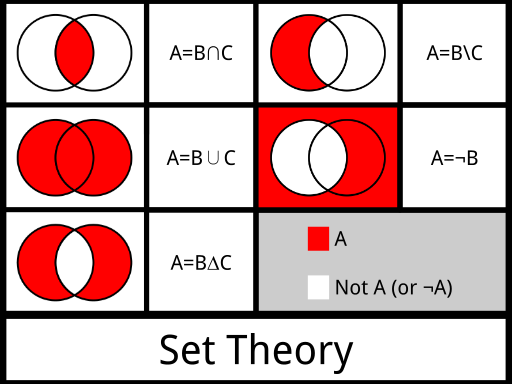

# The Java Collections API

Storing variables collectively is nice; doing so in Arrays is usually not so 
nice - simply because they are static and cannot be extended or shortened or inserted within.
The Java Collections API offers a wealth of other ways to store data, in the form of Lists, Queues, 
Sets, Maps, in variations and hybrids of these.

Finally (not a collection but essential to show you), we will see a nice way to deal with changeable String data: class StringBuilder.

## The old way
In a previous lecture, you have seen the most basic collection type: array.
Arrays store a fixed number of variables. But suppose you want to do something like this:

```java
Sequence[] readSequences(String fileName) {
    //open file
    //read sequences
    //return the sequences as an array of Sequence objects
}
```

There is a problem here: You usually don’t know how many sequences there are in a file!
So, the simple solution is to create a very large array that is as large as the biggest sequence file you know:

```java
String[] readSequences(String fileName) {
    String[] sequences = new String[10_000_000];
    //open file
    //read sequences
    //return the sequences as an arrays of Strings
}
```

When you read only 1 or 2 sequences you will have wasted all this memory space! Moreover, all 
these null values are `NullPointerExceptions` in the waiting.


When somebody invents a new sequencing machine that generates 100 million sequences 
in one run, you have a bigger problem! You will get `ArrayIndexOutOfRangeExceptions` 
or other errors. Actually, these machines already exist!

There is a nice class that will really make your day: `java.util.ArrayList`.

## Lists: ArrayList and LinkedList

ArrayList is the workhorse for most collections where you want to store a number of variables 
in an ordered way. It is, as the name suggests, an Array-like List. The big -no huge- difference 
is that is will grow and shrink according to your needs. So, the previous method could be 
refactored as follows:

```java
import java.util.ArrayList;

ArrayList<String> readSequences(String fileName) {
    //no initial size needed (although you can give one, 
    //if you are really into efficiency)
    ArrayList<String> sequences = new ArrayList<>();

    //open file
    //read sequences
    //return the sequences as an arrays of Strings
}
```

At the top is a line `import java.util.ArrayList;` which is an **_import declaration_**, You need to import classes that are not part of the Java core API (i.e. reside in package `java.lang`). Since most of the collection classes are in package `java.util` they need to be imported. More on imports and namespaces later.

There is another element here that you haven't seen before: it is the **_generic type declaration_**:

<pre style="color:darkblue;font-weight:bold;font-family:courier;font-size:1.2em;">
ArrayList<span style="color:darkred;">&lt;String&gt; </span>sequences = new ArrayList<span style="color:darkred;">&lt;&gt;</span>();
</pre>

### Generics

The `<String>` and `<>` have everything to do with Java being strongly typed. Since everything is typed, a collection that is being instantiated must also know what type it will contain. You specify the type of its elements using the **_diamond operators_**. This mechanism is called **_generics_** in Java, because it makes collection classes generic usable.
Before Java 8, you had to do it twice (`ArrayList<String> sequences = new ArrayList<String>();`) but in newer versions of Java you can leave the second set of diamond operators empty. 

Leaving the type declaration out does not yield a compiler error, but makes your life so much harder:

```java
//typed collection
ArrayList<String> words = new ArrayList<>();
words.add("Game");
words.add("of");
words.add("Thrones");

//type is inferred from collection
for (int i = 0; i < words.size(); i++){
    String word = words.get(i);
    System.out.println("word = " + i + ": " + word);
}

//"raw" type collection: everything is Object
ArrayList wordsNonGeneric = new ArrayList();
wordsNonGeneric.add("House");
wordsNonGeneric.add("of");
wordsNonGeneric.add("Cards");
//danger!
wordsNonGeneric.add(new Duck());

//iterate over Object type
for (int i = 0; i < wordsNonGeneric.size(); i++){
    //need to cast to actual type
    //this will give a ClassCastException exception on the Duck, which is of course not a String!
    String word = (String)wordsNonGeneric.get(i);
    System.out.println("word = " + i + ": " + word);
}
```

So, without the type declaration, you need to cast to the actual type. That makes your code less obvious. But more problematic is that _any_ object can be inserted into the collection, without warning. So, when you attempt to cast a Duck to a String, you get a `ClassCastException`. You can circumvent this problem by checking the type (using the `instanceof` operator):

```java
for (int i = 0; i < wordsNonGeneric.size(); i++){
    Object element = wordsNonGeneric.get(i);
    if (element instanceof String) {
        String word = (String) element;
        System.out.println("word = " + i + ": " + word);
    } else {
        System.out.println("skipped non-String element of type " 
            + element.getClass().getSimpleName());
    }
}
```

but why would you make your life harder than it already is?

### ArrayList operations

Lists in general, and ArrayList is no exception, are used to store in an ordered way. Operations on ArrayLists are of course related to the property. Here are some example usages.

```java
//create
ArrayList<String> words = new ArrayList<>();
//add elements
words.add("Game");
words.add("of");
words.add("Thrones");
//won't compile!
//words.add(new Duck());

//foreach iteration
for (String word : words) {
    System.out.println("word = " + word);
}

//iteration with counter; note the use of ".size()"
for (int i = 0; i < words.size(); i++) {
    //fetch by index - zero based!
    String word = words.get(i);
    System.out.println("word = " + i + ": " + word);
}

words.contains("Thrones"); //true
words.size(); //3
words.isEmpty(); //false
//same as
boolean empty = words.size() == 0;

words.remove("of"); //deletes word
words.remove(1); //second element
words.clear(); //empty list
```

One operation needs special attention: converting an array to a List. This is done with `Arrays.asList()` but be aware that this generates an **_immutable view_** of your array:

```java
String[] wordsArr = {"Lord", "of", "the", "Rings"};
//create immutable List from Array
List<String> immutableStrings = Arrays.asList(wordsArr);
//immutable: UnsupportedOperationException!
immutableStrings.add("!");
//make mutable copy
List<String> mutableString = new ArrayList<>();
//no problem
mutableString.add("!");
```

## Code against interfaces, not implementations

Be aware that the `contains()` method performs at **O(n)** (see your Algorithms & Data structures course!), so if you plan to check for
element presence often, List types are not a good choice. Also, if you are going to do a lot of insert and/or delete operations, LinkedList is a much better choice. Fortunately, you only need to change one line of code in your application to achieve this, and if you design your code well, you only need to change a single word:

```java
//This is OK but not efficient with insert/delete 
//Also, the type declaration is an implementation (ArrayList) and not an 
//interface (List)
ArrayList<String> words = new ArrayList<>();

//Better, declare the interface (abstraction) type and 
//use this type in the rest of your code
List<String> words = new ArrayList<>();

//Best: LinkedList is very good at insertions and deletions
List<String> words = new LinkedList<>();
```

This is an example of the rule **_code against interfaces (abstractions), not implementations_**.

_When you code against interfaces, i.e. declare variables of an interface type, it is really easy to change the implementation class that you use._

In the example above, 
it took only one changes word to use a LinkedList instead of an ArrayList.


## The collection interfaces: Map, List, Set

There four base collection types, each with several dedicated implementations.
You have already seen the `List` type, with two implementations: `ArrayList` and `LinkedList`. 

Here is a -very incomplete- listing of some collection type implementations, 
followed by a demonstration of only the HashMap and HashSet types - you have already seen the `List` type. 

- `List` interface  
    - `ArrayList` simplest and general purpose list type
    - `LinkedList` coupled elements
    - `Stack` last in first out (LIFO)
- `Map` interface  
    - `HashMap` the Python dict equivalent
    - `TreeMap` a sorted hashmap
- `Set` interface  
    - `HashSet` the basic Set implementation
    - `TreeSet` a sorted Set
- `Queue` interface
    - `PriorityQueue` priority queue when first in first out (FIFO) is not enough
    - `ArrayDeque` double-ended queue

### Map: HashMap

HashMap is the main Map implementation in Java. It is a dictionary type mapping keys to values. Like all collection types, it uses generics to declare the type of the keys and values. Here is an example of an ID to User mapping:

<pre style="color:darkblue;font-weight:bold;font-family:courier;font-size:1.2em;">
Map<span style="color:darkred;">&lt;Integer, User&gt; </span>users = new HashMap<span style="color:darkred;">&lt;&gt;</span>();
</pre>

Note the use of `Integer` instead of `int`. 

#### Primitives as objects

Each primitive type in the Java language has an object counterpart. The reason for this is that collection types, amongst others, can not hold primitives but only objects.

These are the primitives and their **_wrapper classes_**:

- boolean, byte, short, char, int, long, float, double.
- Boolean, Byte, Short, Character, Integer, Long, Float, Double.

So only Character and Integer have a different name (longer) the others are simply the primitive name capitalized.

#### Autoboxing

The wrapper classes can be converted to and from pretty easy:

```java
int count = 33;

//deprecated though legal
Integer counter1 = new Integer(count);
//Explicit; uses caching
Integer counter2 = Integer.valueOf(count);
//explicit unwrapping
counter2.intValue();

//autoboxing!
Integer counter3 = count;
//auto-unboxing
int counter4 = counter3;
```

The last two examples show the mechanism of **_autoboxing_** primitives. 
This means the compiler deals with wrapping and unwrapping for you. This is how you typically use primitives in collections. See use cases below.

#### Map operations

See listing below.

```java
Map<Integer, User> users = new HashMap<>();
User u1 = new User(15, "Henk");
//add to Map; note autoboxing of int value (id)
users.put(u1.id, u1);
User u2 = new User(21, "Dirk");
users.put(u2.id, u2);
User u3 = new User(9, "Mike");
users.put(u3.id, u3);

//read size
System.out.println(users.size());
//check for presence of key
System.out.println("users.containsKey(15) = " + users.containsKey(15));
//check for presence of value
System.out.println("users.containsValue() = " + users.containsValue(u1));
//is not in map
System.out.println("users.containsValue() = " + users.containsValue(new User(6, "Nick")));

//iterate values
for (User user : users.values()) { }

//iterate keys
for (int id : users.keySet()) { }

//iterate entries
for (Map.Entry<Integer, User> entry : users.entrySet()) {
    System.out.println(entry.getKey() + ": " + entry.getValue());
}

//empties map
users.clear();
```

### Set: HashSet

Typical set operations are **_intersection_**, **_union_** and **_relative complement_**. 



This is how its done in Java.

First a small utility method, which generically creates a Set of any type from a varargs input:

```java
private static <T> Set<T> setOf(T... values) {
    return new HashSet<T>(Arrays.asList(values));
}
```

Here are three of the fundamental set operations.

```java
Set<Integer> setA = setOf(1, 2, 3, 4);
Set<Integer> setB = setOf(2, 4, 6, 8, 9);

//Intersection
Set<Integer> intersectSet = new HashSet<>(setA);
intersectSet.retainAll(setB);
System.out.println("intersectSet = " + intersectSet);

//Union
Set<Integer> unionSet = new HashSet<>(setA);
unionSet.addAll(setB);
System.out.println("unionSet = " + unionSet);

//Relative complement
Set<Integer> differenceSet = new HashSet<>(setA);
differenceSet.removeAll(setB);
System.out.println("differenceSet = " + differenceSet);
```

with output

<pre class="console_out">
intersectSet = [2, 4]
unionSet = [1, 2, 3, 4, 6, 8, 9]
differenceSet = [1, 3]
</pre>

## Collections utility methods

The Collections class has many useful utility functions. Their name are pretty self-explanatory:

- singletonList()
- unmodifiableList()
- min(), max()
- shuffle()
- frequency()
- sort() - see next post

