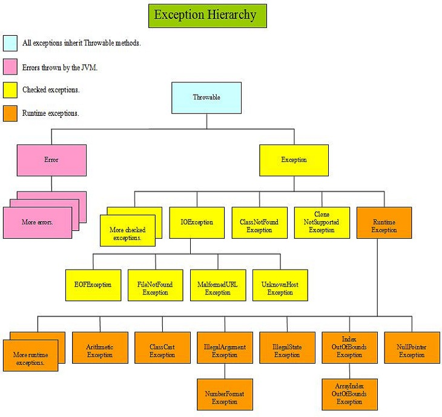

# Exception handling

Before dealing with file IO, exceptions need to be discussed. Whenever you deal with the outside world (keyboard input, files, databases etc.) you need to deal with exceptions . Why? The outside world is dangerous and unpredictable: files do not exist, or are not accessible to you, internet connections can be down, a database has a new password or URL the possibilities for disaster are endless.

All these scenarios will **_throw_** an `Exception` your way. It is up to you, the application programmer, to **_catch_** them and deal with them in an elegant manner. Either by following an alternative program path, or to quit the application with acceptable error messages.

:::{admonition} Definition
:class: note

Exceptions are method return values that do not follow regular program flow; they are instantiated when something goes wrong. They usually cause the program to behave differently from normal flow.
:::

## What are exceptions

Consider this code.

```java
package snippets.apis;

public class ExceptionsDemo {
    public static void main(String[] args) {
        doFirst();
    }

    private static void doFirst() {
        doSecond();
    }

    private static void doSecond() {
        int x = 42 / 0;
    }
}
```

Running `main()` will generate an error resulting in a **_stacktrace_**:

<pre class="console_out">
Exception in thread "main" java.lang.ArithmeticException: / by zero
	at snippets.apis.ExceptionsDemo.doSecond(ExceptionsDemo.java:13)
	at snippets.apis.ExceptionsDemo.doFirst(ExceptionsDemo.java:9)
	at snippets.apis.ExceptionsDemo.main(ExceptionsDemo.java:5)
</pre>

The error - the fact that a number cannot be divided by zero - occurs in method `doSecond()` and this will cause the JVM to generate an Exception. In this case, an `ArithmeticException`. The stack trace starts with the method where the error originated, and works its way down to `main()` from where the application "crashes" because the exception was not caught/resolved by program logic.  

The Exception object is **_thrown_** from this point down the call stack unless it is caught.  

The name "stacktrace" refers to the **_call stack_** or stack of execution. A call stack is a data structure that stores information about the active subroutines of a computer program.
The current executing function is always on top.
When an exception or error occurs, you will see a **_traceback_** through this stack, from the top (where the error occurred) back to the main() function.
This gives you information about the origin and nature of the error.


## Checked vs unchecked exceptions

Although the name `Exception` was used in this example, there are actually quite a few in the Java API. They are all related to each other through inheritance. The base type of all is class `Throwable`. It has two children: `Error` and `Exception`. See figure below.



There are exceptions for standard IO operations. These are called **_checked exceptions_** because their fate is checked by the compiler: whenever you call a method throwing one of these, you **_must_** catch it, or add a throws clause to your method. There is a subbranch extending from `RuntimeException` that represent the **_unchecked_** exceptions. These are not checked by the compiler: you can throw or catch these explicitly, but that is not required.


## Checked exceptions

Whenever a method publishes a throws clause of a checked exception in its method signature, you must take one of these **_two courses of action_**:

- Catch it yourself: place this code in a **_`try/catch`_** structure

    ```java
    try { 
        /*do the risky thing*/ 
    } catch (Exception e) {
        /*solve the problem*/ 
    }
    ```

- Make other code solve the problem: place a **_`throws`_** clause in the method signature:

    ```java
    public void doRisky() throws Exception { 
        /*risky method body*
    }
    ```

You should use the Exception hierarchy to make a robust error-handling backbone in your application. Have a look at this example and read the code comments carefully.

```java
package snippets.apis;

import java.io.FileNotFoundException;
import java.io.IOException;
import java.nio.file.FileAlreadyExistsException;
import java.sql.SQLException;
import java.util.logging.Level;
import java.util.logging.Logger;

public class MyAppWithExceptions {

    public static void main(String[] args) {
        MyAppWithExceptions app = new MyAppWithExceptions();
        app.start();
    }

    private void start() {
        try {
            loadDatabase();
            readFile("some_file");
            processData();
            writeResults("results_file");
        } catch (IOException | SQLException e) {
            Logger.getLogger("MyApp").log(Level.SEVERE, "IO error!", e);
            System.err.println("An error occurred. See the log for details.");

            //don't use stacktrace in production!
            //e.printStackTrace();
        }
    }

    private void processData() {
        try {
            //processing file data
        } catch (NumberFormatException e) {
            //note this is an unchecked exception; 
            //the try/catch is optional
            Logger.getLogger("MyApp").log(Level.INFO, "Number format problem", e);
        }
    }

    private void writeResults(String resultsFile) throws FileAlreadyExistsException {
        //write to results file
    }

    private void loadDatabase() throws SQLException {
        //loading MySQL DB
    }

    private void readFile(String someFile) throws FileNotFoundException {
        //reading input data
    }
}
```

## Unchecked exceptions

Unchecked exceptions are quite similar to checked exceptions, but with the difference that you do not 
- need to declare them - although you may do so!
- need to try/catch or throw them explicitly - although you may do so!

Unchecked exceptions include `NumberFormatException`, `NullPointerException`, `IllegalArgumentException` and `UnsupportedOperationException`. In modern Java, unchecked exceptions are preferred over checked exceptions because they do not clutter your code so much. Try to work with these as much as possible.


## Errors

:::{warning}
You should never ever try to catch errors. There is no possible use case for that:

```java
try {
    thirdMethod();
} catch (OutOfMemoryError error) {
    //recover from an out-of-memory error?
}
```
:::

## All try/catch elements

Here are all the try/catch flow control elements. Note that the supertype of more specific exceptions need to be caught last, after the specific types.

```java
try{
    /* The risky thing.  
    This block will run until an exception occurs - also exceptions that are not 
    explicitly caught */
} catch (FileNotFoundException |
	EndOfFileException ex) {
    /* Deal with some specific file problems */
} catch(IOException ex) {
    /* IOException is supertype to FileNotFoundException and EndOfFileException. 
    Deal with all other IO problems in this catchall */
} catch(SQLException ex) {
    /* Deal with database problems. 
    SQLException is a sibling to IOException */
}
finally {
    /* Always runs, exception or not! 
    Do things that need to be done, no matter what, like closing a file or database connection */
}
```

## Try-with resources

Java 7 introduced the try-with resources structure, which automatically closes the resource once the try block has finished:

```java
try (<OPEN RESOURCE>) { }
catch (<RESOURCE EXCEPTION>) { }
```

This form assures that a resource will be closed() after the try{} block exits, with or without error. 

See the next chapter {doc}`/03_apis/io` for details on its usage.
