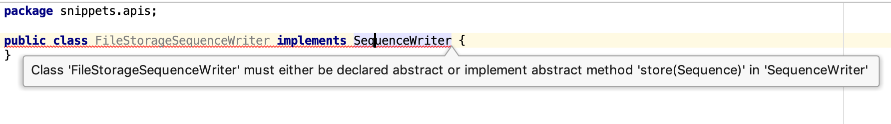
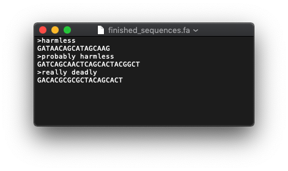

# Interfaces

So far, you have seen two basic types: primitives and classes. Classes have instance variables and methods acting on these. Here is an example.

```java
public class Sequence {
    String sequence;
    String name;

    /**
     * returns the molecular weight, in Daltons
     * @return weightInDaltons
     */
    double getMolecularWeight() {
        double weight = 0;
        //implementation to calculate weight
        return weight;
    }

    /**
     * Mutates a single position and returns a modified copy.
     * This object itself is NOT mutated!
     * @param position
     * @param newCharacter
     * @return mutatedSequence
     */
    Sequence mutate(int position, char newCharacter) {
        StringBuilder stringBuilder = new StringBuilder(this.sequence);
        stringBuilder.setCharAt(position, newCharacter);
        Sequence mutatedSequence = new Sequence();
        mutatedSequence.sequence = stringBuilder.toString();
        return mutatedSequence;
    }
}
```

So the **_contract_** (or API, if you like) of class Sequence is that it can deliver its molecular weight and can generate a mutated copy of itself. Both are **_concrete_** methods that are implemented with a method body. 

Sometimes, however, you want to **_separate the contract from its implementation._**


## A contract without implementation: interface

Maybe you remember from Python the `print()` method. It has this signature  

`print(*objects, sep=' ', end='\n', file=sys.stdout, flush=False)`.  

By default it writes to the console, `sys.stdout`, but you can change this 
behavior as long as you pass an object with a `write()` method: `print("foo", file=object_with_a_write_method)`. 

Translating this to Java, which is strongly typed, the `print()` method would 
expect an object of a certain type, or contract, exposing a `write()` method.
But since there are so many different ways to `write()` data (to console, to 
database, to socket), it would be impossible to create a single implementation that 
supports all possible ways to write data, now and in the future.

The solution is to define a **_contract without implementation_**, separating the contract from the implementation. Classes interested in fulfilling the contract can sign up and define their own implementation, as long as the contract is followed to the letter. In Java, these contracts are called **_interfaces_**. Staying with the Python print() function, we would have to define a contract (interface) defining a "write" method that states "give me your object and I will write it (to a destination of my choice)":


Why is this useful? Let's move away from simple printing a bit. Suppose we have a `SequenceCollection` class that 
exposes a `flush()` method, that is supposed to write the held collection 
to an external location for storage and clear memory to be ready for 
filling: A typical case of **_batch processing_**. But the 
`SequenceCollection` class does not know which storage technology is 
preferred by its clients (API programmers), so it only asks API programmers 
to provide it with an object **_implementing_** the `SequenceWriter` contract. 

First, here is the `SequenceWriter` interface.

```java
package snippets.apis;

public interface SequenceWriter {
    /**
     * This is the sole method defined in this interface. It accepts an
     * object and will store a representation of it to an external destination.
     * @param sequence the sequence to store
     */
    void store(Sequence sequence); //NO METHOD BODY; ONLY A SIGNATURE!
}
```

The `store()` method does not have a method body - it only serves as a contract. 

Here is the `SequenceCollection` class the "talks to" only the contract - it has no clue what kind of implementation it receives.

```java
package snippets.apis;

import java.util.ArrayList;
import java.util.List;

public class SequenceCollection{
    private List<Sequence> sequences = new ArrayList<>();

    public void addSequence(Sequence sequence) {
        this.sequences.add(sequence);
    }

    public void removeSequence(Sequence sequence) {
        this.sequences.remove(sequence);
    }

    /**
     * This will write the current SequenceCollection to an external destination
     * and empty the collection to be filled with a next batch.
     * @param writer the writer that processes each individual sequence object
     */
    public void flush(SequenceWriter writer) {
        for (Sequence seq : this.sequences) {
            //NO CLUE OF THE ACTUAL STORAGE IMPLEMENTATION
            //ONLY KNOWS THERE IS AN OBJECT LIVING UP TO TO THE CONTRACT
            writer.store(seq);
        }
        this.sequences.clear();
    }

    /**
     * Looks for pathogenic sequences in the current batch
     * @return pathogenicSequences
     */
    public List<Sequence> findPathogenicSequences() {
        ArrayList<Sequence> pathogenics = new ArrayList<>();
        //complex logic
        return pathogenics;
    }

    //MORE LOGIC INVOLVING THIS SEQUENCE COLLECTION
}
```

So now, if we want to use this `SequenceCollection` class, we need to provide it with an implementer of the contract. Here are two.

When you create a class in IntelliJ, and type `implements SequenceWriter`, you get a compile error, saying "Class X must either .... or implement method Y":



Place the cursor on the line with the class name, press `alt + Enter` and select "Implement methods". Select `store()` and press Enter. Boilerplate code has been generated.

This implementation simply lets the sequence get **_garbage collected_**.

```java
package snippets.apis;

public class NoStorageSequenceWriter implements SequenceWriter {
    @Override
    public void store(Sequence sequence) {
        System.out.println("not interested in sequence " + sequence.name + " anymore");
    }
}
```

This implementation stores the sequence as Fasta to file (we'll deal with file IO later so don't be scared by that bit).

```java
package snippets.apis;

import java.io.BufferedWriter;
import java.io.IOException;
import java.nio.charset.Charset;
import java.nio.file.Files;
import java.nio.file.Path;
import java.nio.file.Paths;

public class FileStorageSequenceWriter implements SequenceWriter {
    @Override
    public void store(Sequence sequence) {
        Path file = Paths.get("/Users/michiel/Desktop/finished_sequences.fa");
        try {
            if (! Files.exists(file)) {
                Files.createFile(file);
            }
            String fasta = ">" + sequence.name + System.lineSeparator() + sequence.sequence + System.lineSeparator();
            Files.write(
                    file,
                    fasta.getBytes(),
                    StandardOpenOption.APPEND);
        } catch (IOException e) {
            e.printStackTrace();
        }
    }
}
```

And here is the `Sequencer` class showing the usage of two `SequenceWriter` implementations:

```java
package snippets.apis;

public class Sequencer {
    public static void main(String[] args) {
        Sequencer sequencer = new Sequencer();
        sequencer.start();
    }

    private void start() {
        SequenceCollection sequenceCollection = new SequenceCollection();
        Sequence seq;

        seq = new Sequence();
        seq.name = "harmless";
        seq.sequence = "GATAACAGCATAGCAAG";
        sequenceCollection.addSequence(seq);

        seq = new Sequence();
        seq.name = "probably harmless";
        seq.sequence = "GATCAGCAACTCAGCACTACGGCT";
        sequenceCollection.addSequence(seq);

        seq = new Sequence();
        seq.name = "really deadly";
        seq.sequence = "GACACGCGCGCTACAGCACT";
        sequenceCollection.addSequence(seq);

        sequenceCollection.findPathogenicSequences();

        sequenceCollection.flush(new NoStorageSequenceWriter());
//        sequenceCollection.flush(new FileStorageSequenceWriter());
    }
}
```

outputs

<pre class="console_out">
not interested in sequence harmless anymore
not interested in sequence probably harmless anymore
not interested in sequence really deadly anymore
</pre>

while this

```java
//        sequenceCollection.flush(new NoStorageSequenceWriter());
        sequenceCollection.flush(new FileStorageSequenceWriter());
```

creates a file on my Desktop with this contents:




## Summary

Interfaces make it possible to define a contract or API in a way that makes it possible to deal with an object as _being of the contract type_, without knowing its implementation, and without using inheritance.  

