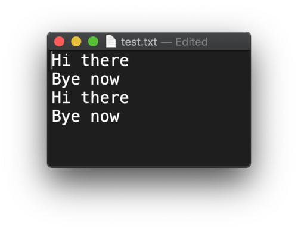

# File IO

Almost all applications work on external data – files, databases and internet resources.  
Here we will only have a look at files. 

## Path & Paths

These classes represent storage locations, not the files themselves. They are useful for quite a number of things. Here are a few.

```java
String fileName = "/Users/michiel/IdeaProjects/JavaIntroProgrammingAssignments/data/proteins.fa";

Path path = Paths.get(fileName);

System.out.println("path = " + path);
System.out.println("path.getParent() = " + path.getParent());
System.out.println("path.getRoot() = " + path.getRoot());
System.out.println("path.subpath(0,3) = " + path.subpath(0, 3));
System.out.println("path.getFileName() = " + path.getFileName());
//convert to File object
File file = path.toFile();
```

will output

```
path = /Users/michiel/IdeaProjects/JavaIntroProgrammingAssignments/data/proteins.fa
path.getParent() = /Users/michiel/IdeaProjects/JavaIntroProgrammingAssignments/data
path.getRoot() = /
path.subpath(0,3) = Users/michiel/IdeaProjects
path.getFileName() = proteins.fa
```

## File and Files

Class `Files` has typical utility methods:

```java
String fileName = "/Users/michiel/IdeaProjects/JavaIntroProgrammingAssignments/data/proteins.fa";

Path path = Paths.get(fileName);
System.out.println("Files.isReadable(path) = " + Files.isReadable(path));
System.out.println("Files.isDirectory(path) = " + Files.isDirectory(path));
try {
    Path copy = Paths.get("/Users/michiel/Desktop/test.fa");
    //delete if it already exists
    Files.deleteIfExists(copy);
    Files.copy(path, copy);
} catch (IOException e) {
    e.printStackTrace();
}
```

outputs this, and copies the file to my Desktop.

```
Files.isReadable(path) = true
Files.isDirectory(path) = false
Files.copy() = /Users/michiel/Desktop/test.fa
```

Class `File` represents the actual file on the storage system. Here is a standard workflow with reading and writing.

### Create
**_Create_** a file.

```java
if(! Files.exists(dataPath)) {
    try {
        Files.createFile(dataPath);
    } catch (IOException e) {
        e.printStackTrace();
    }
}
```

### Write
**_Write_** to file. Note the **_try-with-resources_** construct that was introduced in Java7.

```java
try (BufferedWriter writer = Files.newBufferedWriter(dataPath, StandardOpenOption.APPEND)) {
    writer.write("Hi there");
    writer.newLine();
    writer.write("Bye now");
    writer.newLine();
} catch (IOException e) {
    e.printStackTrace();
}
```

Note the `StandardOpenOption` argument. Besides `APPEND` you have these choices:

- **`APPEND`** If the file is opened for WRITE access then bytes will be written to the end of the file rather than the beginning.
- **`CREATE`** Create a new file if it does not exist.
- **`CREATE_NEW`** Create a new file, failing if the file already exists.
- **`READ`** Open for read access.
- **`WRITE`** Open for write access.

Running this code twice will generate this file contents:



For convenience, you can wrap the BufferedWriter into a `PrintWriter` instance. This gives you easier line writing and the possibility for string formatting:

```java
try (PrintWriter writer = new PrintWriter(Files.newBufferedWriter(dataPath, StandardOpenOption.APPEND))) {
    writer.println("I'm back!");
    writer.format("%s is mijn voornaam en %s mijn achternaam", "Michiel", "Noback");
    //Also nice:  class MessageFormat
    writer.println(MessageFormat.format("{0} is mijn voornaam en {1} mijn achternaam", "Jan", "Jansen"));
} catch (IOException e) {
    e.printStackTrace();
}
```

### Read

**_Reading_** data from file is a similar process:

```java
try(BufferedReader reader = Files.newBufferedReader(dataPath)) {
    String line;
    while ((line = reader.readLine()) != null) {
        System.out.println("line = " + line);
    }
} catch (IOException e) {
    e.printStackTrace();
}
```

## Parsing file content the easy way 

A thing that typically happens when reading data is to split the line into elements on some separator:

```java
//splits on spaces
String[] elements = line.split(" ")
```

In this example, this is the employee data we are going to process. 

<pre class="console_out">
Name	Age	Function	Salary*1000
JohnDoe	27	Programmer	23.67
JaneSmith	31	Manager	42.00
JoanDonnely	38	CEO	89.87
RoseBanner	18	secretary	11.78
</pre>

File `empl_data.csv` is a tab-separated file. Note the first line is a header and not real data.

Here is a typical use case for working with structured data. First, class `Employee`:

```java
package snippets.apis;

public class Employee {
    private String name;
    private int age;
    private double salary;

    public Employee(String name, int age, double salary) {
        this.name = name;
        this.age = age;
        this.salary = salary;
    }

    @Override
    public String toString() {
        return "Employee{" +
                "name='" + name + '\'' +
                ", age=" + age +
                ", salary=" + salary +
                '}';
    }
}
```

Next, parse Employee instances:

```java
private static List<Employee> parseEmployees() {
    String fileName = "/Users/michiel/IdeaProjects/JavaIntroProgrammingAssignments/data/empl_data.csv";
    Path path = Paths.get(fileName);
    List<Employee> employees = new ArrayList<>();
    try (BufferedReader br = Files.newBufferedReader(path)) {
        String line;
        int lineNumber = 0;

        while ((line = br.readLine()) != null) {
            lineNumber++;
            //skips first header line
            if (lineNumber == 1) continue;
            //split on tabs
            String[] elements = line.split("\t");
            String name = elements[0];
            //convert to int
            int age = Integer.parseInt(elements[1]);
            String function = elements[2];
            //convert to double
            double salary = Double.parseDouble(elements[3]) * 1000;

            Employee emp = new Employee(name, age, salary);
            employees.add(emp);
            System.out.println(emp);
        }
    } catch (IOException e) {
        e.printStackTrace();
    }
    return employees;
}
```

As stated before: this is very typical for the start of any data processing pipeline.

More advanced splitting is discussed in a next topic: regular expressions.

## Note on character sets

All these examples worked with the default characterset of Java, **_UTF-8_**. When other sets are required, these can be specified in the `Files.newBufferedReader()` and `Files.newBufferedWriter()` factory methods. See docs for details.

