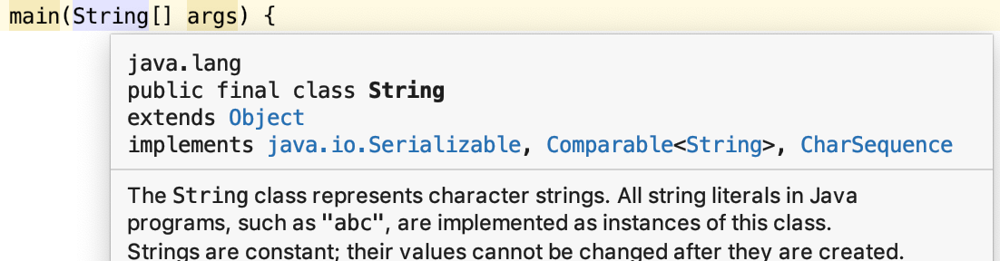
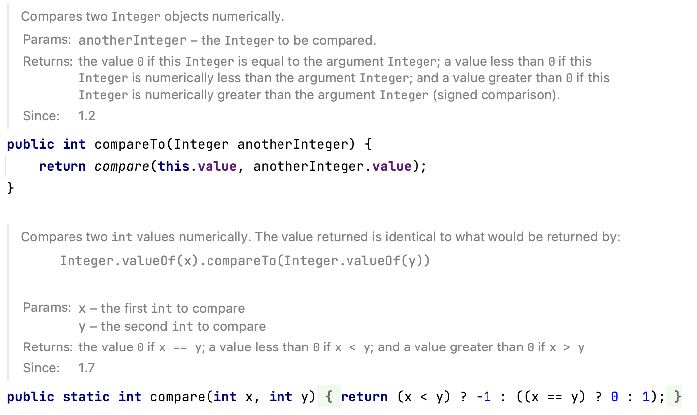
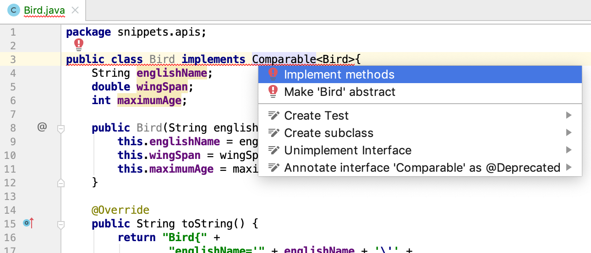

# Sorting

Sorting is one of the fundamental operations on data. You want the best student, the closest cafe, all players with a top 10% ranking...these all involve sorting.

Sorting in "classic" Java (not using the Functional Programming API) is done using the the `Collections.sort()` methods and, since Java 8, some methods in class List. These methods require either  

1. that the objects you want to sort implement the `Comparable` interface or  
2. that you provide a sorter object implementing the `Comparator` interface.  

:::{note}
Arrays of primitives (int, double, float, boolean etc.) or objects that implement `Comparable` (see below) can be sorted in-place using the `Arrays.sort()` and Arrays.parallelSort()` functions. Have a look at the docs; they will not be discussed here.  
:::

## "Natural" sorting with the `Comparable` interface

This is the first and main sorting strategy. Whenever the type in your collection implements the Comparable interface, it is said to have "natural ordering". This interface is described in detail below. Java classes such as String, Integer, and Double all implement the Comparable interface. In IntelliJ you can see this when you select a String variable declaration and press F1 (or \^Q):



You can see `Comparable<String>` in the `implements` declaration.

For Strings, natural order means alphabetic order and for numbers numeric order (from low to high). Using natural ordering can be achieved in two places (since Java 8): In the Collections class and in the List interface.

### Sorting using `Collections.sort()`

We'll start with the "classic" method of `Collections`.
Its signature is rather impressive, but fortunately using it is not.

```java
public static <T extends Comparable<? super T>> void sort(List<T> list)
```

This signature tells us a lot:

-   it is static, so it can be used directly on the `Collections` class
-   it has `void` as return type, so it sorts a list ***in place*** instead of returning a sorted copy.
-   it takes as argument a `List`, so it is applicable to all List-implementing classes such as `ArrayList`, `LinkedList` etc.
-   the elements of the list are of type `T` (a generic placeholder), where the constraint on type `T` is that it should implement the `Comparable` interface - more specifically: a `Comparable` comparing T or its supertypes.

Key here is the `Comparable` interface (package `java.util`):

``` java
package java.util;
public interface Comparable<T> {
    // This is the abstract method that you need to implement
    int compareTo(T other);
}
```

The contract is really simple. To be comparable to other objects of the same class, a class needs to implement the method `compareTo(T other)` where `T` is the class implementing the interface. The method signature of `compareTo()` states that it should receive an instance of `T` and return an integer indicating the sort order of the current object with respect to the other object. 

:::{admonition} The contract of Comparable
The convention for the return value of `int compareTo(T other)` is

-   a negative value if `this` &lt; `other`
-   zero if `this` equals `that`
-   a positive value if `this` &gt; `other`
:::

Many Java classes already implement this interface. For instance, here is the `Integer` implementation:



The `compareTo()` method itself delegates to static function `compare`, passing `this.value` and `anotherInteger.value` as arguments. The `compare()` method itself uses two nested ternary operators to figure out the return value.  

:::{tip}
Have a look at the String implementation of `compareTo()` yourself.  
You can use `Ctrl/Cmd + B` to go from method call to implementation.
:::

Thus, since String, Integer and other Java classes already implement this interface, you can sort them without any further work:

``` java
List<String> names = new ArrayList<>();
names.addAll(List.of("Jordan", "Wanda", "James", "rose", "Aaron"));
System.out.println("names before sort: " + names);
Collections.sort(names);
System.out.println("names after natural sort: " + names);
```

This will output

<pre class="console_out">
names before sort: [Jordan, Wanda, James, rose, Aaron]
names after natural sort: [Aaron, James, Jordan, Wanda, rose]
</pre>

As you can see, capitals come before lower case letters.

### Alternative: `list.sort()`
The exact same thing could have been achieved using the `sort()` method of class `List`, added in Java 8:

``` java
names.sort(Comparator.naturalOrder());
System.out.println("names after sort on List " + names);
```

The signature of this sort method is:

``` java
public void sort(@Nullable java.util.Comparator<? super E> c)
```

It takes a `Comparator` instance; this interface is described in the next section. Some common default Comparators have already been implemented, for natural (`Comparator.naturalOrder()`) and reverse order (`Comparator.reverseOrder()`) for use with classes that already implement Comparable. Note that the `@Nullable` in the above signature means that if `null` is passed, it defaults to `Comparator.naturalOrder()` An overloaded method would have been better design in my opinion, because this `names.sort(null);` is really ugly.

Here is the reverse ordering:

``` java
names.sort(Comparator.reverseOrder());
System.out.println("names after reverse sort " + names);
```

outputs

```html
<pre class="console_out">
names after reverse sort [rose, Wanda, Jordan, James, Aaron]
</pre>
```
Another interesting Comparator is the CASE_INSENSITIVE_ORDER comparator defined in the String class:

``` java
names.sort(String.CASE_INSENSITIVE_ORDER);
System.out.println("names case insensitive sort " + names);
```

outputs

```html
<pre class="console_out">
names case insensitive sort [Aaron, James, Jordan, rose, Wanda]
</pre>
```

:::{note}
The `Comparator` class provides many utility functions that serve Comparator implementations:

```{image} figures/Comparator_factories.png
:alt: Comparator factory methods
:width: 600px
:align: center
```

Have a look at the docs for details.
:::

### Custom comparable implementations

Let's create our own implementation of the Comparable interface in a custom class and demonstrate its use.

Here is a Bird **_record_** (see previous chapter).

```java
package snippets.apis;

public record Bird(String englishName, double wingSpan, int maximumAge) {
}

```

The first thing you need to figure out when implementing sorting is ***what is the natural sort order of this class?*** This depends entirely on you application: which aspect of your class will be used primarily for sorting. In this case, I choose the `wingSpan` property.

Next, these steps should be taken:

1.  Declare your class as implementer of the `Comparable` contract
2.  Create the method stub.
3.  Implement the logic

Step 2 is done by IntelliJ once you've done 1 and selected te context menu (`alt + enter`):



Select the `compareTo()`` method and press enter. This is the result.

```java
@Override
public int compareTo(Bird other) {
    return 0;
}
```

This compiles just fine, but logic is missing. The next snipped solves that.

``` java
@Override
public int compareTo(Bird other) {
    //declare named variables for readability
    final int BEFORE = -1;
    final int EQUAL = 0;
    final int AFTER = 1;
    //compare
    if(this.wingSpan <= other.wingSpan) return BEFORE;
    else if (this.wingSpan >= other.wingSpan) return AFTER;
    else return EQUAL;
}
```

Time for a test drive. The toString method was adjusted for readability and compactness. Also, a Java8+ feature (Streams API) was used for printing (not part of this courses' material).

``` java
List<Bird> birds = new ArrayList<>();

birds.add(new Bird("Buzzard", 1.3, 29));
birds.add(new Bird("Griffon vulture", 2.6, 25));
birds.add(new Bird("Kestrel", 0.35, 15));
birds.add(new Bird("Red kite", 1.8, 23));
birds.add(new Bird("Steppe eagle", 2.1, 41));

System.out.println("Before:");
//prints addition order using Java8 streams
birds.stream().forEach(bird -> System.out.println("\t" + bird));
Collections.sort(birds);
System.out.println("After sort on wingspan:");
//prints sort order on wingspan, ascending
birds.stream().forEach(bird -> System.out.println("\t" + bird));
```

outputs

<pre class="console_out">
Before:
    Buzzard', ws=1.3, max.age=29
    Griffon vulture', ws=2.5, max.age=25
    Kestrel', ws=0.35, max.age=15
    White-tailed eagle', ws=2.5, max.age=25
    Red kite', ws=1.8, max.age=23
    Steppe eagle', ws=2.1, max.age=41
After sort on wingspan:
    Kestrel', ws=0.35, max.age=15
    Buzzard', ws=1.3, max.age=29
    Red kite', ws=1.8, max.age=23
    Steppe eagle', ws=2.1, max.age=41
    Griffon vulture', ws=2.5, max.age=25
    White-tailed eagle', ws=2.5, max.age=25
</pre>

Note the ascending order of wingspan. What if the natural order is descending in your opinion? Simply reverse the sort logic:

``` java
@Override
public int compareTo(Bird other) {
    final int BEFORE = -1;
    final int EQUAL = 0;
    final int AFTER = 1;
    if(this.wingSpan <= other.wingSpan) return AFTER;
    else if (this.wingSpan >= other.wingSpan) return BEFORE;
    else return EQUAL;
}
```

outputs

```html
<pre class="console_out">
After:
    Griffon vulture', ws=2.6, max.age=25
    Steppe eagle', ws=2.1, max.age=41
    Red kite', ws=1.8, max.age=23
    Buzzard', ws=1.3, max.age=29
    Kestrel', ws=0.35, max.age=15
</pre>
```

:::{admonition} Delegate if you can
Although this logic is just fine, it is often better to use classes that are dedicated to dealing with the datatype and ***delegate*** to their implemented and tested methods:

``` java
@Override
public int compareTo(Bird other) {
    //delegate to class double
    return Double.compare(this.wingSpan, other.wingSpan);
}
```
:::

## Sorting using a custom `Comparator`

What if you want to sort in other ways as well, or if you do not want to settle on a natural sort order? Then there is the second form of the `Collections.sort()` method, also supported by the `List.sort()` method since Java 8:

```java
public static <T> void sort(List<T> list, Comparator<? super T> c)
```

or

```java
public void sort(@Nullable Comparator<? super E> comparator)
```

The `Comparator` interface has a single abstract method:

``` java
package java.util

public interface Comparator<T> {
    int compare(T one, T two);
}
```

Let's start with the most straightforward implementation.

``` java
package snippets.apis;
import java.util.Comparator;

public class BirdNameComparator implements Comparator<Bird> {
    @Override
    public int compare(Bird first, Bird second) {
        return first.englishName().compareTo(second.englishName());
    }
}
```

This one sorts on name, and again delegates to the type of the instance variable - class String. This is its usage.

``` java
Collections.sort(birds, new BirdNameComparator());

//or, the Java8+ way
birds.sort(new BirdNameComparator())
```

Implementations of the Comparator interface are often created on-the-fly. For instance, look at this ***anonymous inner class***.

``` java
Collections.sort(birds, new Comparator<Bird>(){
    @Override
    public int compare(Bird first, Bird second) {
        return Integer.compare(first.maximumAge, second.maximumAge);
    }
});
```

Actually, since Java 8, sorting has become much versatile, but you need to climb the learning curve of lambdas first:

``` java
//Java8+ alternative: OK
Collections.sort(birds, (birdOne, birdTwo) -> Integer.compare(birdOne.maximumAge(), birdTwo.maximumAge()));

//Java8+ alternative: better
Collections.sort(birds, Comparator.comparingInt(bird -> bird.maximumAge()));

//Java8+ alternative: best
Collections.sort(birds, Comparator.comparingInt(Bird::maximumAge));
```

:::{note}
Lambdas are discussed in the chapter {doc}`/03_apis/functional_programming_first`.
:::

## Multilevel sorting

You have seen how to code simple comparison logic. But what if you want to sort on multiple properties? Suppose, in the case of the birds example, we wanted to sort on wingspan first and then on name. No matter how many properties, the pattern is always the same: check the primary property, return this if they are not equal. If they are equal, check on the secondary property:

``` java
@Override
public int compareTo(Bird other) {
    // primary property
    int compareWingSpan = Double.compare(this.wingSpan, other.wingSpan);
    
    if (compareWingSpan == 0) {
        // primary property is the same; check secondary property
        return this.englishName.compareTo(other.englishName);
    }
    return compareWingSpan;
}
```

Note that with alphabetical sorting capitals come before lower case letters. This is because the numeric values of the table of ASCII codes are used:


