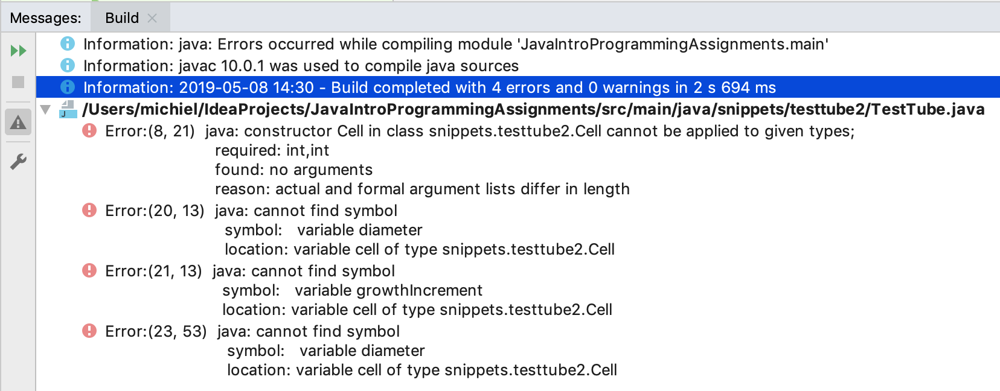
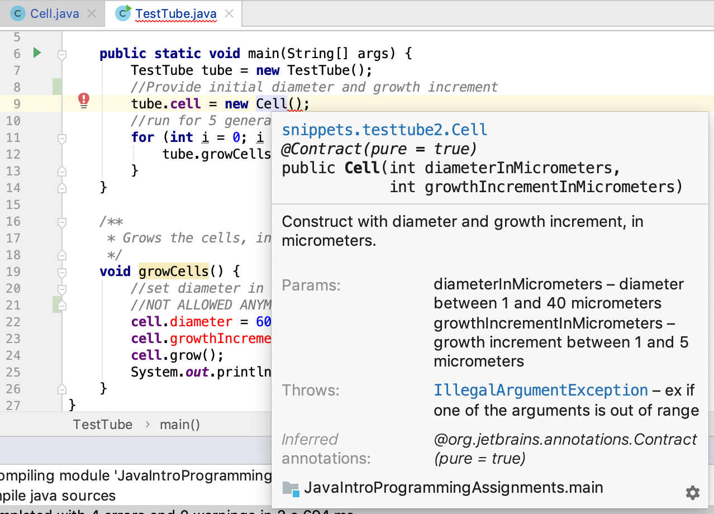

# Encapsulation

So far, we have not dealt with the concept of **_data hiding_** which actually is a pivotal aspect of object-oriented programming. This concept will be illustrated here, starting with the `Cell` class from **Part one** (see {doc}`/01_getting_started/objects_and_classes`). I modified it a bit for demonstration purposes. All access modifiers were removed and a check was introduced, so that the program crashes when a Cell grows too big.

```java
package snippets.testtube2;

public class Cell {
    //diameter in micrometers
    int diameter = 5;
    int growthIncrement = 1;

    /**
     * Lets this cell grow in a single increment
     */
    void grow() {
        //grow by 1 micrometer
        this.diameter += growthIncrement;

        //we can grow many cycles safely before resources run out
        if (this.diameter > 1000) throw new Error("TestTube will explode in 5 seconds");
    }
}
```

So, the logic of this cell is based on the assumption that it starts growing at size 5 with an increment of 1 at each cycle. Nothing funny going on.

Now here is a simple version of class `TestTube`.

```java
package snippets.testtube2;

class TestTube {
    Cell cell;

    public static void main(String[] args) {
        TestTube tube = new TestTube();
        tube.cell = new Cell();
        //run for 5 generations
        for (int i = 0; i < 5; i++) {
            tube.growCells();
        }
    }

    /**
     * Grows the cells, in one single iteration.
     */
    void growCells() {
        //set diameter in nanometers
        cell.diameter = 6000;
        cell.growthIncrement = 750;
        cell.grow();
        System.out.println("cell diameter = " + cell.diameter);
    }
}
```

which outputs 

<pre class="console_out">
Exception in thread "main" java.lang.Error: TestTube will explode in 5 seconds
	at snippets.testtube2.Cell.grow(Cell.java:14)
	at snippets.testtube2.TestTube.growCells(TestTube.java:22)
	at snippets.testtube2.TestTube.main(TestTube.java:11)
</pre>

The TestTube developer was working with nanometer units while the Cell developer was working with micrometer units. The result is a crashing application (or Mars orbiter). 

Besides this big problem, when another class tries to run the `growCells()` method on a TestTube instance, it will get a `NullPointerException`. Can you figure out why?

:::{warning}
**_We need a way to protect the inner state of objects_**
:::

Java has a heap of techniques for preventing illegal access or modification to your instance variables (and methods). These techniques start with the use of **_access modifiers_**.

Let's improve and secure this `Cell` and `TestTube` and keep access open only to that which needs to be publicly accessible.

Here is a new and improved Cell class:

```java
package snippets.testtube2;

public class Cell {
    private int diameterInMicrometers = 5;
    private final int growthIncrementInMicrometers;

    /**
     * Construct with diameter and growth increment, in micrometers.
     *
     * @param diameterInMicrometers diameter between 1 and 40 micrometers
     * @param growthIncrementInMicrometers growth increment between 1 and 5 micrometers
     * @throws IllegalArgumentException ex if one of the arguments is out of range
     */
     public Cell(int diameterInMicrometers, int growthIncrementInMicrometers) {
        if (diameterInMicrometers < 1
            || diameterInMicrometers > 41
            || growthIncrementInMicrometers < 1
            || growthIncrementInMicrometers > 6
        ) {
            throw new IllegalArgumentException("Cell size must start between 0 and 40 " +
                    "and growth increment between 0 and 5");
        }
        this.diameterInMicrometers = diameterInMicrometers;
        //growth increment can never be changed after construction
        this.growthIncrementInMicrometers = growthIncrementInMicrometers;
    }

    /**
     * Serves the read-only property diameter.
     * @return
     */
    public int getDiameterInMicrometers() {
        return diameterInMicrometers;
    }

    /**
     * Grows this cell in a single increment, increasing its size with one time
     * the growth increment.
     * 
     */
    public void grow() {
        this.diameterInMicrometers += growthIncrementInMicrometers;
        if (this.diameterInMicrometers > 1000) throw new Error("TestTube will explode in 5 seconds");
    }
}
```

Quite a lot has changed:
1. All instance variables have been marked **`private`** which means only code inside class Cell can access them. 
2. Variables have been renamed to be more reflective of what they represent.
3. A Constructor was added to provide a single point of initialization to both variables, at construction time. 
4. The constructor performs a check on its parameters so that illegal arguments are caught early.
5. Javadoc was added to explain the public API.
6. A single _getter_ was introduced for property diameter, making it a **_read-only property_**. 
7. No getter was created for property `growthIncrementInMicrometers` because it was decided by the developer (me) that it should only be set once during the life cycle of a Cell object. For that reason, instance variable `growthIncrementInMicrometers` was marked **_final_**.

One setback of this whole procedure: class `TestTube` will not compile anymore because (a) it attempts to access the `private` members of class Cell and (b) because there is no **_no-arg constructor_** anymore:



Since Javadoc was added to class Cell, we can get additional information in IntelliJ by pressing `ctrl + Q` (Linux), `ctrl + J` (Mac), or `F1`when the cursor is on the Constructor:



Let's solve the compilation problems, make `TestTube` safe, add multi-cell support, and move the `main()` function to the Simulator class.

```java
package snippets.testtube2;

import java.util.ArrayList;
import java.util.List;

public class TestTube {
    private final int numberOfLifeCyclesToRun;
    private final int initialCellCount;
    private List<Cell> cells = new ArrayList<>();
    private int defaultCellDiameter = 20;
    private int defaultSizeIncrement = 2;

    /**
     * Constructs with the two essential parameters
     * @param numberOfLifeCyclesToRun a number between 1 and 100
     * @param initialCellCount a number between 1 and 1000
     * @return testtube a TestTube instance
     */
    public TestTube (int numberOfLifeCyclesToRun, int initialCellCount) {
        if (numberOfLifeCyclesToRun < 1
                || numberOfLifeCyclesToRun > 100
                || initialCellCount < 1
                || initialCellCount > 1000) {
            throw new IllegalArgumentException("Number of life cycles should be between 1 and 100 and initial cell " +
                    "count between 1 and 1000");
        }
        this.numberOfLifeCyclesToRun = numberOfLifeCyclesToRun;
        this.initialCellCount = initialCellCount;
    }

    /**
     * sets the initial diameter of instantiated cells.
     * @param defaultCellDiameter
     */
    public void setDefaultCellDiameter(int defaultCellDiameter) {
        this.defaultCellDiameter = defaultCellDiameter;
    }

    /**
     * Sets the size increment for cell growth
     * @param defaultSizeIncrement
     */
    public void setDefaultSizeIncrement(int defaultSizeIncrement) {
        this.defaultSizeIncrement = defaultSizeIncrement;
    }

    /**
     * starts the growth process
     */
    public void start() {
        initializeCells();
        runLifeCycles();
    }

    private void runLifeCycles() {
        for (int i = 0; i < this.numberOfLifeCyclesToRun; i++) {
            growCells();
        }
    }

    private void initializeCells() {
        for (int i = 0; i < this.initialCellCount; i++) {
            cells.add(new Cell(this.defaultCellDiameter, this.defaultSizeIncrement));
        }
    }

    private void growCells() {
        for (Cell cell : this.cells) {
            cell.grow();
        }
        // This is also possible:
        // this.cells.forEach(c -> c.grow());
        // or
        // this.cells.forEach(Cell::grow);
        // see chapter on Functional Programming
    }
}

```

Yes, the class file became substantially larger - one of the setbacks of safe design.

There are several noteworthy changes here:

1. All instance variables are `private`. Note a pattern here?
2. Two public setters were provided (making `defaultCellDiameter` and  `defaultSizeIncrement` **_write-only_**), a public constructor and one public API method that will start the testtube: `start()`
3. All functionality is divided into very small methods with a very clear (and testable) responsibility. This is the **_Single Responsibility Principle_** at work. 

:::{admonition} SRP
The Single Responsibility Principle (SRP) states that all code elements (methods and classes) should only have a single purpose (or, more formal, a single reason to change).
:::

Finally, here is the **_controller_** class `CellGrowthSimulator`. Its sole purpose is now to start the simulation process.

```java
package snippets.testtube2;

/**
 * "Controller" class
 */
public class CellGrowthSimulator {
    public static void main(String[] args) {
        startSimulation();
    }

    private static void startSimulation() {
        TestTube testTube = new TestTube(10, 5);
        testTube.setDefaultCellDiameter(10);
        testTube.start();
    }
}
```

## Summary

This post has introduced a fundamental concept of Object-Oriented Programming and design: **_encapsulation_**; hiding the inner workings of a class, mostly through the use of the private keyword and usage of getters and setters. It has also shown a first view of **_abstraction_** in class TestTube: this class has a single simple public API method (`start()`) and has hidden all the complexities of its simulation algorithm in _private_ methods. 

You have seen two access modifiers; there are two more that are dealt with in the next chapter.

Also, there is another chapter ({doc}`/04_oop/encapsulation_revisited`) covering some more advanced aspects of encapsulation.
