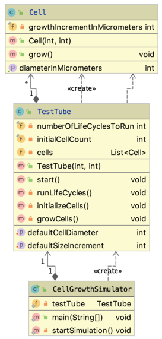
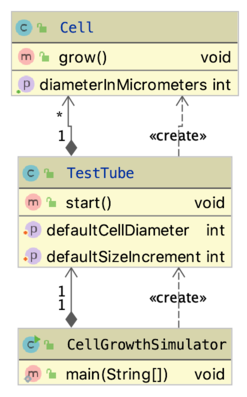
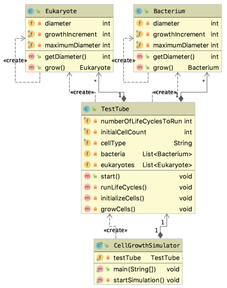
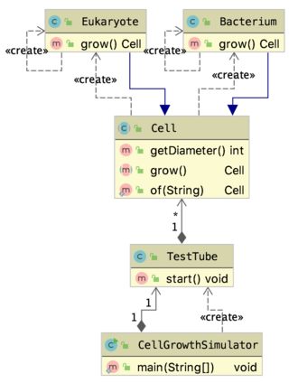

# Inheritance (and a bit of UML)

In this chapter, the concept of inheritance will be revisited and expanded. Since this is a good place for it, a visualization standard called UML (Unified Modelling Language) is also introduced.

## The TestTube with cells

Here is the TestTube at the end of this post {doc}`/04_oop/encapsulation`). Instead of showing code, a UML diagram is displayed.



You can generate such a thing yourself in IntelliJ by selecting the source files you want to visualize &rarr; right-click &rarr; Diagrams &rarr; Show Diagram.

The diagram above shows everything: fields, methods, constructors, with any access level. Using the Diagrams menu (and general settings - see the [doc](https://www.jetbrains.com/help/idea/class-diagram.html)) you can filter what you want to show. Here are the same classes with only the public fields shown, and no constructors:



So, what does this tell us? Class `CellGrowthSimulator` has a singular field of type `TestTube` and creates the instance itself. Class `TestTube` has 1 to many instances of `Cell` (held in a `List<Cell>`), and instantiates them itself. These **_HAS_A_** relations (class A has an instance of class B) are depicted with the arrow-with-diamond connector.

### New specs: different types of cells 

So here comes your boss and tells you  

_"...but how about het difference between bacteria and eukaryotic cells??
They are of way different size and grow at different speeds.  
I WANT TO GROW MANY TYPES OF CELLS IN MY TEST TUBE!!  
And didn't I tell you? They should be able to divide as well."_

You start thinking about the new specs. 
- When to divide? 
- Who controls division: 
	- TestTube or the cell itself? 
- How does this relate to growing?
- The different cell types is easy! Just give every type its own class

As an expert on the subject, you decide that the cells and not the test tube should know when to divide; in fact, they should be solely responsible for their size and increment (not the testtube). Division is depending on the cell size: when a certain size is reached, it is time to divide.

Here is the new design. Note that I simplified the names again and removed comments for conciseness' sake.

### class `Bacterium` 

```java
package snippets.testtube3;

public class Bacterium {
    private int diameter = 10;
    private static final int growthIncrement = 1;
    private static final int maximumDiameter = 30;

    public int getDiameter() {
        return diameter;
    }

    public Bacterium grow() {
        this.diameter += growthIncrement;
        if (this.diameter > maximumDiameter) {
            return new Bacterium();
        } else {
            return null;
        }
    }
}
```

### class `Eukaryote` 

```java
package snippets.testtube3;

public class Eukaryote {
    private int diameter = 20;
    private static final int growthIncrement = 3;
    private static final int maximumDiameter = 80;

    public int getDiameter() {
        return diameter;
    }

    public Eukaryote grow() {
        this.diameter += growthIncrement;
        if (this.diameter > maximumDiameter) {
            return new Eukaryote();
        } else {
            return null;
        }
    }
}
```

See how similar it is to class `Bacterium`?


### class `TestTube` 


```java
package snippets.testtube3;

import java.util.ArrayList;
import java.util.List;

public class TestTube {
    private final int numberOfLifeCyclesToRun;
    private final int initialCellCount;
    private final String cellType;
    private List<Bacterium> bacteria = new ArrayList<>();
    private List<Eukaryote> eukaryotes = new ArrayList<>();

    public TestTube (int numberOfLifeCyclesToRun, int initialCellCount, String cellType) {
        //check code omitted
        this.numberOfLifeCyclesToRun = numberOfLifeCyclesToRun;
        this.initialCellCount = initialCellCount;
        this.cellType = cellType;
    }

    public void start() {
        initializeCells();
        runLifeCycles();
    }

    private void runLifeCycles() {
        for (int i = 0; i < this.numberOfLifeCyclesToRun; i++) {
            growCells();
        }
    }

    private void initializeCells() {
        for (int i = 0; i < this.initialCellCount; i++) {
            if (this.cellType.equals("Bacteria")) {
                bacteria.add(new Bacterium());
            }
            else if (this.cellType.equals("Eukarya")) {
                eukaryotes.add(new Eukaryote());
            }
            //room for more cell types
        }
    }

    private void growCells() {
        if (this.cellType.equals("Bacteria")) {
            for (Bacterium bacterium : this.bacteria) {
                bacterium.grow();
            }
        }
        else if (this.cellType.equals("Eukarya")) {
            for (Eukaryote eukaryote : this.eukaryotes) {
                eukaryote.grow();
            }
        }
        //room for more cell types
    }
}
```

See how much duplicated code there is in class `TestTube`, and repeated use of same `if/else` blocks? 

Here is the UML of this situation (private fields included). It shows the duplication clearly as well.



Repeated code and similar `if/else` algorithm logic are typical signs of **_smelly code_** that can be solved using some Object Oriented design techniques, in this case inheritance.

## Apply inheritance to model what is common

Inheritance can be used when there is a **_IS-A_** relationship: when it can be said that class A IS-A class B. For example, Apple IS-A Fruit and Pear IS-A Fruit (but not Pear IS-A Apple!). In this case, the IS-A relation ship can be defined as "Bacterium IS-A Cell" and "Eukaryote IS-A Cell".

Once this prerequisite for inheritance is established, the common superclass should be created and all common code from the subclasses moved to it.

Class Cell can clearly hold the `diameter`, the `growthIncrement` and the `maximumDiameter` fields, even though they will be different between the subclasses. Class Cell can also publish the `growCells()` method, even though they will be implemented differently in the subclasses. Key here is that _all subclasses will be able to grow_. When you know the functionality should be there, but don't know how, your should make it **_abstract_**. As a consequence, your class needs to be abstract as well. Let's review this with class `Cell`.

```java
package snippets.testtube3;

public abstract class Cell {
    //no decent defaults possible at level of class Cell,
    //but we know this field is relevant
    private int diameter;

    public Cell(int initialDiameter) {
        this.diameter = initialDiameter;
    }

    public int getDiameter() {
        return diameter;
    }

    protected void setDiameter(int newDiameter) {
        this.diameter = newDiameter;
    }

    public abstract Cell grow();
}
```

Note that both the class declaration and the method `grow()` have been marked `abstract`. 

:::{admonition} Being abstract
- An abstract method has no method body, only a signature the same as with interfaces. 
- An abstract class cannot be instantiated.  
:::


Therefore, this statement `Cell cell = new Cell(12)` will not compile because Cell is now abstract.

The next step is declaring your subclasses to `extend` the superclass (only Bacterium shown here):

```java
package snippets.testtube3;

public class Bacterium extends Cell{
    private static int bacterialInitialDiameter = 10;
    private static final int growthIncrement = 1;
    private static final int maximumDiameter = 30;

    public Bacterium() {
        super(bacterialInitialDiameter);
    }

    @Override
    public Cell grow() {
        setDiameter(getDiameter() + growthIncrement);
        if (getDiameter() > maximumDiameter) {
            return new Bacterium();
        } else {
            return null;
        }
    }
}
```

Class `Bacterium` is required to implement a constructor serving an initial size to the class Cell constructor. It has no diameter property anymore, and no getter for it. It has implemented the `grow()` method, and because of that is is not abstract and can be instantiated. Note that, although the  method signature is `public Cell grow()`, it returns a `Bacterium` instance. This is a typical example of **_polymorphism_**.

You may notice that the _static_ variables `growthIncrement` and `maximumDiameter` will be specified in all subclasses and could be specified once (in class Cell). This is true, and several solutions exist for static fields, but focus here lies on different aspects.

You may also notice there is not much won with respect to amount of code. That is correct, but in this case the improvement lies in class `TestTube`:

```java
package snippets.testtube3;

import java.util.ArrayList;
import java.util.List;

public class TestTube {
    private final int numberOfLifeCyclesToRun;
    private final int initialCellCount;
    private final String cellType;
    private List<Cell> cells = new ArrayList<>();

    /**
     * Constructs with the two essential parameters
     * @param numberOfLifeCyclesToRun a number between 1 and 100
     * @param initialCellCount a number between 1 and 1000
     * @param cellType the cell type ["
     * @return testtube a TestTube instance
     */
    public TestTube (int numberOfLifeCyclesToRun, int initialCellCount, String cellType) {
        //check code omitted
        this.numberOfLifeCyclesToRun = numberOfLifeCyclesToRun;
        this.initialCellCount = initialCellCount;
        this.cellType = cellType;
    }

    /**
     * starts the growth process
     */
    public void start() {
        initializeCells();
        runLifeCycles();
    }

    private void runLifeCycles() {
        for (int i = 1; i <= this.numberOfLifeCyclesToRun; i++) {
            growCells();
            if (i % 10 == 0) System.out.println("Grow cycle " + i + " finished; " + cells.size() + " cells present");
        }
    }

    private void initializeCells() {
        for (int i = 0; i < this.initialCellCount; i++) {
            if (this.cellType.equals("Bacteria")) {
                cells.add(new Bacterium());
            }
            else if (this.cellType.equals("Eukarya")) {
                cells.add(new Eukaryote());
            } else {
                throw new IllegalArgumentException("Unknown cell type: " + cellType);
            }
            //room for more cell types - yes this can be improved as well
        }
    }

    private void growCells() {
        //I have no clue what is growing here and don't care
        //enhanced for loop will cause a ConcurrentModificationException
        for (int i = 0; i < cells.size(); i++) {
            Cell cell = cells.get(i);
            Cell child = cell.grow();
            if (child != null) cells.add(child);
        }
    }
}
```

You can see the cell growing logic has been completely decoupled from the actual cells that are being grown. Both `grow()` methods in the subclasses have specific signatures with respect to the return type (`Bacterium`, `Eukaryote`), but still adhere to the superclass contract (otherwise `@Override` would have instigated a compiler error).

For completeness, here is the simulator class, and some output:

```java
package snippets.testtube3;

public class CellGrowthSimulator {
    private static TestTube testTube;

    public static void main(String[] args) {
        startSimulation();
    }

    private static void startSimulation() {
        testTube = new TestTube(100,5, "Bacteria");
        testTube.start();
    }
}
```

outputs

<pre class="console_out">
Grow cycle 10 finished; 5 cells present
Grow cycle 20 finished; 5 cells present
Grow cycle 30 finished; 55 cells present
Grow cycle 40 finished; 105 cells present
Grow cycle 50 finished; 430 cells present
Grow cycle 60 finished; 1255 cells present
Grow cycle 70 finished; 3680 cells present
Grow cycle 80 finished; 12105 cells present
Grow cycle 90 finished; 35105 cells present
Grow cycle 100 finished; 111230 cells present
</pre>

Finally, there is some logic that should be moved for good design. The Cell creation logic should be put in a  **_static factory method_** inside class `Cell` to abstract away the cell creation logic and put it in one place for the entire application:

```java
public static Cell of(String type) {
    switch (type) {
        case "Bacteria": return new Bacterium();
        case "Eukarya": return new Eukaryote();
        default: throw new IllegalArgumentException("Unknown cell type: " + type);
    }
}
```

and class `TestTube becomes even less aware of whet is being grown:

```java
private void initializeCells() {
    for (int i = 0; i < this.initialCellCount; i++) {
        cells.add(Cell.of(cellType));
    }
}
```


Here is the final UML. 



This also shows that actual cell types are hidden behind the abstract Cell class. The subtype constructors could even have been marked `protected` or `<default>` to emphasize this.

This is the power of polymorphism implemented with inheritance!

**_Polymorphism_** allows one type to express some sort of contract, and for other types to implement that contract (often through class inheritance) in different ways. Code using that contract should not have to care about which implementation is involved, only that the contract is obeyed.

### Use a type cast when you need the specific type 

You have seen it is often best to code against generic types, like in this block:

```java
    private void growCells() {
        for (int i = 0; i < cells.size(); i++) {
            Cell cell = cells.get(i);
            Cell child = cell.grow();
            if (child != null) cells.add(child);
        }
    }
```

But what if you have the need for specific functionality? For instance, you have a `WhiteBloodCell` which can also `eatOtherCell(Cell cell)`:

```java
package snippets.testtube3;

public class WhiteBloodCell extends Eukaryote {
    public WhiteBloodCell() {
        super();
    }

    public void eatOtherCell(Cell cell) {
        System.out.println("White blood cell, eating other cell");
        //cell eating logic
    }
}
```

Note that this class extends `Eukaryote` and thereby inherits the `grow()` method. Now if you want to do something specifically white-blood-cellish, perform a type-test-and-cast:

```java
    private void growCells() {
        for (int i = 0; i < cells.size(); i++) {
            Cell cell = cells.get(i);
            Cell child = cell.grow();
            if (child != null) cells.add(child);
            //test and cast
            if (cell instanceof WhiteBloodCell) {
                WhiteBloodCell wbc = (WhiteBloodCell)cell;
                wbc.eatOtherCell(child);
            }
        }
    }
```

:::{note}
Objects never change type, only the reference to them may change.
:::