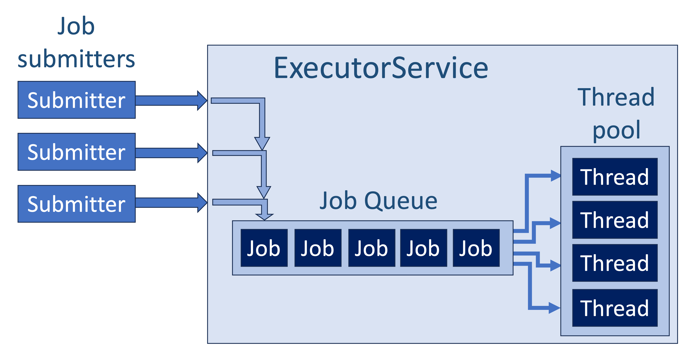
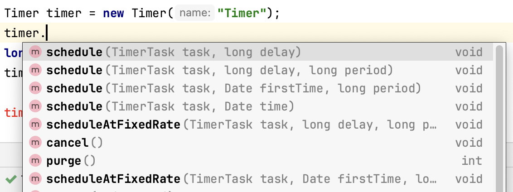

# The Java concurrency API

The `java.util.concurrent` package provides utility classes build on top of the basic classes 'Thread' and 'Runnable' that help you create concurrent applications.  

An important aspect is balancing the number of Threads that you process spawns. Too many threads will deplete resources.
The `java.util.concurrent` package helps you manage Threads in a intelligent manner.

Instead of directly spawning threads, you use `ExecutorService`.


:::{note}
All examples in this chapter use lambda versions of interface implementers (usually Runnable), so this

```java
() -> System.out.println("Hello World")
```

is exactly the same as this solution with an anonymous inner class

```java 
executor.execute(new Runnable() {
    @Override
    public void run() {
        System.out.println("Hello World");
    }
});
```
:::

## Single thread

To get a single managed Thread, as in the firs example of the previous chapter, you use this.

```java
Executor executor = Executors.newSingleThreadExecutor();
executor.execute(() -> System.out.println("I am an Executor"));
```

There is no instantiation of a Thread instance here; this is delegated to the `Executors` class.

## Thread pool

When you have many jobs to execute you should use a **_thread pool_**, to be obtained using the `Executors` class.

```java
//manage a thread pool of 10 Thread instances
ExecutorService executorService = Executors.newFixedThreadPool(10);
//submit to the queue and get a promised result -- a Future.
Future<String> future = executorService.submit(() -> "Executor at work");

System.out.println("doing other stuff");

try {
    String result = future.get();
    System.out.println("result = " + result);
} catch (InterruptedException | ExecutionException e) {
    throw new RuntimeException(e);
}
```

The thread pool is managed in the ExecutorService. You submit jobs to this service to be placed in a job queue. This is a FIFO queue which means First In First Out. Just like a queue at the train station entrance (if everybody plays nice). See below.  



In this setup, the ExecutorService manages both the job queue and the thread pool. Whenever a Thread is freed by a job that is finished, the executor service starts a new job on that thread, as long as there are jobs. The job submitters do not necessarily have to be the same object or even the same class.

The output of a Job is something called a Future, in Javascript this is called a Promise. It is exactly that -- the promise of a result that is not there yet, but will be in the future, when the job has finished.

The `Future` class has several helpful methods for setting up your workflow:

```java
    void future() throws InterruptedException, ExecutionException {
        ExecutorService executorService = Executors.newFixedThreadPool(10);
        Future<String> future = executorService.submit(() -> "Executor at work");

        while(!future.isDone()) {
            System.out.println("Job is running...");
            Thread.sleep(300);
        }
        String result = future.get();
    }
```
Note that this will hold the finishing of method `future()` as long as its job runs.
There is an alternative for this setup, using the `timeout` option.

```java
    void future() throws InterruptedException, ExecutionException {
        ExecutorService executorService = Executors.newFixedThreadPool(10);
        Future<String> future = executorService.submit(() -> "Executor at work");

        String result = future.get(60, TimeUnit.SECONDS);
    }
```

In this case, the method will throw an `TimeoutException` if the job does not finish within one minute.

An alternative to working with Future objects is to implement the Observer pattern (see section Design Patterns).

There are alternatives for ExecutorService where you can set start intervals and delays; see the Further Reading section.

## Timer task

`Timer` is a class that can be used to schedule jobs for future execution in a background thread.
These jobs, passed as `TimerTask` instances, may be scheduled for one-time execution, or for repeated execution at regular intervals.

Here is an example.

```java
TimerTask task = new TimerTask() {
    public void run() {
        //The job you want to execute
        System.out.println("Job executed: " + new Date() 
        + "\nThread's name: " + Thread.currentThread().getName());
    }
};
Timer timer = new Timer("Timer");
long delay = 1000L;
timer.schedule(task, delay);
```

TimerTask has several convenient overloaded methods:



## Further reading  

The [Baeldung concurrency](https://www.baeldung.com/java-concurrency) page has excellent in-depth discussion of all the components in the concurrent package.
