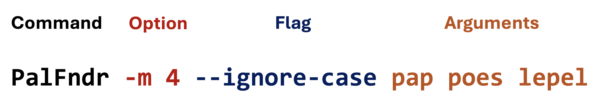

# Command-line processing

## What is the commandline interface?

The Command Line Interface (CLI) is an editing environment that is text-based.  
It uses text 'commands' to interact with the operating system and perform numerous operations.

Usually, commands can be executed and their mode of action "adjusted" using **_options_** (**_flags_**) and **_parameters_**.

For instance, if we want to create a Palindrome finder app, we would like to run it with the possibilities outlined below.



So, we have these four basic elements in a command:

- **the command** or executable. The program that you want to run. All that comes after is meant to adjust the way the program executes, or to pass it data to work on.
- **options**. These are also called named arguments. 
They are usually passed with a single letter prefixed with a dash (`-m`) or a word prefixed with two dashes (`--min`). 
These are conventions only, not strict rules. After the option comes a space and then the option value (`-m 4`)
- **flags**. These are similar to options, with the difference they are not followed by a value. In this example `--ignore-case` says to look for palindromes ignoring the case of characters.
- **parameters**. These usually come last. They have no `option=` prefix. They are simply values passed positionally. In this case, they are the words that need to be checked for being a palindrome.

Besides these conventions, we would like to get a help "page" to appear when we run a command with `-h` or `--help`. Something like this:

<pre class="console_out">
~$ java -jar PalindromeFinder.jar --help

Usage: PalindromeFinder [-hiV] [-f=&lt;filename&gt;] -m=&lt;minimumLength&gt; [WORD...]
      [WORD...]           Words to check for palindromicity
  -f, --file=&lt;filename&gt;   Input file with words
  -h, --help              Show this help message and exit.
  -i, --ignore-case       Ignore case when checking for palindromes
  -m, --min=&lt;minimumLength&gt;
                          Minimum length of palindrome
  -V, --version           Print version information and exit.
</pre>


## PicoCLI

Now, let's build an app just like this. There are quite a few command line argument parsers out there. 
For this tutorial, we have chosen the [PicoCLI](https://picocli.info/) tool. This is quite easy to master, and has the advantage that the options are directly linked to you instance variables by means of annotations.

First, you need to specify the dependency on this library in the `dependencies` section of the `build.gradle` file:

```groovy
dependencies {
    implementation 'info.picocli:picocli:4.7.5'
    //more dependencies
}
```

So, let's dive right into the PalindromeFinder app code. 

```java
package nl.bioinf;

import picocli.CommandLine;
import picocli.CommandLine.Command;
import picocli.CommandLine.Option;
import picocli.CommandLine.Parameters;

import java.util.Arrays;


@Command(name = "PalindromeFinder", version = "PalindromeFinder 0.0.1", mixinStandardHelpOptions = true)
public class PalindromeFinder implements Runnable {
    @Option(names = {"-m", "--min"},
            description = "Minimum length of palindrome",
            required = true)
    private int minimumLength;

    @Option(names = {"-i", "--ignore-case"},
            description = "Ignore case when checking for palindromes",
            defaultValue = "false")
    private boolean ignoreCase;

    @Option(names = {"-f", "--file"},
            description = "Input file with words")
    private String filename;

    @Parameters(arity = "0..*", paramLabel = "WORD", description = "Words to check for palindromicity")
    private String[] words;

    @Override
    public void run() {
        System.out.println("ignoring words below " + minimumLength + " characters");
        System.out.println("ignoreCase = " + ignoreCase);
        System.out.println("filename = " + filename);
        System.out.println("words = " + Arrays.toString(words));

        if (filename != null) {
            System.out.println("Reading words from file " + filename);
            //not implemented yet
        }
        if (words != null && words.length > 0) {
            System.out.println("Checking words from command-line " + Arrays.toString(words));
            reportPalindromes(words);
        }
        else {
            System.out.println("No words given from command line or file");
        }
    }

    private void reportPalindromes(String[] words) {
        for (String word : words) {
            if (word.length() < minimumLength) continue;
            if (isPalindrome(word)) System.out.println(word + " is a palindrome");
            else System.out.println(word + " is not a palindrome");
        }
    }

    private boolean isPalindrome(String word) {
        if (word.length() < minimumLength) {
            return false;
        }
        if (ignoreCase) {
            word = word.toLowerCase();
        }
        int left = 0;
        int right = word.length() - 1;
        while (left < right) {
            if (word.charAt(left) != word.charAt(right)) {
                return false;
            }
            left++;
            right--;
        }
        return true;
    }

    public static void main(String[] args) {
        int exitCode = new CommandLine(new PalindromeFinder()).execute(args);
        System.exit(exitCode);
    }
}
```

And this is the output when run 

<pre class="console_out">
~$ java -jar PalindromeFinder -m 4 --ignore-case pap poes lepel legovogel

ignoring words below 4 characters
ignoreCase = true
filename = null
words = [pap, poes, lepel, legovogel]
Checking words from command-line [pap, poes, lepel, legovogel]
poes is not a palindrome
lepel is a palindrome
legovogel is a palindrome
</pre>

Below is a walk-through of all relevant elements, starting with 

```java
@Command(name = "PalindromeFinder", version = "PalindromeFinder 0.0.1", mixinStandardHelpOptions = true)
```

The `@Command` annotation marks this class as a command-line app.
The `name = "PalindromeFinder"` attribute simply defines the name of the app used in the help documentation.
Similarly, `version = "PalindromeFinder 0.0.1"` gives version info when run with `-V`.
The `mixinStandardHelpOptions` attribute adds `--help` and `--version` options to your application.

Since this is a command-line app managed by PicoCLI, we need to provide the class as a `Runnable`. 
Below is only the code relevant to being a runnable, and being run by PicoCLI.


```java
public class PalindromeFinder implements Runnable {
    @Override
    public void run() {
        //logic omitted
    }

    public static void main(String[] args) {
        int exitCode = new CommandLine(new PalindromeFinder()).execute(args);
        System.exit(exitCode);
    }
}
```

Interface Runnable is part of the Java multithreading API, and it defines a single method: `run()`.  
Where will this method be called? By PicoCLI class `CommandLine`!  

