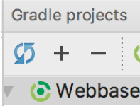
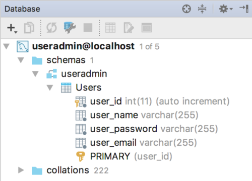
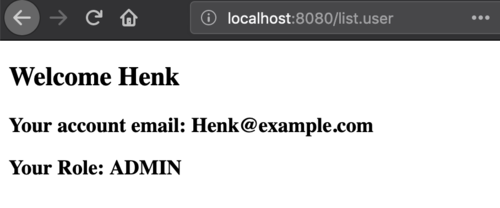

# Database interaction

In this post, these topics will be discussed:
- Database interaction with Java applications: JDBC
- Java design issues that ensure flexible, reusable code that will easily deal with changing specs:
    - a different database provider
    - a different view
    - different analysis components
    - etc etc

Just remember: **_the only constant in programming is change_**.

&rArr; Have a look at the [repo](https://bitbucket.org/minoba/java_web_thymeleaf_demo) to see the full code of these examples.

## JDBC

Having Java applications talk with MySQL databases require that you have the required Driver in your project class path. Let's start with that. Put this line in te dependencies section of your `build.gradle` file:

```javascript
// https://mvnrepository.com/artifact/mysql/mysql-connector-java  
compile group: 'mysql', name: 'mysql-connector-java', version: '5.1.6'
```

You may need to refresh your Gradle project in the Gradle Tool window, if you did not check the auto refresh option when creating the project. 



### The database

Of course, you will need a MySQL server, a database and an account. Deal with that first before proceeding, if you don't have that!

Suppose we have a database called MyDB with this single, simple table `Users`:

| Field         | Type                           |
|---------------|--------------------------------|
| `user_id`       | `int AUTO-INCREMENT`                  |
| `user_name`     | `varchar(30)`                    |
| `user_password` | `varchar(30)`                    |
| `user_email`    | `varchar(30)`                    |
| `role`          | `enum('GUEST', 'USER', 'ADMIN')` |


### The model classes

These are the model classes that play a role in this chapter on database interaction.
Class `User`, a class that models visitors/users of a website:

```java
package nl.bioinf.wis_on_thymeleaf.model;

import java.util.ArrayList;
import java.util.List;
import java.util.Objects;

public class User {
    private String name;
    private String email;
    private String password;
    private Role role;

    public User() { }

    public User(String name, String email, Role role) {
        this.name = name;
        this.email = email;
        this.role = role;
    }

    public User(String name, String email, String password, Role role) {
        this.name = name;
        this.email = email;
        this.password = password;
        this.role = role;
    }

    public void setPassword(String password) {
        this.password = password;
    }

    public void setRole(Role role) {
        this.role = role;
    }

    public String getName() {
        return name;
    }

    public String getEmail() {
        return email;
    }

    public String getPassword() {
        return password;
    }

    public Role getRole() {
        return role;
    }
    //toString(), equals(), hashCode() and getSome() omitted
}
```

The enum `Role`, modelling the role that website users can have:

```java
package nl.bioinf.wis_on_thymeleaf.model;

public enum Role {
    GUEST,
    USER,
    ADMIN;
}
```

and my custom Exception type that encapsulates all exceptions that can occur during database interaction:

```java
package nl.bioinf.wis_on_thymeleaf.dao;

public class DatabaseException extends Exception {
    public DatabaseException() {
        super();
    }

    public DatabaseException(String message) {
        super(message);
    }

    public DatabaseException(String message, Throwable cause) {
        super(message, cause);
    }

    public DatabaseException(Throwable cause) {
        super(cause);
    }

    protected DatabaseException(String message, Throwable cause, boolean enableSuppression, boolean writableStackTrace) {
        super(message, cause, enableSuppression, writableStackTrace);
    }
}
```

### Database actions within IntelliJ

IntelliJ has excellent support for databases: it has an internal MySQL console, and supports autocomplete on in-code SQL statements and sql scripts.

To get this Database toolbox support active, you need let IntelliJ know about the database and follow these steps:

- View &rarr; Tool Windows &rarr; Database
- Click “+” &rarr; Data Source &rarr; MySQL


- Fill in the blanks (note: you may **not** have a localhost MySQL server. Instead, it may run on some specific URL such as `mysql.bin`)


- Click "download missing driver files"
- Click "test connection"

Note the URL it creates. Check that the data provided corresponds with your situation (Host, Database, User and Password).

- Open the MySQL console (double-click the data source in the Databases panel), 
- Enter a command 
- Press `Ctrl + enter`


### Add data to the DB

First, a simple table is defined and created, and some preliminary dummy data is entered.

```mysql
DROP TABLE IF EXISTS Users;
CREATE TABLE Users (
    user_id INT NOT NULL auto_increment,
    user_name VARCHAR(100) NOT NULL,
    user_password VARCHAR(100) NOT NULL,
    user_email VARCHAR(255) NOT NULL,
    user_role VARCHAR(100) NOT NULL,
    primary key(user_id));
    
INSERT INTO Users (user_name, user_password, user_email, user_role)
VALUES ('Henk', 'Henkie', 'Henk@example.com', 'ADMIN');
```

Of course, **_storing a user password unencrypted is a very bad idea_**. We will address this aspect later.

Next, have a look at the DB tool window:



## The naive implementation

Here follow some classes demonstrating the general usage of database interaction components. 
You should not implement your logic like this - it is inefficient, not OO, and very ugly. 
A better solution follows later in this chapter.
Study this class carefully so you understand how everything works at the syntax level.

```java
package nl.bioinf.wis_on_thymeleaf.dao;

import nl.bioinf.wis_on_thymeleaf.model.Role;
import nl.bioinf.wis_on_thymeleaf.model.User;

import java.sql.*;

public class VerySimpleDbConnector {
    private final String url;
    private final String dbUser;
    private final String dbPassword;
    private Connection connection;
    
    /**
     * a main for demonstration purposes
     * @param args
     */
    public static void main(String[] args) {
        try {
            //connect
            VerySimpleDbConnector connector = new VerySimpleDbConnector("<host>", "<db-user>", "db-password");

            //insert a user
            connector.insertUser("Piet", "Pietissafe", "piet@example.com", Role.ADMIN);

            //fetch a user
            connector.getUser("Piet", "Pietissafe");

            //a catch-all for database interaction exceptions
        } catch (DatabaseException e) {
            e.printStackTrace();
        }
    }

    public VerySimpleDbConnector(String url, String dbUser, String dbPassword) throws DatabaseException {
        this.url = url;
        this.dbUser = dbUser;
        this.dbPassword = dbPassword;

        //make the connection
        connect();
    }

    private void connect() throws DatabaseException {
        try {
            //load driver class
            Class.forName("com.mysql.jdbc.Driver");
            //create connection
            connection = DriverManager.getConnection(url, dbUser, dbPassword);
            //..which is risky
        } catch (Exception e) {
            e.printStackTrace();
            throw new DatabaseException("Something is wrong with the database, see cause Exception",
                    e.getCause());
        }
    }

    public User getUser(String userName, String userPass) throws DatabaseException  {
        try {
            //Prepare the SQL statement. The question marks are placeholders for repeated use with different data
            //!! Doing this within this method is extremely inefficient !!
            String fetchQuery = "SELECT * FROM Users WHERE user_name = ? AND user_password = ?";
            PreparedStatement ps = connection.prepareStatement(fetchQuery);

            //set data on the "?" placeholders of the prepared statement
            ps.setString(1, userName);
            ps.setString(2, userPass);

            //execute
            ResultSet rs = ps.executeQuery();

            //if there is data, process it
            while (rs.next()) {
                String userMail = rs.getString("user_email");
                String userIdStr = rs.getString("user_id");
                String userRoleStr = rs.getString("user_role");
                Role role = Role.valueOf(userRoleStr);
                User user = new User(userName, userMail, userPass, role);
                return user;
            }

            //close resources
            rs.close();
        } catch (SQLException e) {
            e.printStackTrace();
            throw new DatabaseException("Something is wrong with the database, see cause Exception",
                    e.getCause());
        }
        return null;
    }

    public void insertUser(String userName, String userPass, String email, Role role) throws DatabaseException  {
        try{
            //Prepare statement
            //!! Doing this within this method is extremely inefficient !!
            String insertQuery = "INSERT INTO Users (user_name, user_password, user_email, user_role) "
                    + " VALUES (?, ?, ?, ?)";
            PreparedStatement ps = connection.prepareStatement(insertQuery);

            //set data on the "?" placeholders of the prepared statement
            ps.setString(1, userName);
            ps.setString(2, userPass);
            ps.setString(3, email);
            ps.setString(4, role.toString());

            //do the actual insert
            ps.executeUpdate();

            //close resources
            ps.close();
        } catch (Exception ex) {
            ex.printStackTrace();
            throw new DatabaseException("Something is wrong with the database, see cause Exception",
                    ex.getCause());
        }
    }

    /**
     * close the connection!
     * @throws DatabaseException
     */
    public void disconnect() throws DatabaseException {
        try {
            connection.close();
        } catch (SQLException e) {
            e.printStackTrace();
        }
    }
}
```

### JDBC class loading

```java
    Class.forName("com.mysql.jdbc.Driver");
```

This mechanism is called **_dynamic class loading_**. It loads the driver classes required for the MySQL interaction:

### Create a Connection

After loading the driver class(es), you need to establish a connection:

```java
    String dbUrl = "jdbc:mysql://MyHost/MyDbName";
    String dbUser = "Fred";
    String dbPass = "FredIsSafe";
    this.connection = DriverManager.getConnection(dbUrl, dbUser, dbPass);
```

Note that hardcoding your passwords in a repo that you are going to put online is a very bad idea; see the next section ofr a solution.  

## Improve on naive implementation

### Externalize your credentials

I have created a small helper app that you can use to prevent storing passwords in your code. It reads your credentials from the `.my.cnf` file stored in your home folder.

You can clone and build the [repo](https://bitbucket.org/michiel_noback/dbutils)
or download the jar [here](../downloads/DButils-1.0.2.jar) and put it in your build path by adding the following line to the `build/gradle` file:

```groovy
compile files('path/to/library/folder/DButils-1.0.2.jar')
```

When you have it on the build path, simply use it as follows:

```java
DbUser dbUser = DbCredentials.getMySQLuser();
String user = dbUser.getUserName();
String passWrd = dbUser.getDatabasePassword();
String host = dbUser.getHost();
String dbName = dbUser.getDatabaseName();
```

assuming you have a `.my.cnf` file in your home folder and it has the correct entries:

```properties
[client]
user=<db user name>
password=<db password>
host=localhost
database=<default database>
```

Once you establish the connection, you have a live `java.sql.Connection` object. 
Talking to a database -an external resource- is "risky" business, so you have to put it in a try/catch block. 
In a real app, you should do something else with the exception than print it of course, but this post is not about exception handling. 

### Use PreparedStatements

Use PreparedStatements for interacting with the database.
Using `PreparedStatement` instances makes it easier and far more efficient to repeat a query. Here is one of the two queries that are required for implementing the interface methods.

```java
    private static final String GET_USER = "get_user";

    /**
     * prepares prepared statements for reuse
     * @throws SQLException
     */
    private void prepareStatements() throws SQLException {
        String fetchQuery = "SELECT * FROM Users WHERE user_name = ? AND user_password = ?";
        PreparedStatement ps = connection.prepareStatement(fetchQuery);
        this.preparedStatements.put(GET_USER, ps);
    }
```

The prepared statements are stored as entries of a Map, which is an instance variable of the class `MyAppDaoMySQL.
The `?` characters serve as placeholders, to be replaced with actual values before executing the statement. See next section.

### Traversing results

Results can be traversed through the `ResultSet` object that you get back from `ResultSet rs = ps.executeQuery();`.

```java
    ResultSet rs = ps.executeQuery();
    while (rs.next()) {
        //process results
    }
```

Here, you see the use of `while (rs.next()) {}` which is not entirely logical if you expect a single result, as in this case (checking for a registered user). Maybe it is better to add some checks, such as:

```java
if (rs.getFetchSize() > 1) {
    throw new DatabaseException("something wrong");
}
```

Now the low level code details are ready and known, let's implement this in a better way.


## Code against interfaces

Code against interfaces, not implementations.  

Suppose you start working on a website with a MySQL database as backend data layer. You think "encapsulation", and create a class responsible for all database interaction (`MyMySqlDbConnector`), and use this class all over our code base. Something like this:

```java
MyMySqlDbConnector dbConnector = new MyMySqlDbConnector(url, user, pass);
```

Next year, after our application has grown, we decide a **_key-value store_** such as Couchbase is better suited for our growing customer base. We create a new class, `MyCouchbaseConnector`. Unfortunately, everywhere we used the MySQL connector, we need to change our code to the new implementation.

```java
MyCouchbaseConnector dbConnector = new MyCouchbaseConnector();
```

And if we are unlucky, the `MyCouchbaseConnector` has differing method signatures as well, making the refactoring process a hellish job.

That is such an unnecessary waste of time if we would have adhered to one of the prime directives of OO programming: **Code against interfaces not implementations** (where interface may mean interface as type, but also abstract class).

## Refactoring to OO principles 

This principle is outlined in the following series of steps.

### 1: An interface definition

Think long and hard about the contract: which methods do you need, disregarding the technology behind the scenes? 
This will be your interface definition.
Here is the interface specifying my user database interactions:

```java
package nl.bioinf.wis_on_thymeleaf.dao;

import nl.bioinf.wis_on_thymeleaf.model.Role;
import nl.bioinf.wis_on_thymeleaf.model.User;

public interface MyAppDao{

    /**
    * connection logic should be put here.
    * @throws DatabaseException
    */
    void connect() throws DatabaseException;

    /**
    * shutdown logic should be put here
    * @throws DatabaseException
    */
    void disconnect() throws DatabaseException;

    /**
    * fetches a user by username and password.
    * @param userName
    * @param userPass
    * @return
    * @throws DatabaseException
    */
    User getUser(String userName, String userPass) throws DatabaseException;

    /**
    * inserts a new User.
    * @param userName
    * @param userPass
    * @param email
    * @param role
    * @throws DatabaseException
    */
    void insertUser(String userName, String userPass, String email, Role role) throws DatabaseException;
}
```

### 2: Create an interface implementer

Here is the complete class. It of course implements all interface methods. 
The Singleton pattern will be explained below.

```java
package nl.bioinf.wis_on_thymeleaf.dao;
//imports omitted
public final class MyAppDaoMySQL implements MyAppDao {
    private static final String GET_USER = "get_user";
    private static final String INSERT_USER = "insert_user";
    private final String url;
    private final String dbUser;
    private final String dbPassword;
    private Connection connection;
    private Map<String, PreparedStatement> preparedStatements = new HashMap<>();

    /*singleton pattern*/
    private static MyAppDaoMySQL uniqueInstance;

    /**
     * singleton pattern
     */
    private MyAppDaoMySQL(String url, String dbUser, String dbPassword) {
        this.url = url;
        this.dbUser = dbUser;
        this.dbPassword = dbPassword;
    }

    /**
     * singleton pattern
     */
    public static MyAppDaoMySQL getInstance(String url, String dbUser, String dbPassword) {
        //lazy
        if (uniqueInstance == null) {
            uniqueInstance = new MyAppDaoMySQL(url, dbUser, dbPassword);
        }
        return uniqueInstance;
    }

    @Override
    public void connect() throws DatabaseException {
        try {
            Class.forName("com.mysql.jdbc.Driver");
            connection = DriverManager.getConnection(url, dbUser, dbPassword);
            prepareStatements();
        } catch (Exception e) {
            e.printStackTrace();
            throw new DatabaseException("Something is wrong with the database, see cause Exception",
                    e.getCause());
        }
    }

    /**
     * prepares prepared statements for reuse
     * @throws SQLException
     */
    private void prepareStatements() throws SQLException {
        String fetchQuery = "SELECT * FROM Users WHERE user_name = ? AND user_password = ?";
        PreparedStatement ps = connection.prepareStatement(fetchQuery);
        this.preparedStatements.put(GET_USER, ps);

        String insertQuery = "INSERT INTO Users (user_name, user_password, user_email, user_role) "
                        + " VALUES (?, ?, ?, ?)";
        ps = connection.prepareStatement(insertQuery);
        this.preparedStatements.put(INSERT_USER, ps);
    }

    @Override
    public User getUser(String userName, String userPass) throws DatabaseException  {
        try {
            PreparedStatement ps = this.preparedStatements.get(GET_USER);
            ps.setString(1, userName);
            ps.setString(2, userPass);
            ResultSet rs = ps.executeQuery();
            while (rs.next()) {
                String userMail = rs.getString("user_email");
                String userIdStr = rs.getString("user_id");
                String userRoleStr = rs.getString("user_role");
                Role role = Role.valueOf(userRoleStr);
                User user = new User(userName, userMail, userPass, role);
                return user;
            }
            rs.close();
        } catch (SQLException e) {
            e.printStackTrace();
            throw new DatabaseException("Something is wrong with the database, see cause Exception",
                    e.getCause());
        }
        return null;
    }

    @Override
    public void insertUser(String userName, String userPass, String email, Role role) throws DatabaseException  {
        try{
            PreparedStatement ps = this.preparedStatements.get(INSERT_USER);
            ps.setString(1, userName);
            ps.setString(2, userPass);
            ps.setString(3, email);
            ps.setString(4, role.toString());
            ps.executeUpdate();
            ps.close();
        } catch (Exception ex) {
            ex.printStackTrace();
            throw new DatabaseException("Something is wrong with the database, see cause Exception",
                    ex.getCause());
        }
    }

    @Override
    public void disconnect() throws DatabaseException {
        /*After you are done, you must carefully clean up your database resources!*/
        /*These objects need to be closed explicitly:
         *  `ResultSet` (here: done in method itself)
         *  `PreparedStatemenent`
         *  `Connection` (always last)
         */
        try{
            for( String key : this.preparedStatements.keySet() ){
                this.preparedStatements.get(key).close();
            }
        }catch( Exception e ){
            e.printStackTrace();
        }
        finally{
            try {
                connection.close();
            } catch (SQLException e) {
                e.printStackTrace();
            }
        }
    }
}
```

### 3: Create a **_factory class_** 

Here, class `MyAppDaoFactory` was created that will instantiate and serve the right type of implementer.
This should preferably be done based on some external configuration setting (such as `web.xml`).
Also note that the Database credentials are read from the external `.my.cnf` file here, using the 
helper app discussed earlier.

```java
package nl.bioinf.wis_on_thymeleaf.dao;
//imports deleted
public class MyAppDaoFactory {
    private static MyAppDao daoInstance;

    /**
    * Code should be called at application startup
    */
    public static void initializeDataSource(String type) throws DatabaseException {
        if (daoInstance != null) {
            throw new IllegalStateException("DAO can be initialized only once");
        }
        switch(type) {
            case "dummy": {
                createDummyInstance();
                break;
            }
            case "mysql": {
                createMySQLInstance();
                break;
            }
            default: throw new IllegalArgumentException("unknown database type requested");
        }
    }

    /**
    * serves the dao instance
    * @return
    */
    public static MyAppDao getDataSource() {
        if (daoInstance == null) {
            throw new IllegalStateException("DAO is not initialized; call initializeDataSource() first");
        }
        return daoInstance;
    }

    private static void createDummyInstance() throws DatabaseException {
        daoInstance = new MyAppDaoInMemory();
        daoInstance.connect();
    }

    private static void createMySQLInstance() throws DatabaseException {
        try {
            DbUser mySQLuser = DbCredentials.getMySQLuser();
            String dbUrl = "jdbc:mysql://" + mySQLuser.getHost() + "/" + mySQLuser.getDatabaseName();
            String dbUser = mySQLuser.getUserName();
            String dbPass = mySQLuser.getDatabasePassword();
            daoInstance = MyAppDaoMySQL.getInstance(dbUrl, dbUser, dbPass);
            daoInstance.connect();
        } catch (IOException | NoSuchFieldException e) {
            throw new DatabaseException(e);
        }
    }
}
```

### 4: Have the correct type instantiated

Have the correct type instantiated at application startup.

The `web.xml` deployment descriptor is an excellent place to specify which implementation of the `MyAppDao` interface to use:

```xml
    <context-param>
        <param-name>db-type</param-name>
        <param-value>mysql</param-value>
    </context-param>
```

The datasource needs to be initialized at application startup, requested from the class `MyAppDaoFactory`. 
You have seen the application startup hook in a previous post (see [servlet details and lifecycle hooks](servlet_details.md)); 
it was implemented in class `WebConfig`.
Here, the DAO initialization is done within that method, `contextInitialized()`.

```java
@WebListener
public class WebConfig implements ServletContextListener {

    @Override
    public void contextInitialized(ServletContextEvent servletContextEvent) {
        //other code

        //fetch the database type
        String dbType = servletContextEvent.getServletContext().getInitParameter("db-type");
        try {
            MyAppDaoFactory.initializeDataSource(dbType);
        } catch (DatabaseException e) {
            e.printStackTrace();
            //this should be logged of course; and dealt with elegantly
        }
    }
    //other code
}
```

### 5: Use the interface type in your code base

It is now easy to get hold of the connector anywhere in our application because we can call the static method `getInstance()`.

```java 
MyAppDao dao = MyDbConnector.getInstance();
```


## Singleton

I want class `DbCredentials` to be instantiated only once - we do not want to create resource-heavy classes twice if we can prevent it. To guarantee this, the **_singleton pattern_** is implemented.  It has three components:

- a private static instance
- a private constructor (only this class can instantiate itself)
- a public static method serving the single instance

```java
    private static MyAppDaoMySQL uniqueInstance;

    private MyAppDaoMySQL(String url, String dbUser, String dbPassword) {
        this.url = url;
        this.dbUser = dbUser;
        this.dbPassword = dbPassword;
    }

    public static MyAppDaoMySQL getInstance(String url, String dbUser, String dbPassword) {
        //lazy instantiation
        if (uniqueInstance == null) {
            uniqueInstance = new MyAppDaoMySQL(url, dbUser, dbPassword);
        }
        return uniqueInstance;
    }
```

Key here is the private constructor which guarantees ony code within class `MyAppDaoMySQL` can instantiate its objects, and it does so only once.
This solution is simple, but **not thread safe!**. In a later course, we'll revisit this.


## Use in a servlet environment

Here is the relevant servlet code:

```java
    protected void doGet(HttpServletRequest request, HttpServletResponse response) throws ServletException, IOException {
        final MyAppDao dataSource = MyAppDaoFactory.getDataSource();
        try {
            final User user = dataSource.getUser("Henk", "Henkie");
            final TemplateEngine templateEngine = WebConfig.getTemplateEngine();
            WebContext ctx = new WebContext(request, response, request.getServletContext(), request.getLocale());
            ctx.setVariable("user", user);
            templateEngine.process("user-details", ctx, response.getWriter());
        } catch (DatabaseException e) {
            e.printStackTrace();
        }
```

and the thymeleaf view:

```html
<!DOCTYPE html SYSTEM "http://www.thymeleaf.org/dtd/xhtml1-strict-thymeleaf-4.dtd">
<html xmlns="http://www.w3.org/1999/xhtml" xmlns:th="http://www.thymeleaf.org">
<head>
    <title>Show user</title>
    <meta http-equiv="Content-Type" content="text/html; charset=UTF-8" />
    <script src="js/myPage.js" type="application/javascript"></script>
</head>
<body>
<!-- welcome message read from resource bundle welcome.html-->
<h2 th:text="'Welcome ' + ${user.name}"></h2>
<h3 th:text="'Your account email: ' + ${user.email}"></h3>
<h3 th:text="'Your Role: ' + ${user.role.name}"></h3>
</body>
</html>
```

Below you see the results with the two different values for the same `web.xml` context-param entry. The code does not know which implementation is running.

**db-type=mysql**  
Here, the MySQL database is queried:



**db-type=dummy**  
And this queries the internal dummy database:


This constitutes the final layer in the app: the data layer:


