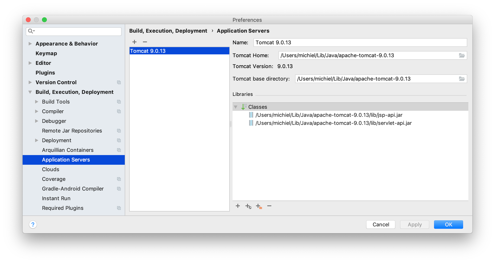
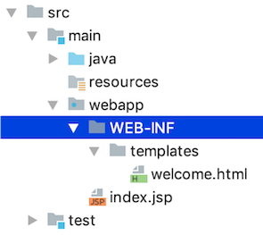
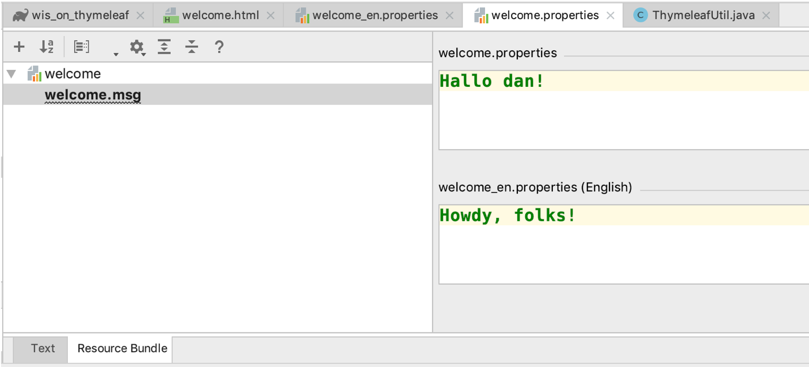
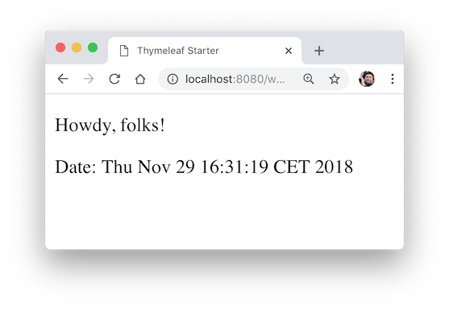

# A first project

## Introduction  

The topic of this presentation is getting started with a Java web application using a Thymeleaf View that serves an internationalized welcome message.

Since JSP and not Thymeleaf is the default for basic Java web applications, this involves quite a few steps:

1.    configuring IntelliJ with the application server Tomcat
2.    creating a Gradle-managed web project
3.    creating a Thymeleaf template
4.    configuring the use of Thymeleaf
5.    creating a servlet
6.    running the web application

You should realise that creating a web app from scratch is something you don't do very often so it is not that terrible it takes some time. Also, this example makes use of a resource bundle supporting multiple languages (internationalization) and that is something you won't do with every app you build.


### Prerequisites

- **Tomcat**. I assume you have a working version of Tomcat server (see http://tomcat.apache.org/). This tutorial uses Tomcat 9.0.XX - (Tomcat 10 failed for mysterious reasons on my machine!). Simply extract the downloaded zip at a convenient location. Don't forget to make the `*.sh` scripts in the `bin` folder executable!
- **IntelliJ Idea**. This blog uses the 2022.2.1 Ultimate version. Please refer to Jetbrains for educational licences.


## Configure Tomcat as webserver

After extraction of Tomcat the Tomcat server application (and making the *.sh scripts executable), you’ll have to let IntelliJ know where it is. 
You do this via `Preferences` &rarr; `Build, Execution, Deployment` &rarr; `Application Servers` &rarr; click `+` (Add) and point to the location where you extracted Tomcat.



## Create a Gradle-managed web project

Creating a Gradle-managed web project in IntelliJ:

- Choose `File` &rarr; `New` &rarr; `Project`

You see something like this:


Enter GroupId (your unique identifier to this project), ArtifactId (its name) and Version and click `Create`.

You may get an error message like this:
")

Don't worry, simply click `Yes`. We'll fix that first.


You will have something like this, after Gradle has build the project (this may take some time, depending on your machine and internet connection):


To solve the warning (if you had any), open file `gradle-wrapper.properties` under `gradle/wrapper/` and change the version number to 7.5, then hit "Load Gradle Changes" button:


## Configure Gradle

In this project, we’ll be using Thymeleaf and JUnit5 (and the Servlet API). Since they are not available in Java by default (i.e. not in the standard JDK), you’ll need to configure them as your projects dependencies. 
Fortunately, Gradle is an excellent tool for dependency management. 
Here is the contents of a basic `build.gradle` configuration file for a web app:

```ruby
plugins {
    id 'war'
    id 'java'
    id 'idea'
}

group 'nl.bioinf.nomi'
version '0.0.1'

repositories {
    mavenCentral()
}

dependencies {
    //Servlets
    implementation 'javax.servlet:javax.servlet-api:4.0.0' # or 3.1.0
    //Thymeleaf
    implementation 'org.thymeleaf:thymeleaf:3.0.15.RELEASE'
    //JUnit
    testImplementation 'org.junit.jupiter:junit-jupiter-api:5.8.1'
    testRuntimeOnly 'org.junit.jupiter:junit-jupiter-engine:5.8.1'
}

test {
    useJUnitPlatform()
}
```

## The WEB-INF folder

Under `main`, create folder `webapp`, create a folder called `WEB-INF` and within that one a folder called `templates`. Within `templates`, create the html file called `welcome.html`. You can do that via context menu `New` &rarr; `Thymeleaf` or simply `New` &rarr; HTML File.



Your file `welcome.html` should have this contents:

```html
<!DOCTYPE html SYSTEM "http://www.thymeleaf.org/dtd/xhtml1-strict-thymeleaf-4.dtd">
<html xmlns="http://www.w3.org/1999/xhtml" xmlns:th="http://www.thymeleaf.org">
<head>
    <title>Thymeleaf Starter</title>
    <meta http-equiv="Content-Type" content="text/html; charset=UTF-8" />
</head>
<body>
    <!-- welcome message read from resource bundle welcome.html-->
    <p th:text="#{welcome.msg}">Welcome Offline</p>
    <!-- date forwarded from the servlet-->
    <p>Date: <span th:text="${currentDate}">Sat Oct 24 2015</span></p>
</body>
</html>
```

Note the `<!DOCTYPE...>` declaration on top declaring it to be a Thymeleaf page.
There are several non-html syntax elements that make this page special: 
**`#{...}`** and **`${...}`** and the Thymeleaf tag attributes `th:text`.  

**`#{...}`** fetches the value from the **_resource bundle_** (files named `xxxxx.properties` discussed below). The expression **`#{welcome.msg}`** gets the value of key `welcome.msg` from the file `welcome_xx.properties`. The expression `${...}` fetches the value set in the `WebContext` instance. The expression `${currentDate}` gets the value for the attribute `currentDate` set in `WebContext`.  

Much more on that stuff.  

Other than that, this is a plain old html file. You can open it in any browser and it will show you the non-processed view. This is what makes Thymeleaf so nice; you can develop the view of your app without using servers or template engines!

## Create a resource bundle

A resource bundle is where you store your web page texts, if you ever want to support more than one language. Instead of creating web pages for every language you are willing to support, you create text-free web pages and store the texts for the different languages in separate files called *resource bundles*.

This is how you add language support to your web app:

Right-click the templates folder, select `New` &rarr; `Resource Bundle` &rarr;  
Type welcome as base name &rarr;  
Click `+` under `Locales to add` and add `en` &rarr;  
Click `OK` &rarr; Click `OK` again to finish.  


The resource bundle will open in your editor. It has plain text view and "Resource Bundle" view. (You may need to install the Plugin for that via `Preferences` &rarr; `Plugins` &rarr; search for Resource Bundle Editor in Marketplace).  
Here I choose the latter. Click '+' to add a new Property key and name it `welcome.msg`.


Give some Dutch (or other language of course) and English values for `welcome.msg`.



Now you have internationalized your view.  
Note that in Text view (the default when no plugin is present), you can simply enter `key=value` pairs in each of your resource bundle files. This one is in `welcome.properties`:

```
welcome.msg=Hallo dan!
```

## Prepare to use Thymeleaf

Thymeleaf needs some configuration to get going. Here is some boilerplate code that you can simply copy-and-paste.

Under `main/java`, create a base package using the context menu looking like this `<your_._domain>.<your_name>.<your_project>`, e.g. `nl.bioinf.nomi.mywebapp`. Within it, create two additional packages: `config` and `servlets`. —Under `config`, create a new Java class file `WebConfig.java`. Put this code in there, and change the package declaration to match your situation:  

```java
package nl.bioinf.wis_on_thymeleaf.config; //change this for your situation!
import org.thymeleaf.TemplateEngine;
import org.thymeleaf.templateresolver.ServletContextTemplateResolver;
import javax.servlet.ServletContext;
import javax.servlet.http.HttpServletResponse;

public class WebConfig {
    public static TemplateEngine createTemplateEngine(ServletContext servletContext) {
        ServletContextTemplateResolver templateResolver =
                new ServletContextTemplateResolver(servletContext);
        templateResolver.setTemplateMode("XHTML");
        templateResolver.setPrefix("/WEB-INF/templates/");
        templateResolver.setSuffix(".html");
        templateResolver.setCacheTTLMs(3600000L);
        // Cache is set to true by default.
        // Set to false if you want templates to be automatically
        // updated when modified.
        templateResolver.setCacheable(true);
        TemplateEngine templateEngine = new TemplateEngine();
        templateEngine.setTemplateResolver(templateResolver);
        return templateEngine;
    }
    
    /**
      * Configures the response in a standard way.
      * @param response
      */
    public static void configureResponse(HttpServletResponse response) {
        response.setContentType("text/html;charset=UTF-8");
        response.setHeader("Pragma", "no-cache");
        response.setHeader("Cache-Control", "no-cache");
        response.setDateHeader("Expires", 0);
    }
}
```

The main role of this class is to provide a **_template engine_**. This is the component of your application that is responsible for processing the Thymeleaf templates into html views. To do this, the template engine needs to know -amongst other things- where these templates are. That is the responsibility of the `TemplateResolver`. have a look at the code and try to understand what's happening.

:::{warning} 
In the course of this web tutorial the implementation of this `WebConfig` class changes. The current implementation is the simplest, but least efficient one. 
For instance, for each and every request a new `TemplateEngine` instance is created which is something that should be avoided for non-data classes. This should preferably only be done once in the application lifecycle.  
Later implementations make use of application lifecycle hooks to achieve this.
:::

### Create a Servlet  

Finally, everything is going to fall into place. Under package `....servlets`, create a new Servlet class with the contents listed below. If you have that context menu item whan right-clicking on the `servlets` package, you can use the `New` &rarr; `Servlet` wizard; if not, use `New` &rarr; `Java class` to create one from scratch.   

```java
package nl.bioinf.wis_on_thymeleaf.servlets; //change to your situation!
import nl.bioinf.wis_on_thymeleaf.config.WebConfig; //change to your situation!
import org.thymeleaf.context.WebContext;
import javax.servlet.ServletContext;
import javax.servlet.ServletException;
import javax.servlet.annotation.WebServlet;
import javax.servlet.http.HttpServlet;
import javax.servlet.http.HttpServletRequest;
import javax.servlet.http.HttpServletResponse;
import java.io.IOException;
import java.util.Date;
@WebServlet(name = "WelcomeServlet", urlPatterns = "/welcome", loadOnStartup = 1)
public class WelcomeServlet extends HttpServlet {
    @Override
    public void init() throws ServletException {
        System.out.println("Initializing Thymeleaf template engine");
        final ServletContext servletContext = this.getServletContext();
        WebConfig.createTemplateEngine(servletContext);
    }
    private static final long serialVersionUID = 1L;
    public void doPost(HttpServletRequest request, HttpServletResponse response) throws IOException{
        process(request, response);
    }
    public void doGet(HttpServletRequest request, HttpServletResponse response) throws IOException{
        process(request, response);
    }
    public void process(HttpServletRequest request, HttpServletResponse response)
            throws IOException {
        //this step is optional; standard settings also suffice
        WebConfig.configureResponse(response);
        WebContext ctx = new WebContext(
                request,
                response,
                request.getServletContext(),
                request.getLocale());
        ctx.setVariable("currentDate", new Date());
        WebConfig.createTemplateEngine(getServletContext()).
            process("welcome", ctx, response.getWriter());
    }
}
```
Of course, the package declarations will be different, as well as the first `import` statement.
The alert reader may notice that this will create a `TemplateEngine` for each single servlet. This is absolutely not the best strategy, but for simplicity we'll stick to it for now. 
Have a look at the [Demo repo](https://bitbucket.org/minoba/java_web_thymeleaf_demo "Demonstration repository") for a final solution with the template resolver.


### Finally: run it

Create a new run configuration (it's in the top bar, `Add Configuration`).
Click `+` &rarr; select `Tomcat Server/Local` (NOT `TomEE Server`!). Make sure the `Application server` is defined (your unpacked Tomcat location), use for `URL`
this address: `http://localhost:8080/welcome`.

Note the `Warning: no artifacts...` message at the bottom. Click `Fix` &rarr; select either one of the options `Gradle....war` and in `Application context` (you are now under Tab `Deployment`) fill in `/` instead of `/Gradle___nl_bioinf_nomi___MyWebApp_0_0_1_war`. If you don't do this, you will need to add this to your URLs!


If you run the configuration (Green triangle in menu bar), the browser will fire op or you'll have to do it yourself, and go to `http://localhost:8080/welcome`.  
(If you get an error message like "... Permission denied" you may have forgotten to make the files in the /bin folder of your Tomcat folder executable.

I hope you’ll see something like this:  


Go to `chrome://settings/languages` and change your language to English, refresh the view of your welcome page and you’ll see this:



That’s it. It was quite some work, but this is the foundation for a nice basic Java + Thymeleaf driven web application.  

:::{note}
This seems to be such a lot of work for a simple app. But then again, how often do you create web applications from scratch?
:::