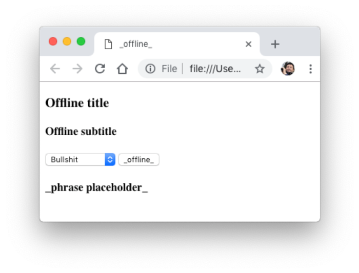
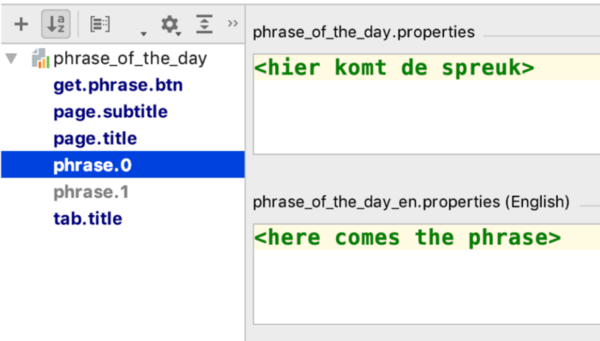
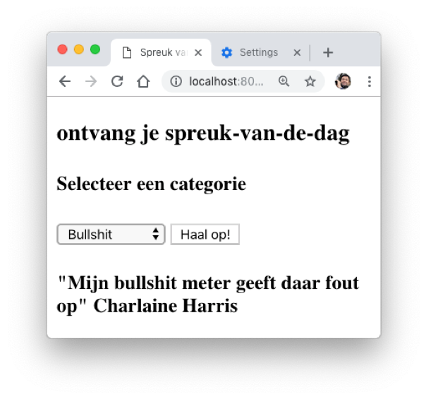
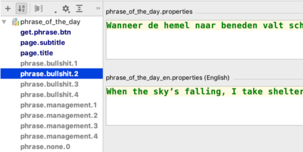
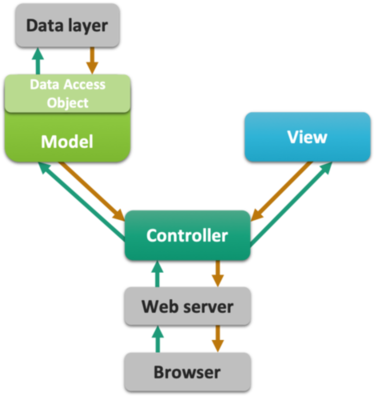

# Implementing MVC

The topic of this post is setting up a clean “MVC“ Java web application.
This involves working with separated components for different responsibilities. Besides the Model, the View and the Controller, this post also deals with the Data Layer, a fourth component that is almost always a part of a web app.

## Introduction

### The Components a.k.a Layers

The components -or layers- of an MVS application are generally recognized in most applications, 
web-based or not:

- **Model**: the business-specific logic, model classes, domain-specific algorithms
- **View**: what the user gets to see, often the visual representation of the underlying data
- **Controller**: receives input or requests (from the user) and determines what action should be taken; what part of the model should be invoked
- **Data layer**: all data is abstracted away behind data access objects (DAOs)

")

### The goal: a random phrase of the day

The specs: a web app that will display a phrase, chosen randomly from one of two categories: Bullshit or Management.

This post assumes you already have created a new Gradle-managed web app - see post 
[First Project](first_project.md)

## Java web app architecture

Java web apps are managed by servers, also called containers. We work with Tomcat, but the idea is the same for all.
Tomcat receives requests and forwards these to specific entry points in your app. 
These entry points are not `main()` methods as in Commandline apps, but the service methods of Servlets: 
`void doGet(HttpServletRequest request, HttpServletResponse response)` and `doPost(HttpServletRequest request, HttpServletResponse response)`. 
Also, unlike commandline apps that receive their arguments via the `String[] args` argument to `main()`, the service methods receive `HttpServletRequest` and `HttpServletResponse` objects as their communication channels to the outside world: the request object is the way in and the response object is the connection out.

Besides these objects, there is the `HttpSession` object supporting "cross-request memory", and the `ServletContext` object that you use for application-wide configuration settings. And throughout the app, Plain Old Java Objects (POJOs) serve as data carriers - the glue of the app. Here is a schema of an entire app.


### A View

To create a Thymeleaf template, right-click on folder webapp/templates, select New &rarr; html.
(Hint: you can also make your own Thymeleaf template!)

Name it phrase_of_the_day.html and click OK
The file will automatically open in an editor window, with some standard template code already present. 

Here is the contents of `phrase_of_the_day.html` 

```html
<!DOCTYPE html SYSTEM "http://www.thymeleaf.org/dtd/xhtml1-strict-thymeleaf-4.dtd">
<html xmlns="http://www.w3.org/1999/xhtml" xmlns:th="http://www.thymeleaf.org">
<head>
    <meta http-equiv="Content-Type" content="text/html; charset=UTF-8" />
    <title th:text="#{tab.title}">_offline_</title>
</head>
<body>
    <h3 th:text="#{page.title}">Offline title</h3>
    <h4 th:text="#{page.subtitle}">Offline subtitle</h4>

    <form action="give.phrase" method="GET">
        <select name="phrase_category">
            <option value="bullshit">Bullshit</option>
            <option value="management">Management</option>
        </select>
        <input type="submit" th:value="#{get.phrase.btn}" value="_offline_"/>
    </form>

    <h4 th:text="#{'phrase.' + ${phrase_num}}">_phrase placeholder_</h4>
</body>
</html>
```

Note the text have been moved to a resource bundle.

Within the editor pane, click the icon of the browser you want to view the file in (the browser icons are in the top right corner).
Do not select “Run phrase_of_...” from the context menu because you will get a 404!



You won't get any texts into the placeholders because (1) there simply aren't any and (2) you are viewing a static html page, not a view that is processed by the template engine.

#### Create resource bundle

The resource should have as base name `phrase_of_the_day` and should have a default and 'en' locale versions.
You also need entries for the used texts, of course



### A model

Create a new package called `model`.
Give it some dummy implementation (we’ll put some real code in there later on).

```java
public class PhraseFactory {
    public static String getPhrase(String phraseType) {
        //we'll get to this later!
        //You thought I’d return some text here, didn’t you?
        return "1";
    }
}
```

### A controller

Create a new Servlet and put the following code in there. 

```java
package nl.bioinf.wis_on_thymeleaf.servlets;

//many imports

@WebServlet(name = "PhraseServlet", urlPatterns = "/give.phrase")
public class PhraseServlet extends HttpServlet {
    private TemplateEngine templateEngine;

    @Override
    public void init() throws ServletException {
        this.templateEngine = WebConfig.getTemplateEngine();
    }

    protected void doGet(HttpServletRequest request, HttpServletResponse response)
            throws ServletException, IOException {
        String phraseType = request.getParameter("phrase_category");
        Locale locale = request.getLocale();
        WebContext ctx = new WebContext(
                request,
                response,
                request.getServletContext(),
                locale);
        if (phraseType != null) {
            final String phrase = PhraseFactory.getPhrase(phraseType);
            ctx.setVariable("phrase_type", phraseType);
            ctx.setVariable("phrase_num", phrase);
        } else {
            ctx.setVariable("phrase_type", "none");
            ctx.setVariable("phrase_num", "0");
        }
        templateEngine.process("phrase_of_the_day", ctx, response.getWriter());
    }
}
```

The controller receives request parameters from the submitted form using `String requestParameter = request.getParameter("<parameter_name>");`. On the output side, it passed data to the Thymeleaf template using `ctx.setVariable("<variable_name>", <variable>);`. It is not responsible for any application logic; for that it calls on the model class `PhraseFactory`. The controller does not involve itself with the view either; it simply passes the data it received from the model to the View component, the Thymeleaf template `phrase_of_the_day.html`.

### Test!

Create a new run configuration called "phrase" and point it to give.phrase.

Test the result; try the form submit; change your language; refresh




### Extend the model

Implement some nice behavior in `PhraseFactory.java`.
First the Junit5 test and only then the implementation: this is called Test-Driven Development (TDD).

```java
class PhraseFactoryTest {
    @Test
    void getPhrase() {
        for (int i=0; i<50; i++) {
            int random = Integer.parseInt(PhraseFactory.getPhrase("bullshit"));
            assertTrue(random >= 1 && random <= PhraseFactory.MAX_PHRASE_COUNT);
        }
        for (int i=0; i<50; i++) {
            int random = Integer.parseInt(PhraseFactory.getPhrase("management"));
            assertTrue(random >= 1 && random <= PhraseFactory.MAX_PHRASE_COUNT);
        }
    }
}
```

The implementation.

```java
public class PhraseFactory {
    public static int MAX_PHRASE_COUNT = 4;
    public static String getPhrase(String phraseType) {
        //I only have 4 phrases of each category
        Random rand = new Random();
        int phraseIndex = rand.nextInt(MAX_PHRASE_COUNT) + 1;
        return Integer.toString(phraseIndex);
    }
}
```

Now fetch the phrases a little bit sophisticated. Here is the relevant part of the Thymeleaf template.

```html
<h4 th:text="#{'phrase.' + ${phrase_type} + '.' + ${phrase_num}}">_phrase placeholder_</h4>
```

This snippet is building a reference to a randomly chosen phrase from the requested category.

In the resource bundle, the phrases are stored in two languages.



### MVC complete

Thats it; you have seen the MVC pattern in action. There is a dedicated model class that knows how to provide a random choice for messages. 
The Servlet controller invokes the model (PhraseFactory) and dispatches its output to the view. 
The Thymeleaf template handles the view, processed by the template engine that is also responsible for injecting the text messages from the resource bundle, in the correct language.

Thymeleaf has several techniques to deal with dynamic content generated by the model; this is the subject of the next post.



