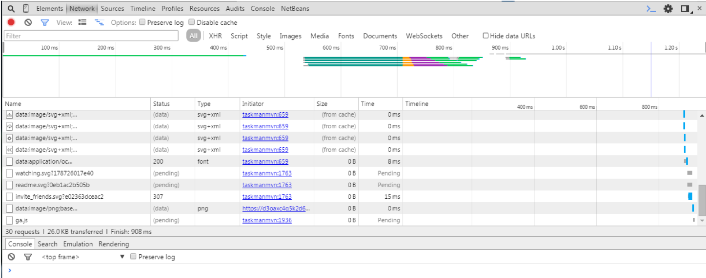
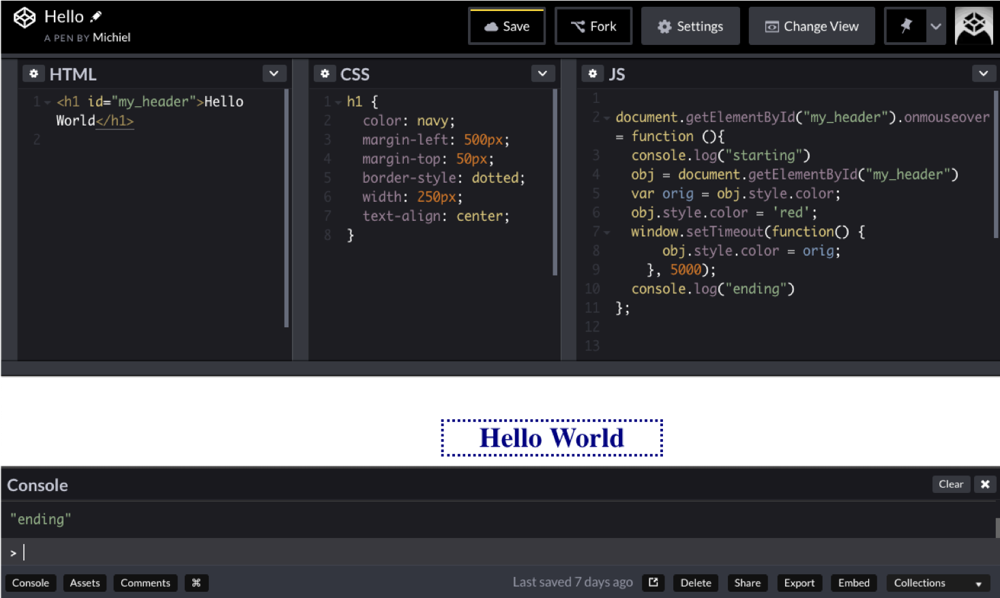

# The toolbox

## Intro 

These are the tools we are going to use to build our dynamic web applications:
**Java**: plain old Java to build the logic
**Java EE**: The enterprise edition - an extension that has web apis, including **Servlets**.
**Thymeleaf**: A very nice templating technology for Java web pages
**Tomcat**: a container where the Java web apps live

Of course, you will also need (knowledge of)

**Javascript**: client-side scripting language to manipulate the view, and in particular **jQuery**: a Javascript library/platform for performing many tasks that are pretty hard to implement using raw Javascript
**css** (cascading style sheets): to style the view

but these will not be dealt with in this course. 

## The tools 

### Java development kit

Download and install from Oracle.

### The Tomcat application server

To start working with Java web technology, you have to get a **_server runtime_**. We'll use Tomcat. 
To install it:
- go to [apache tomcat](http://tomcat.apache.org/) and download the latest version
- extract it in a suitable location
- make the `bin/*.sh` file executable
- To test, start up Tomcat using 
    - `./tomcat.../bin/startup.sh`
- direct your browser to `http://localhost:8080/` and you should see the Tomcat management page.

### IntelliJ Ultimate

This course uses IntelliJ, but for your own endeavors you are of course free to use another IDE.

### A MySQL server

A MySQL server and account. Installing and administering this is not in the scope of this course. Also, MySQL as query language is assumed to be known. 

### Debugging web sites

All modern browsers have extensive debugging support.
Do not use the JavaScript function `alert("my debug message")` but intead use `console.log("my debug message")`!
Use the context menu option “Inspect element” in the browser:

Use the inspector to investigate, change and track DOM structure, bugs, network traffic, styling information, print info from JavaScript, change JavaScript variables.

### Codepen

Use Codepen for testing snippets:

