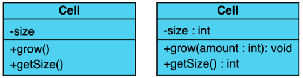
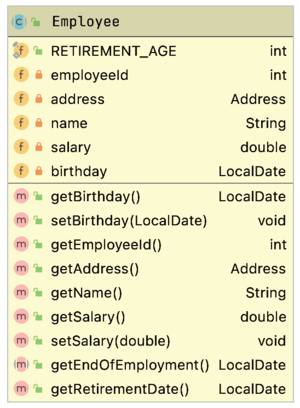
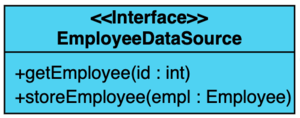
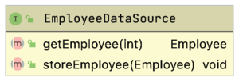
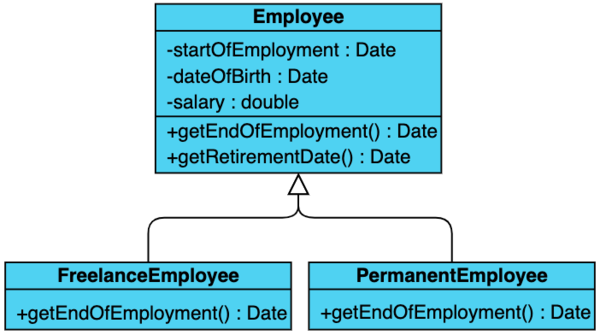
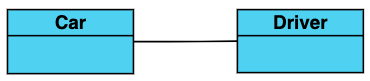
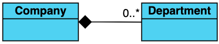
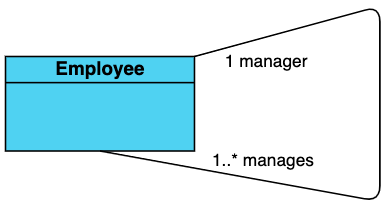

# UML

## Introduction
This chapter only gives a really simple intro so you are able to read the schematics that are used in the courses, in books and on the internet.

In the picture below you can see a UML schema of a simple datamodel. Since it uses the OO UML conventions, any OO programmer can "read" the picture and immediately understand what story it is telling.

UML is used to create graphical representations of your design –any design-. Since there are strict rules/conventions, other designers can “read” your model easily. In the chapter only OO design UML is dealt with, and the bare essentials at that.

### Class 

A rectangle containing three compartments stacked vertically.  
The top compartment holds the class name. The middle compartment: class attributes/properties with name and type.
The bottom compartment: class operations/methods with name, parameters (not always) and return type.  

The attributes' type, method parameter names and types and return types may also be given, as shown in the figure.
Sometimes, members (properties and/or methods) are preceded by a symbol indication their visibility:  

- **`+`** denotes _public_ attributes or operations  
- **`-`** denotes _private_ attributes or operations  
- **`#`** denotes _protected_ attributes or operations
- **`~`** denotes _package_ attributes or operations

Here is another class example: `Employee`. Regular setters and getters have been omitted to keep the picture clean.

The UML plugin for IntelliJ -used for some of the graphics in this chapter- uses lock symbols to show the scope of the members:

### Interfaces 

A class and an interface differ: A class can have an actual instance, whereas an interface must have at least one class to implement it. 
An interface is drawn just like a class, but the top compartment of the rectangle also has either the text _`<<interface>>`_ or the name of the class is printed in italics. 

Again, the IntelliJ UML plugin takes a slightly different approach.

### Inheritance 

Inheritance is indicated by a solid line with a closed, (usually) unfilled arrowhead pointing at the super class. It can be drawn with separate lines or using a tree notation, as in this example.

### Realization 

Realization is a bit like inheritance. Subclasses indicate inheritance. Sometimes implementing classes of interfaces are also called subclasses, but the relation is is slightly different. Although they pas the _IS-A_ test of the  `instanceof` operator, they are actually _realizations_ of a contract. Therefore they show up slightly different in an UML schema.
Realization is indicated with a dashed line and closed, filled arrowheads pointing at the interface.

### Association 

It is a relationship between objects. One object is connected to the other. Usually called as “has-a” relationship. Both objects have independent life-cycle. Each object owns their actions and will not affect other object.

Example: `Car` and `Driver`.

### Basic Aggregation 

A specialized form of Association. Usually called as “has-a” relationship.
Each object has an independent life-cycle. A whole-part relationship between a component object and an aggregate object. There is sense of ownership between objects.
In basic aggregation, the child class instance can outlive its parent class.  
Drawn with a solid line from the parent class to the part class, with an unfilled diamond shape on the parent class's association end.

This is a typical example of basic aggregation. A car has 3 to 4 wheels, and wheels can absolutely outlive their cars (and be exchanged for that matter).

### Composition aggregation 

This is also a specialized form of Aggregation. Usually called as “has-a” relationship. The Child Object has a dependent life-cycle. This is what separates it from aggregation. A whole-part relationship between a component object and an aggregate object (one class is an integral part of another class). Sense of ownership between objects

In composition aggregation, the child class's instance lifecycle is dependent on the parent class's instance lifecycle. Also, the part class can only be related to one instance of the parent class.  
Drawn with a solid line from the parent class to the part class, with a filled diamond shape on the parent class's association end.  

In this example, a company can have zero to many deprtments. However, a department cannot outlive its company.

### Reflexive aggregation 

One class is associated with itself.  

Here it means that an instance of Employee can be the manager of other (0 to many) Employee instances.   
Drawn with a solid line.  

### All together 

In this example, all described types of UML entities and relationships are present, as well as some more.

