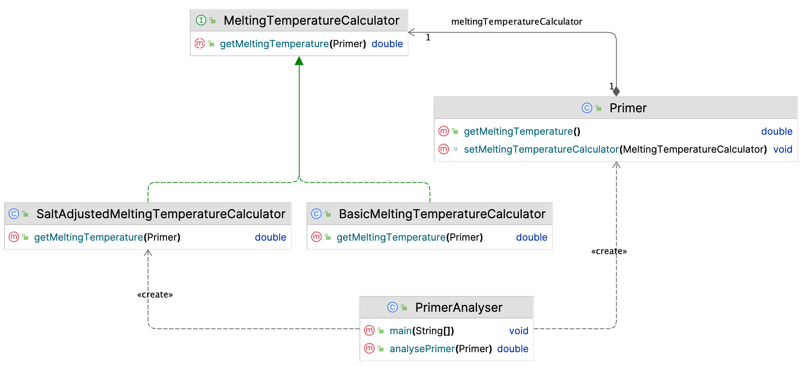
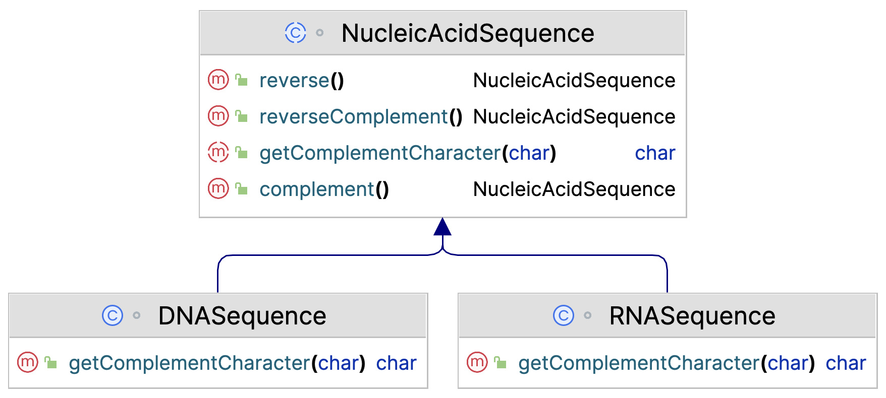
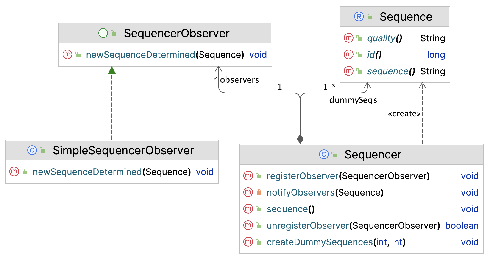
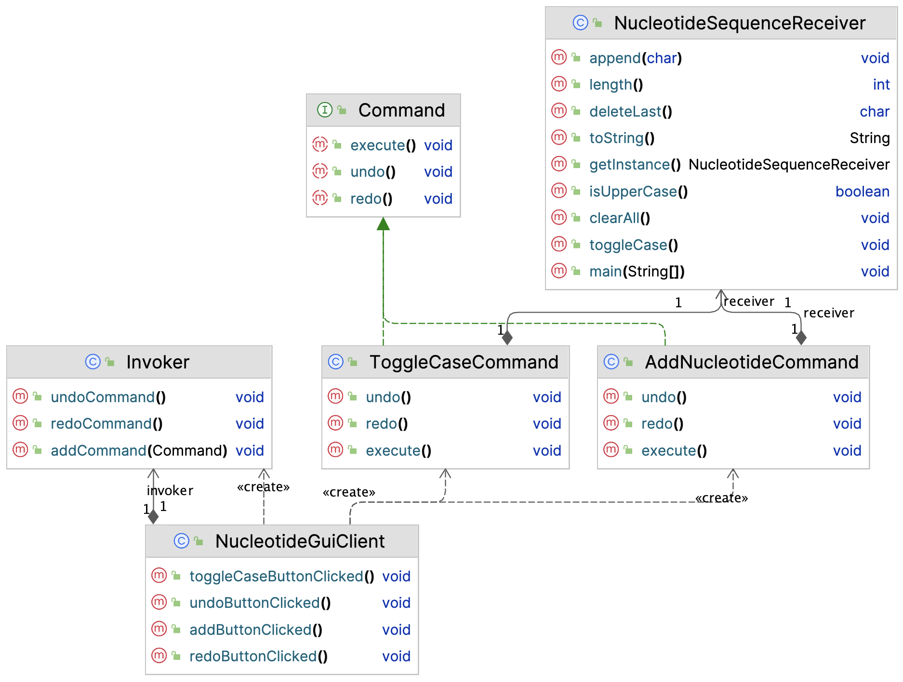
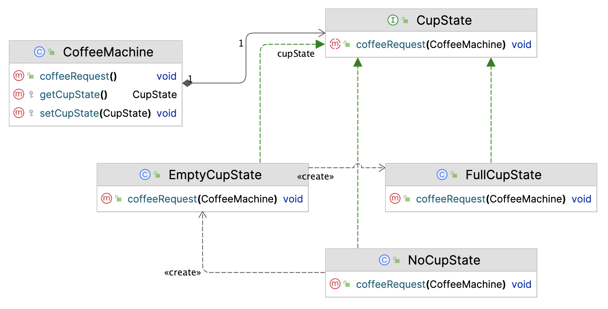
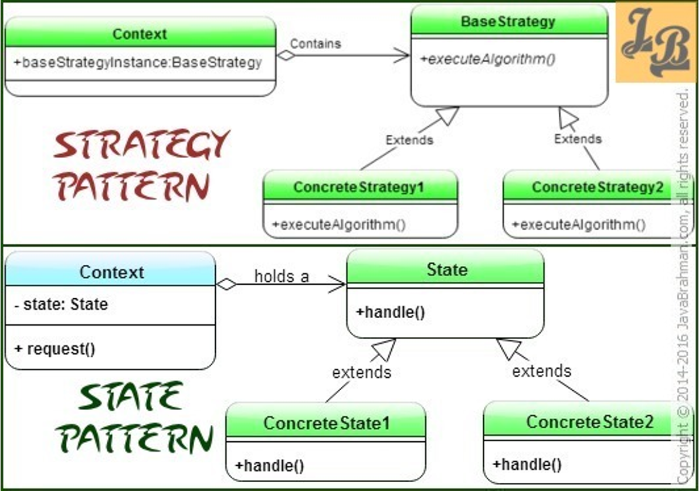

# Design Patterns - Behavioural

Design patterns are proven solutions to a wide variety of design challenges
Here we'll deal with a selection of often-used ones in a quick review. Many books and websites have much more extensive discussion and examples. For instance: [Refactoring Guru](https://refactoring.guru/design-patterns/template-method) 

Behavioural patterns target algorithm flexibility and -polymorphism.

## Null or Special Case Object

This is not one of the classic design patterns, but it warrants some attention and is rather simple.

Suppose you have an application processing information of `Person` objects:

```java
//other properties omitted
public record Person(String firstName, String lastName, Address address){ } 
```

and these Person objects also have `Address`-es of course:

```java
public record Address(String street, int number, String zipCode, String city) { }
```

Here is a collection of persons (imagine you have around 19 million of them):

```java
List<Person> persons = new ArrayList<>();
persons.add(new Person("Henk", "Boer",
        new Address("Zernikeplein", 11, "9746BA", "Groningen")));
persons.add(new Person("Hans", "Anders",
        new Address("Dam", 1, "1012JS", "Amsterdam")));
persons.add(new Person("Agnes", "Dakloos",null));
persons.add(new Person("Joost", "Wandel",
        new Address("Spuistraat", 24, "2511BD", "Den Haag")));
persons.add(new Person("Ingrid", "Dommel",
        new Address("Leidseplein", 9, "1017PR", "Amsterdam")));
```

Finally, here is some example usage of a Person Stream: looking for Persons from Amsterdam:


```java
    persons.stream()
            .filter(p -> p.address().city().equals("Amsterdam"))
            .forEach(p -> System.out.println(p.firstName() + " " + p.lastName()));
```
<pre class="console_out">
Hans Anders

java.lang.NullPointerException: Cannot invoke "nl.bioinf.designpatterns.null_object.Address.city()" because the return value of "nl.bioinf.designpatterns.null_object.Person.address()" is null
	at nl.bioinf.designpatterns.null_object.PersonTest.lambda$testPersonStream$0(PersonTest.java:25)
    &lt;many more lines of stacktrace&gt;
</pre>

What happens here is we have a homeless person causing a `NullPointerException` when a method is invoked on the address instance variable.
You could of course deal with this by putting an extra test clause, an if/else block or an extra filter step everywhere you deal with Addresses:

```java
persons.stream()
        .filter(p -> p.address() != null && p.address().city().equals("Amsterdam"))
        .forEach(p -> System.out.println(p.firstName() + " " + p.lastName()));
```

But wouldn't it be nice to deal with this beforehand, by creating a **special null case object** when someone is homeless.

```java
public record Person(String firstName, String lastName, Address address){
    @Override
    public Address address() {
        if (address == null) return Address.NULL_ADDRESS;
        return address;
    }
}

public record Address(String street, int number, String zipCode, String city) {
    public static final Address NULL_ADDRESS = new Address("UNDERTHEBRIDGE", 0, "0000AA", "NOWHERE");
}
```

:::{admonition} Null Object
:class: note
The intent of a Null Object is to encapsulate the absence of an object by providing a substitutable 
alternative that offers suitable default do nothing behavior.
:::

Note that many methods in the functional programming domain now return `Optional` objects, which is also a valid solution to this predicament.


## Strategy

Suppose we are building a Probe (Primer) evaluation tool. A Probe (in molecular biology) is a short DNA sequence 
complementary to a target (genomic) sequence that can be used to prove its existence. Many applications exist for 
probes: PCR, sequencing, DNA arrays, SNP detection, etc.
Probe quality can be assessed by looking at several properties: melting temperature, single-nucleotide stretches (homopolymers) and others.

Probe melting temperature can be calculated in several ways:

1. Basic. This is calculated with 
   $T_m = 4N_C \times (N_G + N_C) + 2N_C \times (N_A + N_T)$
2. Salt adjusted: Calculated with 
   $T_m = 81.5C + 7.21C \times log(molar salt) + (0.41 \times GC) - (675 / L)$
   where L is primer Length.
3. Nearest neighbour using base stacking information. $T_m = ((1000 \times dh)/(ds+(R \times log(C)))) - 273.15$
   where C is the primer concentration, R is a constant (1.987) and dh and ds refer to stacking energy.

You have implemented all three algorithms in class Primer:

```java
public class Primer {
    private String sequence;
    private String name;

    public Primer(String sequence, String name) {
        this.sequence = sequence;
        this.name = name;
    }

    public double getBasicMeltingPoint() {
        //LOGIC omitted
        return 43;
    }

    public double getSaltAdjustedMeltingPoint() {
        //LOGIC omitted
        return 45;
    }

    public double getNearestNeighborMeltingPoint() {
        //LOGIC omitted
        return 47;
    }

    //much more code
}
```

In the app you are building, you want to let the used decide which method should be used to calculate the Tm, at runtime.

So everywhere in your app, whenever the melting temperature is requested, you will have logic like this (assuming you use an enum for this):

```java
//the enum
public enum MeltingTempMethod{
    BASIC,
    SALT_ADJUSTED,
    NEAREST_NEIGHBOUR;
}
```

and this is the logic you use all over the place:

```java
public double analysePrimer(Primer primer, MeltingTempMethod method) {
    switch (method) {
        case BASIC:
            return primer.getBasicMeltingPoint();
        case SALT_ADJUSTED:
            return primer.getSaltAdjustedMeltingPoint();
        case NEAREST_NEIGHBOUR:
            return primer.getNearestNeighborMeltingPoint();
        default:
            throw new IllegalArgumentException("Unknown method: " + method);
    }
}
```

:::{admonition} Code Smell!
:class: warning

Whenever you see (multiple) uses of switch or if/else blocks on some property, 
and have algorithmic logic choices based on that, chances are that you can do it better 
with some nice object-oriented design pattern.
:::

Code Smells are certain structures in the code that indicate violation of fundamental design principles and negatively impact design quality.  
The solution to this code smell is the **Strategy Pattern**:

:::{admonition} Strategy Pattern
:class: note
The Strategy pattern defines a family of algorithms, encapsulates each one, and makes them interchangeable
Strategy lets the algorithm vary independently from the clients that use it
:::

Let's refactor the Primer example to Strategy. Here is the interface defining the base functionality: calculating melting temperature:

```java
interface MeltingTemperatureCalculator{
    double getMeltingTemperature();
}
```

Refactor the three methods of class primer into their own classes (only one is shown here):

```java
public class BasicMeltingTemperatureCalculator implements MeltingTemperatureCalculator {
    @Override
    public double getMeltingTemperature(Primer primer) {
        //LOGIC omitted
        return 43;
    }
}
```

And class Primer becomes much simpler:

```java
public class Primer {
    private String sequence;
    private String name;
    private MeltingTemperatureCalculator meltingTemperatureCalculator;

    public Primer(String sequence, String name) {
        this.sequence = sequence;
        this.name = name;
    }

    void setMeltingTemperatureCalculator(MeltingTemperatureCalculator calculator) {
        this.meltingTemperatureCalculator = calculator;
    }

    public double getMeltingTemperature() {
        return meltingTemperatureCalculator.getMeltingTemperature(this);
    }
}
```

Here is a demo usage of this system:

```java
PrimerAnalyser analyser = new PrimerAnalyser();
Primer primer = new Primer("atttaggtgacactatag", "self_annealing1");
primer.setMeltingTemperatureCalculator(new SaltAdjustedMeltingTemperatureCalculator());
double meltingTemperature = analyser.analysePrimer(primer);
System.out.println("meltingTemperature = " + meltingTemperature);
```

Below is the UML diagram of this example.



You can vary in this design depending on your specifications: specify some default melting temperature calculator, 
choose to define the calculator as static property of all primers, or set the calculator depending on some primer property (e.g. its length).


## Template Method

:::{admonition} Template Method Pattern
:class: note
Template Method is a behavioural design pattern that defines the skeleton of an algorithm in the superclass but lets subclasses implement (override) specific steps of the algorithm without changing its structure.
:::

In the chapter "Interfaces & Abstract Classes" the following example was presented, which is in fact a typical (simple) use case of the Template Method Pattern (not relevant code omitted):

```java
abstract class NucleicAcidSequence{
    protected String sequence;
    protected String name;

    public NucleicAcidSequence(String sequence, String name) {
        this.sequence = sequence;
        this.name = name;
    }

    //ABSTRACT METHOD!
    public abstract char getComplementCharacter(char c);

    public DNASequence complement() {
        StringBuilder newSequence = new StringBuilder();
        for (int i = 0; i < sequence.length(); i++) {
            //CALL ABSTRACT METHOD THAT DOES NOT EXIST YET!
            newSequence.append(getComplementCharacter(sequence.charAt(i)));
        }
        return new DNASequence(newSequence.toString(), name);
    }

    public NucleicAcidSequence reverse() {
        String newSeq = new StringBuilder(sequence).reverse().toString();
        if (this instanceof DNASequence)
            return new DNASequence(newSeq, name);
        else if (this instanceof RNASequence)
            return new RNASequence(newSeq, name);
        else
            throw new IllegalArgumentException("Unknown sequence type");
    }

    public NucleicAcidSequence reverseComplement(){
        return complement().reverse();
    }
}
```

In class `NucleicAcidSequence`, an algorithm is defined (`complement()`) that has several concrete steps applicable to all subtypes (DNA and RNA), and one step (`getComplementCharacter()` that cannot be defined generically and has to be specific to subtypes.

```java
class DNASequence extends NucleicAcidSequence{
    static Map<Character, Character> complements = new HashMap<>();
    static {
        complements.put('A', 'T');
        complements.put('T', 'A');
        complements.put('C', 'G');
        complements.put('G', 'C');
    }
    public DNASequence(String sequence, String name) {
        super(sequence, name);
    }

    @Override
    public char getComplementCharacter(char c) {
        return complements.get(c);
    }
}
```

(Class RNASequence is very similar of course)

As you can see, the UML of this pattern is pretty straightforward.  


:::{admonition} Template Method vs Strategy
:class: note

Actually, Template Method and Strategy achieve the same through different means.  
Strategy through composition and template method through inheritance.  
Can you implement the previous Nucleic acids complementing solution using Strategy instead of Template?  
:::

## Observer

Observer is a pattern that can be seen whenever an application uses jobs or other processes of which 
it is not known when they finish, or when new data is ready to be served.

:::{admonition} Observer Pattern
:class: note
Define a one-to-many dependency relationship between objects so that when one object changes state, 
all its dependents are notified and updated automatically.
:::

Imagine you have a sequencer determining DNA sequences in swimming pond water. 
The sequencer generates new sequences at a constant rate.
You want to have realtime updates whenever a sequence is finished so that you can check whether the new sequence belongs to a known pathogen. You can couple the detection of "pathogenic sequences" to an early warning system.

Your app does not know when new sequences arrive, but wants to know at the moment they finish. In short, you want to **observe the sequencer**.

Here is the Sequence class as a record:

```java
public record Sequence(String sequence, String quality, long id) {}
```

And this is the pivotal interface, `SequencerObserver`.

```java
public interface SequencerObserver {
    /**
     * Client will get notified here when a new sequence has been determined/finished.
     */
    public void newSequenceDetermined(Sequence sequence);
}
```

Below is an implementer of this interface.

```java
public class SimpleSequencerObserver implements SequencerObserver {
    @Override
    public void newSequenceDetermined(Sequence sequence) {
        System.out.println("A new sequence was determined!\n" + sequence);
        //Do pathogenicity analysis on the sequence
        //Alert other clients when a pathogenic bacterium is found.
    }
}
```

And here is the `Sequencer` class:

```java
public class Sequencer {
    List<SequencerObserver> observers = new LinkedList<>();

    public void registerObserver(SequencerObserver observer) {
        this.observers.add(observer);
    }

    public boolean unregisterObserver(SequencerObserver observer) {
        if (this.observers.contains(observer)) {
            this.observers.remove(observer);
            return true;
        }
        return false;
    }

    private void notifyObservers(Sequence seq) {
        for (SequencerObserver obs : this.observers) {
            obs.newSequenceDetermined(seq);
        }
    }

    public void sequence() {
        //this simulates tha actual sequencing process
        for (Sequence seq : getDummyData()) {
            notifyObservers(seq);
        }
    }
}
```
<pre class="console_out">
A new sequence was determined!
Sequence[sequence=AAGCGACCCCGAATGATTAGAATTA, quality=A$A!559$AC11ECE555I1AC!9C, id=0]
A new sequence was determined!
Sequence[sequence=GCCTTACACGATAAACTACAAACGT, quality=I90A1A5509A!CE!1$10!!0I$$, id=1]
A new sequence was determined!
Sequence[sequence=ATATGATCTGTAGTAGCATGATGCC, quality=01CI55!AIEAC00019!0AAIC09, id=2]
</pre>

Here is the UML.



We'll see this example code base again when discussing the Filter Pattern.

## Command

:::{admonition} Command Pattern
:class: note
Encapsulate a request in a stand-alone object, a `command` object, that contains all information about the request. 
This lets you pass requests as a method arguments, delay or queue a request’s execution, and support undoable operations.
:::


Suppose you have a sequence editing application, a very simple GUI with a sequence view and some editing operations that you can do on 
the displayed sequence: add a nucleotide, toggle the case of the sequence (uppercase &harr; lowercase). But besides these editing operations you also want to be able to _undo_ all of these.  

This is a typical case for the command pattern. It starts, as almost all patterns with the definition of the core interface, in this case the `Command` interface:

```java
public interface Command {
    void execute();
    void undo();
    void redo();
}
```

The `undo()` and `redo()` operations are not always included in implementations of this pattern, but we'll have a look at them as well.
To keep things simple, only two command implementations are presented here: `ToggleCaseCommand` and `AddNucleotideCommand`. 


```java
public class ToggleCaseCommand implements Command {
    private final NucleotideSequenceReceiver receiver;

    public ToggleCaseCommand(NucleotideSequenceReceiver receiver) {
        this.receiver = receiver;
    }

    @Override
    public void execute() {
        this.receiver.toggleCase();
    }

    @Override
    public void undo() {
        this.receiver.toggleCase();
    }

    @Override
    public void redo() {
        this.receiver.toggleCase();
    }
}
```

The `Receiver` in the code above is the "wrapper" for sequence objects that are being edited (code will follow).

```java
public class AddNucleotideCommand implements Command {
    private static char[] nucleotides = new char[]{'A', 'C', 'G', 'T'};
    private final NucleotideSequenceReceiver receiver;
    private char lastChar;

    public AddNucleotideCommand(NucleotideSequenceReceiver receiver) {
        this.receiver = receiver;
    }

    @Override
    public void execute() {
        Random r = new Random();
        int index = r.nextInt(4);
        this.receiver.append(nucleotides[index]);
    }

    @Override
    public void undo() {
        this.lastChar = receiver.deleteLast();
    }

    @Override
    public void redo() {
        this.receiver.append(lastChar);
    }
}
```

Here is the Receiver class.

```java
public class NucleotideSequenceReceiver {
    private static final NucleotideSequenceReceiver instance = new NucleotideSequenceReceiver();
    private StringBuilder sequence = new StringBuilder();
    private boolean isUpperCase = true;

    public static NucleotideSequenceReceiver getInstance() {
        return instance;
    }

    public void append(char c) {
        if (sequence.isEmpty()) {
            this.isUpperCase = Character.isUpperCase(c);
            this.sequence.append(c);
        }
        else {
            if (this.isUpperCase) {
                this.sequence.append(Character.toUpperCase(c));
            } else {
                this.sequence.append(Character.toLowerCase(c));
            }
        }
    }

    public int length() {
        return this.sequence.length();
    }

    public boolean isUpperCase() {
        return isUpperCase;
    }

    public void clearAll() {
        this.sequence = new StringBuilder();
    }

    public char deleteLast() {
        char last = this.sequence.charAt(this.sequence.length() - 1);
        this.sequence.deleteCharAt(this.sequence.length() - 1);
        return last;
    }

    public void toggleCase() {
        if (this.sequence.length() > 0) {
            String temp = this.sequence.toString();
            if (this.isUpperCase) {
                temp = temp.toLowerCase();
                this.isUpperCase = false;
            } else {
                temp = temp.toUpperCase();
                this.isUpperCase = true;
            }
            this.sequence = new StringBuilder(temp);
        }
        //have call on empty sequence pass silently
    }


    @Override
    public String toString() {
        return "sequence=" + sequence;
    }
}
```


Finally, here is the "GUI" serving functionality to users and transforming actions in command objects operating on th Receiver instance.

```java
public class NucleotideGuiClient {
    private final AddNucleotideInvoker invoker = new AddNucleotideInvoker();

    public void addButtonClicked() {
        invoker.addCommand(new AddNucleotideCommand(NucleotideSequenceReceiver.getInstance()));
    }

    public void toggleCaseButtonClicked() {
        invoker.addCommand(new ToggleCaseCommand(NucleotideSequenceReceiver.getInstance()));
    }

    public void undoButtonClicked() {
        invoker.undoCommand();
    }

    public void redoButtonClicked() {
        invoker.redoCommand();
    }
}
```

In this example, I have decoupled the management of Command objects from the GUI; they are in the Invoker class listed below.

```java
public class AddNucleotideInvoker {
    private Stack<Command> commands = new Stack<>();
    private Stack<Command> undoneCommands = new Stack<>();

    public void addCommand(Command command) {
        command.execute();
        this.commands.push(command);
        this.undoneCommands.clear();
    }

    public void undoCommand() {
        Command undo = this.commands.pop();
        undo.undo();
        this.undoneCommands.push(undo);
    }

    public void redoCommand() {
        Command redo = this.undoneCommands.pop();
        redo.execute();
        this.commands.push(redo);
    }
}
```

Here is some sample code and output.

```java
NucleotideGuiClient nucleotideGuiClient = new NucleotideGuiClient();
nucleotideGuiClient.addButtonClicked();
nucleotideGuiClient.addButtonClicked();
nucleotideGuiClient.addButtonClicked();
nucleotideGuiClient.addButtonClicked();
nucleotideGuiClient.addButtonClicked();
System.out.println("after add button clicked five times : " + NucleotideSequenceReceiver.getInstance());
nucleotideGuiClient.toggleCaseButtonClicked();
System.out.println("toggled case: " + NucleotideSequenceReceiver.getInstance());
nucleotideGuiClient.addButtonClicked();
System.out.println("added again: " + NucleotideSequenceReceiver.getInstance());
nucleotideGuiClient.undoButtonClicked();
System.out.println("after undo button clicked : " + NucleotideSequenceReceiver.getInstance());
nucleotideGuiClient.undoButtonClicked();
System.out.println("after undo button clicked : " + NucleotideSequenceReceiver.getInstance());
nucleotideGuiClient.redoButtonClicked();
System.out.println("after redo button clicked : " + NucleotideSequenceReceiver.getInstance());
nucleotideGuiClient.redoButtonClicked();
System.out.println("after redo button clicked : " + NucleotideSequenceReceiver.getInstance());
```
<pre class="console_out">
after add button clicked five times : sequence=GCCCT
toggled case: sequence=gccct
added again: sequence=gccctc
after undo button clicked : sequence=gccct
after undo button clicked : sequence=GCCCT
after redo button clicked : sequence=gccct
after redo button clicked : sequence=gccctc
</pre>


This example is simple; each command can be undone and redone quite easily. 
Most often, your actual use case wil be more complicated. In that case you have to think about how to 
store the state of your data: a complete frozen copy, an incremental approach? That is the hardest thing in this pattern.

The UML for this pattern is below.




## State

:::{admonition} State Pattern
:class: note
State is a behavioural pattern that lets an object alter its behaviour when its internal state changes. It appears as if the object changed its class: it looks like polymorphism but it is not, in the strict sense of the meaning.
:::

Let's do a classic for this one: coffee machine state.  
- Coffee machines should not serve coffee when there is no cup to pour it in.  
- Coffee machines should not serve coffee when there is already a full cup that is not removed yet.  
- Coffee machines can only serve coffee when there is an empty cup present.  

The pivotal interface is `CupState` that defines the contract for what to do when a cup of  coffee is requested:

```java
public interface CupState {
    void coffeeRequest(CoffeeMachine context);
}
```

It needs a reference to its containing object, `CoffeeMachine`.

```java
public class CoffeeMachine {
    private CupState cupState;

    protected void setCupState(CupState cupState) {
        this.cupState = cupState;
    }

    protected CupState getCupState() {
        return this.cupState;
    }

    public void coffeeRequest() {
        this.cupState.coffeeRequest(this);
    }
}
```

Below are the three cup states:

```java
public class EmptyCupState implements CupState {
    @Override
    public void coffeeRequest(CoffeeMachine context) {
        System.out.println("Pouring a nice Java!");
        context.setCupState(new FullCupState());
    }
```
```java
public class FullCupState implements CupState {
    @Override
    public void coffeeRequest(CoffeeMachine context) {
        System.out.println("Empty your cup before getting a new one please!");
    }
}
```
```java
public class NoCupState implements CupState {
    @Override
    public void coffeeRequest(CoffeeMachine context) {
        System.out.println("Placing a cup first..");
        context.setCupState(new EmptyCupState());
        context.coffeeRequest();
    }
}
```

This is the test code:

```java
CoffeeMachine coffeeMachine = new CoffeeMachine();
//machine is empty
coffeeMachine.setCupState(new NoCupState());
coffeeMachine.coffeeRequest(); //request 1
coffeeMachine.coffeeRequest(); //request 2
coffeeMachine.setCupState(new EmptyCupState());
coffeeMachine.coffeeRequest(); //request 3
```
<pre class="console_out">
Placing a cup first..
Pouring a nice Java!
Empty your cup before getting a new one please!
Pouring a nice Java!
</pre>

Below is the UML if this pattern. Yes, it looks a lot like Strategy...




:::{admonition} State vs Strategy
:class: note

They really look the same in UML:



But their intent is different:  

Intent of Strategy Pattern is to have a family of interchangeable algorithms which can be chosen based on the context and/or client needs
On the other hand, State Pattern’s intent is to manage states of the object along with object’s behavior which changes with its state.
:::