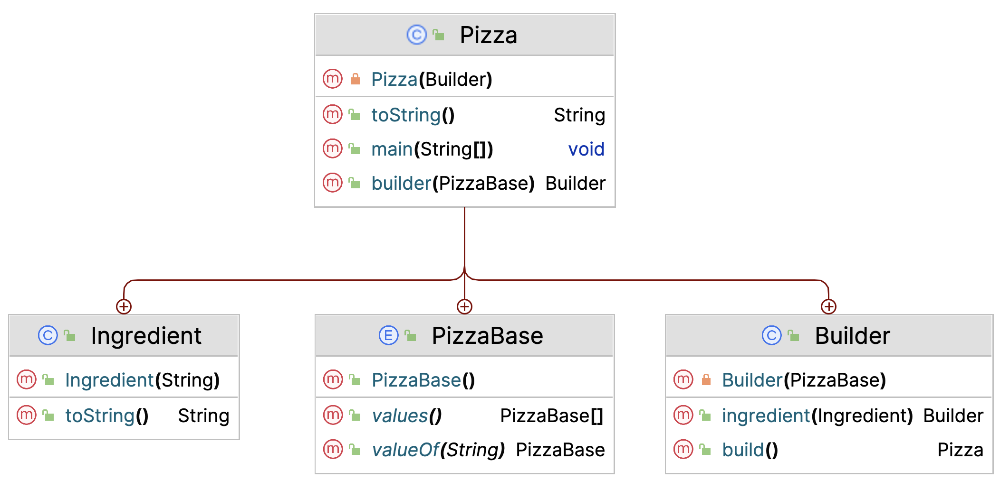
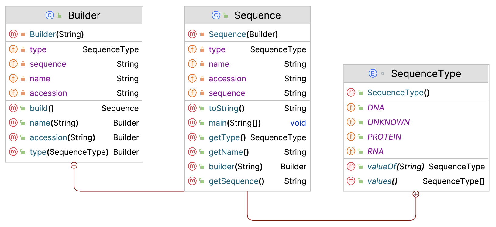

# Design Patterns - Creational

Creational patterns target the process of object creation. 

## Singleton

:::{admonition} Singleton
:class: note  
Singleton is a creational design pattern that lets you ensure that a class has only one instance, 
while providing a global access point to this instance.
:::


In its classic form it looks like this.

```java
public class ClassicSingleton {
    //PART ONE: THE SINGLE INSTANCE
    private static ClassicSingleton instance;

    //PART TWO: THE PRIVATE CONSTRUCTOR
    private ClassicSingleton() {
    }

    //PART THREE: THE PUBLIC STATIC GETTER
    public static ClassicSingleton getInstance() {
        if (instance == null) {
            //LAZY INITIALIZATION!
            instance = new ClassicSingleton();
        }
        return instance;
    }
}
```

However, this solution is not thread safe. Therefore, other implementations of this pattern have evolved.
Here is the solution using `synchronized` and `volatile`:

```java
public class ThreadSafeSingleton {
    //volatile -- keep in main memory, not in thread-local cache
    private static volatile ThreadSafeSingleton instance = null;

    private ThreadSafeSingleton() {
    }

    public static ThreadSafeSingleton getInstance() {
        if (instance == null) {
            //synchronized -- ensures that only one thread can enter this block at a time
            synchronized (ThreadSafeSingleton.class) {
                if (instance == null) {
                    instance = new ThreadSafeSingleton();
                }
            }
        }
        return instance;
    }
}
```

:::{admonition} `synchronized`
:class: note  
Java synchronized blocks can be used to avoid race conditions (a system attempts to perform two 
or more operations at the same time, but the operations must be done in the proper sequence to be done correctly).   
A synchronized block in Java is synchronized on some object.  
All synchronized blocks synchronized on the same object can only have one thread executing inside them at the same time.  
:::

:::{admonition} `volatile`
:class: note  
Volatile is used to indicate that a variable's value will be modified by different threads.  
Declaring a volatile Java variable means:  

* The value of this variable will never be cached thread-locally: all reads and writes will go straight to "main memory”.
* Access to the variable acts as though it is enclosed in a synchronized block, synchronized on itself.
:::

Other -arguably simpler- solutions make use of `enum` properties:

```java
public enum Singleton {
    INSTANCE;
}
```

However, any instance variables need to be specified as compile-time constants. This is often not appropriate or applicable.

GIYF for more in-depth discussion of the different solutions.

GGcdi54@v5ad3bH

## Factory (Method)

Factory pattern comes in several flavors, depending on the complexity of your model: 

- Factory Method
- Factory (class)
- Abstract Factory

Here, we'll only discuss factory method.

In Factory pattern, we create an object without exposing the creation logic to the client,
 and refer to newly created object using a common interface.  

More advanced (Abstract Factory):  
Define an interface for creating an object, but let subclasses decide which class to instantiate.  

The Factory method lets a class defer instantiation it uses to subclasses.

We have already seen a very simple factory method in chapter General coding principles, where the chapter ended with 
this example (Prefer factory methods over complex constructors):

```java
class Cell {
    static final int STATUS_FLAGGED = 4;
    private int status;

    public boolean isFlagged() {
        return status == STATUS_FLAGGED;
    }

    private Cell() {  }

    public static Cell createFlaggedCell() {
        Cell cell = new Cell();
        cell.status = STATUS_FLAGGED;
        return cell;
    }

    public static Cell fromStatusCode(int status) {
        Cell cell = new Cell();
        cell.status = status;
        return cell;
    }
}
```

This class actually has two factor methods: one creating specific instances (flagged cells) and one serving a more generic purpose.
Factory methods are always `static` because their purpose is to create instances.  
Note that the constructor is marked private, so the only way to create instances is through one of the two factory methods.

Here is another example, where the purpose is to serve subtypes without the client being aware of the particular type.

Suppose you have (again - yes, we're into bioinformatics) an app processing biological sequences. 
You have some sequence reading class that you want to have create and serve the sequence instances of the correct subtypes, 
without you having to worry about which type you have at hand - not until their type is relevant.

This is the factory in class `Sequence`:

```java
public abstract class Sequence {
    //much more code

    public static Sequence fromString(String sequence, Properties properties) {
        sequence.toUpperCase();
        Sequence newSeq;
        //determine what type the string represents
        //create the correct subtype (DNA, RNA, ...)
        if (sequence.contains("T"))
            newSeq = new DNA();
        else if (sequence.contains("U"))
            newSeq = new RNA();
        else
            newSeq = new Protein();
        //process the properties and return the created object
        return newSeq;
    }
}
```

This is the (extremely simple) UML to go with it:


```{image} figures/factory_pattern.png
:alt: factory
:class: bg-primary mb-1
:width: 400px
:align: center
```


## Builder

I love the builder. It is such a great pattern for creating objects that need many variables to be set, 
some of which required and some of which optional, with reasonable defaults. 

:::{admonition} Builder
:class: note  
Separate the construction of a complex object from its representation so that the same construction process can create different representations.  
Builder pattern builds a complex object using simple objects in a step by step approach.
:::


I have two examples for you. First, let's have some pizza. 
The three ingredients of the builder pattern are 

1. A private constructor of the object types you want to build (Pizza)
2. A Builder class, dedicated to creating objects (in this case, Pizza instances)
3. A static factory-like method serving a Builder instance

Here is the UML for this particular case.



The `Pizza` class has three inner classes: `Ingredient`, `PizzaBase` and `Builder`.
Every Pizza needs a PizzaBase, and that base is topped with zero to many Ingredients.
We use the Builder for this purpose. Here is the `Pizza` code

```java
public class Pizza {
    private List<Ingredient> ingredients;
    private PizzaBase base;

    //1. PRIVATE CONSTRUCTOR
    private Pizza(Builder builder) {
        this.base = builder.base;
        this.ingredients = new ArrayList<>();
        for (Ingredient ingredient : builder.ingredients) {
            this.ingredients.add(ingredient);
        }
    }

    @Override
    public String toString() {
        String ingredientsStr = ingredients.stream()
                .map(i -> i.name)
                .collect(Collectors.joining(" & "));
        return "Pizza{" +
                "base=" + this.base +
                "\n\tingredients=" + ingredientsStr +
                '}';
    }

    //2. INNER CLASS: BUILDER CLASS
    public static class Builder {
        private final PizzaBase base;
        private List<Ingredient> ingredients = new ArrayList<>();
        // BASE IS REQUIRED
        private Builder(PizzaBase base) {
            this.base = base;
        }
        //INGREDIENTS ARE OPTIONAL
        public Builder ingredient(Ingredient ingredient) {
            this.ingredients.add(ingredient);
            //RETURNS ITSELF TO FACILITATE CHAINING!
            return this; 
        }

        public Pizza build() {
            if (this.ingredients.isEmpty()) {
                throw new IllegalArgumentException("there should be at least one ingredient");
            }
            return new Pizza(this);
        }
    }

    //3. STATIC METHOD SERVING BUILDER
    // BASE IS REQUIRED
    public static Builder builder(PizzaBase base) {
        try {
            Objects.requireNonNull(base);
        } catch (NullPointerException ex) {
            throw new IllegalArgumentException("base should be provided");
        }

        return new Builder(base);
    }

    //INNER CLASS
    public static class Ingredient {
        private final String name;

        public Ingredient(String name) {
            this.name = name;
        }

        @Override
        public String toString() {
            return "Ingredient{" +
                    "name='" + name + '\'' +
                    '}';
        }
    }

    //INNER CLASS
    public enum PizzaBase {
        STANDARD,
        EXTRA_THICK,
        LOW_SALT;
    }
}
```
Let's bake:

```java
Pizza pizza = Pizza
        .builder(null)
        .ingredient(new Ingredient("cheese"))
        .ingredient(new Ingredient("onions"))
        .ingredient(new Ingredient("peppers"))
        .ingredient(new Ingredient("gorgonzola"))
        .build();
System.out.println("pizza = " + pizza);
```
<pre class="console_out">
pizza = Pizza{base=EXTRA_THICK
	ingredients=cheese & onions & peppers & gorgonzola}
</pre>


Below is another example, building sequences. It is quite different because 
it has no "ingredient" that can be added repeatedly.




```java
package nl.bioinf.designpatterns.builder;

public class Sequence {
    private String sequence;
    private String accession;
    private String name;
    private SequenceType type;

    public static class Builder {
        //required parameter
        private final String sequence;
        //optional parameters
        private String name = "_ANONYMOUS_";
        private String accession = "_UNKNOWN_ACCNO_";
        private SequenceType type = SequenceType.UNKNOWN;

        private Builder(String sequence) {
            this.sequence = sequence;
        }

        public Builder name(String name) {
            this.name = name;
            return this;
        }

        public Builder accession(String accession) {
            this.accession = accession;
            return this;
        }

        public Builder type(SequenceType type) {
            this.type = type;
            return this;
        }

        public Sequence build() {
            return new Sequence(this);
        }
    }

    public static Builder builder(String sequence) {
        return new Builder(sequence);
    }

    private Sequence(Builder builder) {
        this.sequence = builder.sequence;
        this.accession = builder.accession;
        this.name = builder.name;
        this.type = builder.type;
    }

    public String getSequence() {
        return sequence;
    }

    public String getName() {
        return name;
    }

    public SequenceType getType() {
        return type;
    }

    @Override
    public String toString() {
        return "Sequence{" +
                "sequence='" + sequence + '\'' +
                ", accession='" + accession + '\'' +
                ", name='" + name + '\'' +
                ", type=" + type +
                '}';
    }

    enum SequenceType {
        DNA,
        RNA,
        PROTEIN,
        UNKNOWN;
    }
}

```
Building a sequence:
```java
Sequence sequence = Sequence.builder("GAATTC")
        .accession("GB|123456")
        .name("RNA Polymerase III")
        .type(SequenceType.DNA)
        .build();
System.out.println(sequence);
```
<pre class="console_out">
Sequence{sequence='GAATTC', accession='GB|123456', name='RNA Polymerase III', type=DNA}
</pre>

This pattern is an alternative to a design that is called the **telecoping constructor pattern**. It is a perfectly valid design tool, but much more rigid than builder. It has these problems associated:

- hard-to-read client code
- high risk of mistaken argument position
- only certain combinations have defaults
- objects at risk of corrupted data (no atomic construction)

Here is the Sequence class telescoping constructor implementation.

```java
class Sequence{
    //REST OF CODE OMITTED  

    public Sequence(String sequence) {
        this(sequence, "_UNKNOWN_ACCNO_");
    }

    public Sequence(String sequence, String accession) {
        this(sequence, accession, "_ANONYMOUS_");
    }

    public Sequence(String sequence, String accession, String name) {
        this(sequence, accession, name, SequenceType.UNKNOWN);
    }

    public Sequence(String sequence,
                    String accession,
                    String name,
                    SequenceType type) {
        this.sequence = sequence;
        this.accession = accession;
        this.name = name;
        this.type = type;
    }
}
```