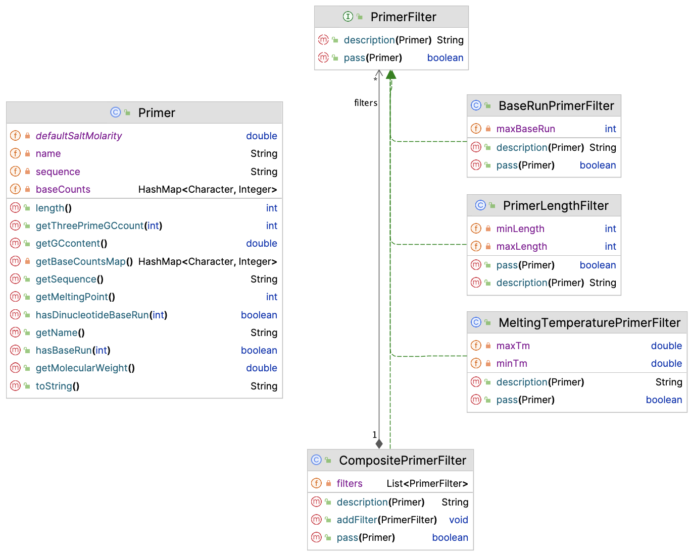
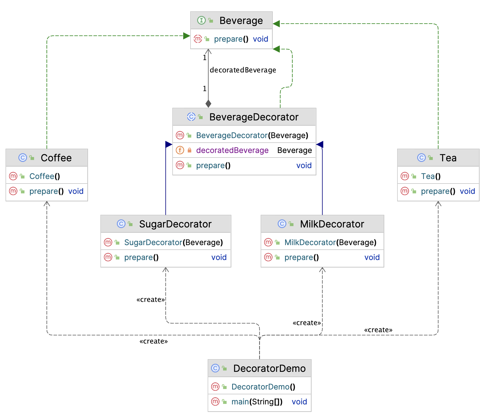

# Design Patterns - Structural

Structural patterns target application structure. We only deal with one of these.

## Facade

:::{admonition} Facade Pattern
:class: note
Facade pattern hides the complexities of a system and provides a simple interface to the client 
The client uses only this interface to access the system
:::

A well-known example is the use of DAO classes to abstract away the complexities of database interaction.

This pattern is not further discussed here.

## Filter

:::{admonition} Filter Pattern
:class: note
Filter pattern (or Criteria pattern) is a design pattern that enables developers to filter a set of objects using different criteria and chaining them in a decoupled way through logical operations. 
:::

Although plain filtering of objects has been greatly simplified with the introduction of the streams API, 
this pattern still has uses for all more complicated cases.

Suppose you are working on an application for primer analysis.  
This includes several optional and configurable filter steps:  

- GC percentage filter
- Length filter
- Homopolymer (baserun) filter
- ...other filter steps

Here is the Primer class.

```java
public class Primer {
    private static double defaultSaltMolarity = 0.05;
    private String sequence;
    private String name;
    private HashMap<Character, Integer> baseCounts;

    public Primer(String sequence, String name) {
        this.sequence = sequence;
        this.name = name;
    }

    public Primer(String sequence) {
        this(sequence, "UNNAMED");
    }

    public String getSequence() {
        return sequence;
    }

    public String getName() {
        return name;
    }

    public int length() {
        return this.sequence.length();
    }

    public double getGCcontent() {
        double perc = (double) (getBaseCountsMap().get('G') + getBaseCountsMap().get('C')) / sequence.length();
        return perc;
    }

    private HashMap<Character, Integer> getBaseCountsMap() {
        if (baseCounts == null) {
            baseCounts = new HashMap<Character, Integer>();
        } else {
            return baseCounts;
        }
        baseCounts.put('A', 0);
        baseCounts.put('C', 0);
        baseCounts.put('G', 0);
        baseCounts.put('T', 0);
        baseCounts.put('O', 0);
        for (Character c : this.sequence.toUpperCase().toCharArray()) {
            baseCounts.put(c, baseCounts.get(c) + 1);
        }
        return baseCounts;
    }

    public double getMolecularWeight() {
        HashMap<Character, Integer> baseCountsLocal = getBaseCountsMap();
        if (baseCountsLocal.get('O') != 0) {
            throw new UnsupportedOperationException("Ambiguous bases not supported yet");
        }
        double mw = baseCountsLocal.get('G') * 329.21;
        mw += baseCountsLocal.get('A') * 313.21;
        mw += baseCountsLocal.get('T') * 304.2;
        mw += baseCountsLocal.get('C') * 289.18;
        mw -= 61.96;
        return mw;
    }

    /**
     * Commonly used formula takes into account the molarSalt concentration of
     * the reaction: Tm = 81.5C + 7.21C x Math.log(molarSalt) + (0.41 x GC) -
     * (675 / primer length)
     * @return Tm the melting point
     */
    public int getMeltingPoint() {
        HashMap<Character, Integer> baseCountsLocal = getBaseCountsMap();
        if (baseCountsLocal.get('O') != 0) {
            throw new UnsupportedOperationException("Ambiguous bases not supported yet");
        }
        double pGC = ((double) (baseCountsLocal.get('G') + baseCountsLocal.get('C')) / length()) * 100;
        return (int) Math.round(81.5 + 7.21 * Math.log(defaultSaltMolarity) + (0.41 * pGC) - (675 / length()));
    }

    public boolean hasBaseRun(int maxRunLength) {
        char[] nucs = {'G', 'A', 'T', 'C'};
        for (char nuc : nucs) {
            Pattern p = Pattern.compile(nuc + "{" + maxRunLength + "}");
            Matcher m = p.matcher(this.sequence.toUpperCase());
            if (m.find()) {
                return true;
            }
        }
        return false;
    }

    public boolean hasDinucleotideBaseRun(int maxRunLength) {
        String[] dinucs = {"GA", "GT", "GC", "AG", "AT", "AC", "TG", "TA", "TC", "CG", "CA", "CT"};
        for (String dinuc : dinucs) {
            Pattern p = Pattern.compile("(" + dinuc + ")" + "{" + maxRunLength + "}");

            Matcher m = p.matcher(this.sequence.toUpperCase());
            if (m.find()) {
                return true;
            }
        }
        return false;
    }

    /**
     * returns the count of G+C nucleotides in the last 3' terminal nucleotides
     * (length indicated by desiredThreePrimeEndSize)
     * Also called 3'GC-clamp
     *
     * @param desiredThreePrimeEndSize
     * @return threePrimeGCcount
     */
    public int getThreePrimeGCcount(int desiredThreePrimeEndSize) {
        String threePrimeEnd;
        if (sequence.length() >= desiredThreePrimeEndSize) {
            threePrimeEnd = sequence.substring(sequence.length() - desiredThreePrimeEndSize, sequence.length());
        } else {
            threePrimeEnd = sequence;
        }

        Primer tpPrimer = new Primer(threePrimeEnd);
        tpPrimer.getBaseCountsMap();

        int gcCounts = tpPrimer.getBaseCountsMap().get('G') + tpPrimer.getBaseCountsMap().get('C');

        return gcCounts;
    }

    @Override
    public String toString() {
        return "> Primer" + name + '\n' + sequence  + '\n';
    }
}
```

For convenience, here is the UML of this class:

```{image} figures/primer.png
:alt: primer
:class: bg-primary mb-1
:width: 300px
:align: center
```

Now, given this class, you want to be able to filter Primer instances for many of the properties implemented above:

- length
- GC-percentage
- melting temperature
- base runs
- etc.

So in your app, you create a form where the form fields represent all of these properties, and, if not left blank,
should be included in the filtering procedure.  
Each form field will translate into an implementation of this interface:

```java
public interface PrimerFilter {
    /**
     * checks the given primer.
     */
    boolean pass(Primer primer);
    
    /**
     * Returns the description of this filter.
     */
    String description(Primer primer);
}
```

Here are a few implementations.

```java
public class PrimerLengthFilter implements PrimerFilter{
    private int minLength;
    private int maxLength;

    public PrimerLengthFilter(int minLength, int maxLength) {
        this.minLength = minLength;
        this.maxLength = maxLength;
    }

    @Override
    public boolean pass(Primer primer) {
        return primer.length() >= minLength && primer.length() <= maxLength;
    }

    @Override
    public String description(Primer primer) {
        return getClass().getSimpleName() + "{" + "min length=" + minLength + ", max length=" + maxLength + "}; ACTUAL=" + primer.length();
    }
}
```
```java
public class MeltingTemperaturePrimerFilter implements PrimerFilter {
    private double minTm;
    private double maxTm;

    public MeltingTemperaturePrimerFilter(double minTm, double maxTm) {
        this.minTm = minTm;
        this.maxTm = maxTm;
    }

    @Override
    public boolean pass(Primer primer) {
        return primer.getMeltingPoint() >= minTm && primer.getMeltingPoint() <= maxTm;
    }

    @Override
    public String description(Primer primer) {
        return getClass().getSimpleName() + "{" + "min Tm=" + minTm + ", max Tm=" + maxTm + "}; ACTUAL=" + primer.getMeltingPoint();
    }
}
```

Other properties will follow a similar pattern.

Now, naively, you may do something like this:

```java
public class PrimerAnalysisApp {
    public static void main(String[] args) {
        List<Primer> primers = new ArrayList<>();
        primers.add(new Primer("GCTCGATCGATCGAGCGAGT", "primer1"));
        primers.add(new Primer("GACTCCCCTACGCTAGCAG", "primer2"));
        primers.add(new Primer("TTACATCTCACCTTTATAAA", "primer3"));
        primers.add(new Primer("GCATTGCAGCATACTATCGCAGCG","primer4"));

        List<PrimerFilter> filters = new ArrayList<>();
        filters.add(new PrimerLengthFilter(10, 24));
        filters.add(new MeltingTemperaturePrimerFilter(50, 65));
        filters.add(new BaseRunPrimerFilter(4));

        List<Primer> passedPrimers = new ArrayList<>();

        for (Primer p : primers) {
            System.out.println("Analyzing primer: " + p.getName());
            for (PrimerFilter filter : filters) {
                System.out.println("Applying filter: " + filter.getClass().getSimpleName());
                if (! filter.pass(p)) {
                    System.out.println("Primer " + p.getName() + " did not pass filter " + filter.description(p));
                } else {
                    passedPrimers.add(p);
                }
            }
        }
    }
}
```

But this is not a reusable solution.  
This is where a **_composite filter_** may come in handy!

```java
public class CompositePrimerFilter implements PrimerFilter {
    private List<PrimerFilter> filters = new ArrayList<>();

    public void addFilter(PrimerFilter filter) {
        filters.add(filter);
    }

    @Override
    public boolean pass(Primer primer) {
        for (PrimerFilter filter : filters) {
            if (! filter.pass(primer)) {
                return false;
            }
        }
        return true;
    }

    @Override
    public String description(Primer primer) {
        StringBuilder sb = new StringBuilder();
        sb.append(getClass().getSimpleName()).append("{");
        for (PrimerFilter filter : filters) {
            if (! filter.pass(primer)) {
                sb.append(filter.description(primer)).append(", ");
            }
        }
        sb.delete(sb.length() - 2, sb.length());
        sb.append("}");
        return sb.toString();
    }
}
```

Here is the App code refactored:

```java
    CompositePrimerFilter compositeFilter = new CompositePrimerFilter();

    compositeFilter.addFilter(new PrimerLengthFilter(10, 24));
    compositeFilter.addFilter(new MeltingTemperaturePrimerFilter(50, 65));
    compositeFilter.addFilter(new BaseRunPrimerFilter(4));

    List<Primer> passedPrimers = new ArrayList<>();

    for (Primer p : primers) {
        System.out.println("Analyzing primer: " + p.getName());
        if (! compositeFilter.pass(p)) {
            System.out.println("Primer " + p.getName() + " did not pass: " + compositeFilter.description(p));
        } else {
            passedPrimers.add(p);
        }
    }
```

And below the final UML.




Note that this solution could have been made more efficient and more concise. Try to solve this yourself.


### Revisiting the Factory pattern

We could extend on the filter pattern above by also employing the factory pattern, in particular 
the factory class (or even abstract factory).

Given two different use cases of Primer filtering, we could design composite filter objects: 

- Probe filtering for microarray: 
    * Probe lengths between 25 and 35
    * Melting temp between 65 and 85
    * more specific properties

- Primer filtering for qPCR  
    * Length between 18 and 25
    * Melting temp between 50 and 65
    * more specific properties

This will involve a complex construction process that can be abstracted away in an Abstract Factory Class, each a subtype of subtype of AbstractPrimerFilterFactory:

`AbstractPrimerFilterFactory`  
    `MicroarrayProbeFilterFactory extends AbstractPrimerFilterFactory`  
    `PcrPrimerFilterFactory extends AbstractPrimerFilterFactory`  

Can you implement this model as a Factory class hierarchy?


## Decorator

:::{admonition} Decorator Pattern
:class: note
Attach additional responsibilities to an object dynamically.  
Decorators provide a flexible alternative to subclassing for extending functionality
:::

The classic example (people like coffee...) is preparing a cup of coffee.

Let's start with the UML.



Central is the interface `Beverage` with is single abstract method, `prepare()`. Now, both the beverage decorators (Sugar, Milk) implement this interface, and the drinks themselves as well (Coffee, Tea). The deal with the interface differently though.

Here are Coffee and Tea:

```java
public class Tea implements Beverage {
    @Override
    public void prepare() {
        System.out.println("Making plain tea");
    }
}
```

```java
public class Coffee implements Beverage {
    @Override
    public void prepare() {
        System.out.println("Preparing a nice hot Java!");
    }
}
```

Nothing fancy going on here. The secret lies in the abstract class `BeverageDecorator` and its subclasses.

```java
public abstract class BeverageDecorator implements Beverage {
    private final Beverage decoratedBeverage;

    public BeverageDecorator(Beverage beverage) {
        this.decoratedBeverage = beverage;
    }

    @Override
    public void prepare() {
        decoratedBeverage.prepare();
    }
}
```

The decorator holds an instance of its decorated object, and lets it prepare itself, and subclasses can the extend (wrap) this behaviour with their own:

```java
public class MilkDecorator extends BeverageDecorator {
    public MilkDecorator(Beverage beverage) {
        super(beverage);
    }

    @Override
    public void prepare() {
        super.prepare();
        System.out.println("..adding milk");
    }
}
```
```java
public class SugarDecorator extends BeverageDecorator {
    public SugarDecorator(Beverage beverage) {
        super(beverage);
    }

    @Override
    public void prepare() {
        super.prepare();
        System.out.println("..adding some sugar");
    }
}
```

Below is some sample code:

```java
//create coffee with milk and sugar
Beverage coffee = new MilkDecorator(
        new SugarDecorator(
                new Coffee()));
coffee.prepare();

//create tea with sugar only
Beverage tea = new SugarDecorator(
        new Tea());
tea.prepare();
```
<pre class="console_out">
Preparing a nice hot Java!
..adding some sugar
..adding milk
Making plain tea
..adding some sugar
</pre>


Where in practice could you do this? For instance, a logging system may make use of it, by attaching tie stamps or other textual wrappers to logged messages.
