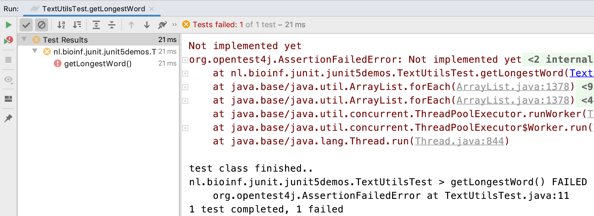

# JUnit 5 basics

## Introduction

In this post, we'll address a topic that is subject to heated debate in development land: testing.
Why would you spend a significant portion of your development time writing code to test other code?
This will be addressed in more detail later, but think about this question first:

**_How much of your time is lost on debugging and solving problems that could have been foreseen and prevented if you would have taken the time to think about "boundary" use cases of your methods?_**

Several major Java unit testing frameworks exist, but we will explore JUnit since it is the most widely used. Also, the concepts you learn with JUnit are easily transferred to other frameworks.

The **_unit_** in unit testing is the method - a named piece of reusable code. If designed well it does one thing only, and it does it well. When creating tests, we **_cover_** the software units (methods) of our code base with one or more test methods - unit tests or **_test cases_**.

Here is an example to clarify the concept. Suppose you have class `Polygon` that has as field a list of `Coordinate` instances. Here is the `Coordinate` class:

```java
package nl.bioinf;
public class Coordinate {
    private int x;
    private int y;
    
    //constructors, getters and setters omitted
    
    public double distanceTo(Coordinate other) {
        return Math.sqrt(Math.pow(this.x - other.x, 2) + Math.pow(this.y - other.y, 2));
    }
}
```

And here is the `Polygon` class:

```java
package nl.bioinf;
import java.util.List;

public class Polygon {
    private List<Coordinate> coordinates;

    //constructors, getters and setters omitted
    
    public void addCoordinate(Coordinate coordinate) {
        if (coordinates == null) {
            coordinates = new LinkedList<>();
        }
        this.coordinates.add(coordinate);
    }
    
    public double getLength() {
        double distance = 0;
        //calculate distance
        return distance;
    }
}
```

Now look at the Coordinate and Polygon classes and ask yourself: "Is this code robust?". Can I think of usage scenario's where one of these classes will fail? 
Or is there even a real bug in there? Take a minute and then read on.

One thing that will immediately alert an experienced programmer is the instance variable in the Polygon class: it is being initialized in a "lazy" manner. There is a big fat `NullPointerException` lurking there. When the `getLength()` method is called on an object where no Coordinate has been added yet, `coordinates` will be null.

This is the essence of JUnit testing: it makes you think about **_boundary cases_** like this, and will help you create robust code in a systematic way.

A typical test covering this boundary case could be:

```java
package nl.bioinf;

import org.junit.jupiter.api.Test;
import static org.junit.jupiter.api.Assertions.assertEquals;
public class PolygonTest {
    @Test
    public void getLength() {
        Polygon polygon = new Polygon();
        double expectedLength = 0;
        assertEquals(expectedLength, polygon.getLength());
    }
}
```

This test **asserts** that the length of an empty Polygon is zero - a good choice of **_expected behavior_**. Any other result, including a `NullPointerException`, will make the test fail.

The next step is of course to modify method `getLength()` in such a way that it will pass this test. Here is a simple solution:

```java
    public double getLength() {
        if (coordinates == null) return 0;
        else {
            double distance = 0;
            //calculate distance
            return distance;
        }
    }
```

> The how-to of creating and running tests in IntelliJ will be shown shortly.

## Reasons for unit testing

Test Driven Development (TDD) is today’s standard in software development. 
If you introduce new features, a solid test suite protects you against regression in existing code

The approach we’ll take in this course is hand-in-hand development of test and production code. This is one school. 
The other believes that all test code should be written before any production code.

These are the three main reasons for spending time and resources to create and run tests.

1. For any function and given a set of inputs, we can determine if the function is returning the proper values and will gracefully handle failures during the course of execution should invalid input be provided.
2. You'll be writing code that is easy to test: you are more likely to have a higher number of smaller, more focused functions that provide a single operation rather than large functions performing a number of different operations
3. Since you're testing your code as you introduce new functionality, you can prevent changes and additions from breaking existing functionality

(See [tutsplus](http://code.tutsplus.com/articles/the-beginners-guide-to-unit-testing-what-is-unit-testing--wp-25728))

## Running JUnit 5 tests using Gradle and IntelliJ

First make sure you have the correct dependencies in your Gradle build file. Note that I already put two additional dependencies in there (AssertJ and JUnit Params) that will be needed for the next post.

```groovy
group 'nl.bioinf.nomi.appdesigndemos'
version '1.0-SNAPSHOT'

apply plugin: 'java'
apply plugin: 'idea'

sourceCompatibility = JavaVersion.VERSION_1_10

repositories {
    mavenCentral()
}

dependencies {
    testCompile(
    testImplementation 'org.junit.jupiter:junit-jupiter-api:5.5.2'
    testRuntimeOnly 'org.junit.jupiter:junit-jupiter-engine:5.5.2'
    //for parameterized tests
    testImplementation 'org.junit.jupiter:junit-jupiter-params:5.5.2'
    //for assertJ type assertions
    testImplementation 'org.assertj:assertj-core:3.13.2'
}

// this tells IntelliJ you wish to use the JUnit platform to run the tests
test {
    useJUnitPlatform()
}
```

Next, create a class and method stub that should be unit tested. Suppose you are creating a class, `TextUtils` with method `getLongestWord(String text)` 
This is what it looks like without any functionality implemented:

```java
package nl.bioinf.junit5tests;
public class TextUtils {
    /**
     * Finds the longest word in a given string.
     * If there is a tie, the last found longest
     * is returned.
     *
     * @param text the text to scan
     * @return longestWord
     */
    public static String getLongestWord(String text) {
        throw new UnsupportedOperationException("Not implemented yet");
    }
}
```

Note that the programmer already thought about a single boundary case - the tie. This can be seen in the Javadoc.
To create a test for this method, put the cursor on the class name, activate the context menu (`alt + enter`) and select "Create Test"


The destination package is `nl.bioinf.junit.junit5demos` - the same as the `TextUtils` class. This is an extremely important aspect since it puts the test class in the same package scope.
Select the method you want to create a test for ant press "OK".

This will create a test class with the same name as your original class, but with "Test" appended. **_Although the test class is in the same package it will not be in the same folder._** Instead, it will be located in the `src/test` folder while the original class is located under `src/main`.

Since implementation and test code are in the same package scope, all non-private methods from the class to test are visible:  

- public
- protected
- package-public (default)

Only private scoped method will be invisible and therefore in principle untestable.


The test class will look like this.

```java
package nl.bioinf.junit.junit5demos;

import org.junit.jupiter.api.Test;
import static org.junit.jupiter.api.Assertions.*;

class TextUtilsTest {

    @Test
    void getLongestWord() {
    }
}
```

Note the `@Test` **_annotation_** above the method signature. It makes this method recognizable as test method - it tells the JUnit runtime this is a JUnit test method. We'll visit more JUnit -related annotations later on. 
This default method stub should never be kept as is; it will always pass! There is great danger in that (think about it).
A much better default test stub is the one below as it will always fail because the `fail()` method will throw an error.

```java
    @Test
    void getLongestWord() {
        fail("test not implemented yet");
    }
```

In the editor margin, you see little green arrows (triangles):
These represent the simplest way to run one or more tests. You find them next to the class name (run the entire test class) or besides a single test case. Hover one to see the hint.


Click the arrow next to the test case and the Gradle daemon will run it. Of course it will fail - you specified that yourself. The test run panel will show both console output and a test run summary (in this case a single test).



Now create some test code. The simplest is a so-called **_sunny-day scenario_**: a normal input where you expect unambiguous result. Here is an example:

```java
@Test
public void getLongestWord() {
    final String input = "Hello JUnit testing world";
    final String expected = "testing";
    final String observed = TextUtils.getLongestWord(input);
    assertEquals(expected, observed);
}
```

Assertions are the fundaments on which unit testing is built. They are used to specify _how you expect the code under test will behave given a set of conditions_. one of the most basic ones is the `assertEquals()` assertion method that is also used in the snippet above. You use it like this: `assertEquals(<expected value>, <observed value>);` When the expected value does not equal the observed value (according to the `equals()` method of course), an error will be thrown. In this case, `AssertionFailedError`. The test will fail.

Of course the test will still fail because the tested method throws an `UnsupportedOperationException`. The next snippet gives a naive implementation.

```java
public static String getLongestWord(String text) {
    String[] words = text.split(" ");
    String longest = "";
    for (String word : words) {
        if (word.length() >= longest.length()) {
            longest = word;
        }
    }
    return longest;
}
```

If you're into it, you can also do it the Java8 / Functional Programming way:

```java
public static String getLongestWord(String text) {
    String[] words = text.split(" ");
    Optional<String> findFirst = Stream.of(words).sorted(
            (one, two) -> Integer.compare(two.length(), one.length())
        ).findFirst();
    return findFirst.get();
}
```

Given the above implementation(s), many programmers would think they are done. But you're not!
Can you think of use cases where the above code would break, or behave incorrectly?
Again: This is a very important reason to test - it makes you think about other than sunny day scenarios.

Take a minute to think about some useful tests that will demonstrate the reliability of the code and take extra care of boundary cases!
Should you maybe even change the signature of the method getLongestWord()?

Given these inputs  

1. `"The quick brown fox jumps over the lazy dog"`:
2. `""`
3. `" "`
4. `"foo bar 1234"`
5. `null`
5. `"A sentence, with some: punctuation!"`

What should your method do, and what should the test case expect?

New specs:  
- throw an `IllegalArgumentException` for cases 2, 3 and 5
- strip punctuation characters: ':', ';', '?' etc
- keep numbers (why? Because I like them).

Here is a (still flawed) next iteration

```java
    public static String getLongestWord(String text) {
        if (isIllegalInput(text)) {
            throw new IllegalArgumentException("text cannot be null or empty");
        }

        text = stripPunctuationCharacters(text);
        String[] words = text.split(" ");
        String longest = "";
        for (String word : words) {
            if (word.length() >= longest.length()) {
                longest = word;
            }
        }
        return longest;
    }

    private static boolean isIllegalInput(String text) {
        return null == text || text.isEmpty() || text.equals(" ");
    }

    public static String stripPunctuationCharacters(String text) {
        return text.replaceAll("[?,.:;]", "");
    }
```

Notice how very small pieces of code have been extracted to separate methods. It makes the functionality so much more readable! Compare the readability of this


```java
    if (isIllegalInput(text)) {
        throw new IllegalArgumentException("text cannot be null or empty");
    }
```

with this

```java
    if (null == text || text.isEmpty() || text.equals(" ")) {
        throw new IllegalArgumentException("text cannot be null or empty");
    }
```

Besides readability, these small methods can be tested separately, making for a much more robust test suite.

## Document!

Don't forget to write down your design decisions in the Javadoc section - especially regarding public methods. 

```java
/**
 * This method searches for the longest word in 
 * a given string.
 * It will split the String on all spaces and
 * removes all punctuation characters (matching
 * the pattern "[:;,.?!]"). If multiple words
 * have the same length, it will return the
 * first of these.
 * @param text the text to analyze
 * @return longest the longest word
 * @throws IllegalArgumentException when 
 *    a null value, an empty string or a single space is passed
 */
```

The nice thing about Javadoc is that you can access it in a readable manner from within your IDE (Fn+F1 on Mac or Ctrl + Q on Linux/Windows):


## JUnit `assert...()` methods

You have seen the `fail()` and `assertEquals()` methods that simply fail a test or assert equality between two objects, respectively. Although in principle you could write almost any test with the assertEquals method, there are more. The primary reason is that they make your test suite more readable and more concise.  

Below are the assert methods you can use in your tests. Their names are mostly self-explanatory but some need a bit of an explanation. The `assertThrows()` method, testing for exceptions, will be dealt with in more detail, as well as the `assertAll()` method that groups other assertions.  

- `assertEquals()`
- `assertTrue()` & `assertFalse()`
- `assertNull()` & `assertNotNull()`
- `assertThrows()`
- `assertArrayEquals()`
- `assertSame()` & `assertNotSame()`
- `assertAll()`
- `fail()`

Note that equality is not equal to sameness!

There are overloaded variants for many of them.  
Please refer to the docs for more detail: [https://junit.org/junit5/docs/current/user-guide](https://junit.org/junit5/docs/current/user-guide)

## Testing for Exceptions

The method `assertThrows(Class<? extends Throwable> expectedType, Executable executable)`
in JUnit5 is used to assert that the supplied **_executable_** will throw an exception of the expected type. 
It relies on lambdas, which were not discussed in {doc}`/03_apis/functional_programming`. 

```java
@Test
void shouldThrowException() {
    Throwable exception = assertThrows(
        IllegalArgumentException.class,        // expects an IllegalArgumentException.class instance
        () -> TextUtils.getLongestWord(null)); // will call getLongestWord as tested method

    // this uses a regular assertTrue test to check for the exception message
    assertEquals(exception.getMessage(), "text cannot be null");
}
```

If you don't like (or understand) lambdas you can also use the strategy below with basic Java to achieve the same test functionality.

```java
@Test
public void shouldThrowExceptionOldSchool() {
    try {
        TextUtils.getLongestWord(null);
        fail("Expected an IllegalArgumentException");
    } catch (IllegalArgumentException e) {
        assertEquals("text cannot be null", e.getMessage());
    }
}
```

## Grouping assertions using `assertAll()` 

When multiple assertions are concern a single object, it may be a good idea to treat them as a single assertion. That is where `assertAll()` comes in. This method takes a varargs "list" of Executables.

Here is a self-contained example (borrowed and adapted from the official docs).

```java
@DisplayName("Testing the name elements of Person")
@Test
void groupedAssertions() {
    class Person {
        String firstName;
        String LastName;
        public Person(String firstName, String lastName) {
            this.firstName = firstName;
            LastName = lastName;
        }
        public String getFirstName() {
            return firstName;
        }
        public String getLastName() {
            return LastName;
        }
    }

    Person person = new Person("Jane", "Goodall");
    // In a grouped assertion all assertions are executed, and all
    // failures will be reported together.
    assertAll("person",
            () -> assertEquals("Jane", person.getFirstName()),
            () -> assertEquals("Doe", person.getLastName())
    );
}
```

This results in 


You can even nest them within code blocks:

```java
    @Test
    void dependentAssertions() {
        Person person = new Person("Jane", "Goodall");

        // Within a code block, if an assertion fails the
        // subsequent code in the same block will be skipped.
        assertAll("properties",
                () -> {
                    String firstName = person.getFirstName();
                    assertNotNull(firstName);

                    // Executed only if the previous assertion is valid.
                    assertAll("first name",
                            () -> assertTrue(firstName.startsWith("J")),
                            () -> assertTrue(firstName.endsWith("e"))
                    );
                },
                () -> {
                    // Grouped assertion, so processed independently
                    // of results of first name assertions.
                    String lastName = person.getLastName();
                    assertNotNull(lastName);

                    // Executed only if the previous assertion is valid.
                    assertAll("last name",
                            () -> assertTrue(lastName.startsWith("G")),
                            () -> assertTrue(lastName.endsWith("l"))
                    );
                }
        );
    }

```

:::{admonition} Design rules
- Have a Test case (a @Test method) test only a single type of use; keep the number of assertions small
- Always create tests for Sunny Day and Boundary case scenarios.
- Don't be afraid to split up production methods if you find out that the tests become too complicated
:::