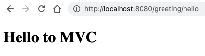

# REST and MVC with Spring

These tutorials assume you have Jetbrands IntelliJ Idea ultimate. They also assume you have a working knowledge of http, Java - in particular Servlets, and annotations, Gradle, Thymeleaf and html. It is recommended to use Postman for testing your endpoints (visit [Website](https://www.postman.com/)).

## Create a new project

Let's start with a quick rundown of how you create and run a Spring MVC Web application.

1. Open IntelliJ
2. Choose New Project…
    a. Spring Initializr &rarr; Next  
    b. Give Group & Artifact &rarr; Next  
    c. Choose Gradle / Java / Jar &rarr; Next  
    d. Choose Dependencies:   
        i. Web &rarr; Spring Web  
        ii. Template Engines &rarr; ThymeleafSQL &rarr; JDBC API / Spring Data JPA / JDBC / MySQL Driver [This depends on what you are going to do with the app of course. These can be  added later in `build.gradle` as well]  
	e. Choose location &rarr; Next & Finish  

	The `build.gradle` file will have these dependencies:

	```javascript
	dependencies {
		implementation 'org.springframework.boot:spring-boot-starter-thymeleaf'
		implementation 'org.springframework.boot:spring-boot-starter-web'
		testImplementation 'org.springframework.boot:spring-boot-starter-test'
	}
	```
	If you look at the "External Libraries" section in the project panel you will see a huge amount of dependencies are pulled in with only these three top level dependencies.

3. Go to root folder `/main/java/<your/package>/` and open `<YourProject>Application.java`.  Run the application by clicking on the green triangle in the editor margin.

	```java
	@SpringBootApplication
	public class SpringDemoProjectApplication {

		public static void main(String[] args) {
			SpringApplication.run(SpringDemoProjectApplication.class, args);
		}
	}
	```

4. Go to your browser (or Postman!) and open [localhost:8080](http://localhost:8080). This will generate "Whitelabel Error Page" in the browser. In Postman you get this - a Json literal:

	```json
	{
		"timestamp": "2021-01-12T09:54:58.110+00:00",
		"status": 404,
		"error": "Not Found",
		"message": "",
		"path": "/"
	}
	```

OK, the app works, but there nothing (no data or web page) being served by the application at this url. Therefore you get an `404/Not Found`. Let's fix that

## Create a REST response  

Right click on base package &rarr; New &rarr; Package &rarr; name = `webcontrol`
Right click on this package &rarr; New &rarr; Java Class &rarr; name = `HelloRest`

In the  editor, modify the class so it looks like this

```java
@RestController
@RequestMapping(value = "/hello")
public class HelloRest {

	@GetMapping(value = "/rest1")
	public String getHello() {
		return "Hello Spring Boot!";
	}
}
```
The corresponding import statements will appear as well. There are several core _Spring annotations_ here that warrant some explanation.

The annotation `@RestController` tells the Spring container that this class will service REST (REpresentational State Transfer) endpoints. See [https://en.wikipedia.org/wiki/Representational_state_transfer](https://en.wikipedia.org/wiki/Representational_state_transfer) for details.

`@RequestMapping` publishes to the container that this class will serve all urls that start with `/hello` relative to the _context path_ (or base url) of this application. `@GetMapping` serves the same purpose, but only for GET requests. And in this case it applies only to the method it annotates. Therefore, the url `<app_root>/hello/rest1` will map to the method `getHello()`. Since the entire class is annotated as being a REST controller, all return values of its controller methods (i.e. web-serving methods) will be converted into JSON literals automagically (using the Jackson library).

Now reload the app by pressing this button in the lower panel:


Go to Postman and hit the endpoint [http://localhost:8080/hello/rest1](http://localhost:8080/hello/rest1).
You should get this:

>Hello Spring Boot!

### Serve Json literals

Create a new package (`model`) with a new class, `Bird`, and generate a constructor, `toString()` and getters for all fields.

```java
package nl.bioinf.model;

public class Bird{
private String name;
private String status;

public Bird (String name, String status) {
	this.name = name;
	this.status = status;
}
//boilerplate code omitted
```

Create a new method within class `HelloRest`.

```java
@GetMapping(value = "/rest2")
public Bird getBird() {
	return new Bird("Long-legged buzzard", "extremely rare");
}
```

Hit the endpoint [http://localhost:8080/hello/rest2](http://localhost:8080/hello/rest2). As you can see, a JSON literal is returned representing a Java Bird instance. That is because your annotated the class with `@RestController`. All objects returned from the controller methods will be converted into a Json representation. In fact, it works for the whole object graph, so if you return a list of Java objects you will get a Javascript array containing these objects as json!

### Path Variables

Create a new method within `HelloRest`

```java
@GetMapping(value="/echo/{msg}")
public String doEcho(@PathVariable String msg) {
	return "You said" + msg + "...I say goodbye.";
}
```

Note that the three occurrences of "msg" should be typed exactly the same! Hit the endpoint [http://localhost:8080/hello/echo/I%20Rule%20Rest](http://localhost:8080/hello/echo/I%20Rule%20Rest). You will get this:  
`You said I Rule Rest...I say goodbye.`

There is a new annotation here: `@PathVariable`. It is used on a method parameter. Together with the `value="/echo/{msg}"` attribute of `@GetMapping`, it tells the container that there is a request variable embedded in the url and it should be extracted into `String msg`.

### Request Parameters

Create a new method within `HelloRest`

```java
@GetMapping(value="/echo_name")
public String doEchoName(@RequestParam(value = "name") String name) {
	return "You said" + name + "...I say goodbye.";
}
```

And go to url [http://localhost:8080/hello/echo_name?name=<your_name>](http://localhost:8080/hello/echo_name?name=<your_name>)

The annotation `@RequestParam(value = "name")` tells the system that the GET request should contain a request parameter called `name` and it should be inserted into the value of `String name`. You can specify whether it is a required parameter, and whether it should have a default value.:

```java
    @GetMapping(value = "/echo_name")
    public String doEchoName(@RequestParam(
			value = "name", 
			required = false, 
			defaultValue = "JohnDoe") String name) {
        return "You said " + name + "...I say goodbye.";
    }
```

### An html view instead of Json

So far you have seen three basic ways of serving data using a REST endpoint. Now we'll switch to serving an html view using Thymeleaf.
Create a new class within package `webcontrol` called `HelloMvc`, with this content

```java
@Controller
@RequestMapping(value="greeting")
public class HelloMvc {

	@GetMapping(value="hello")
	public String getGreeting(Model model) {
		model.addAttribute("greeting", "Hello to MVC");
		return "greeting";
	}
}
```

Under folder `/src/main/resources/templates`, right-click and select New &rarr; Thymeleaf. This will generate a standard html page. Replace 

```html
	<h1 th:tekst="#{page.title}">Offline title</h1> 
```

with 

```html
<h1 th:text="${greeting}">_greeting_</h1>
```

Reload the app and hit the endpoint [http://localhost:8080/greeting/hello](http://localhost:8080/greeting/hello). Postman will show this:

```html
	<!DOCTYPE html PUBLIC "-//W3C//DTD XHTML 1.0 Strict//EN" "http://www.w3.org/TR/xhtml1/DTD/xhtml1-strict.dtd">
	<html xmlns="http://www.w3.org/1999/xhtml">
	<head>
		<meta http-equiv="Content-Type" content="text/html; charset=UTF-8" />
		<title>Phrase of the day</title>
	</head>
	<body>
		<h1>Hello to MVC</h1>
	</body>
	</html>
```

Whereas the browser will show 



This concludes a first acquaintance with several aspects of the Spring (Boot) framework. You have seen the creation and consuming of both REST and MVC-type endpoints. All discussed annotations are listed and explained [here](spring_annotations.md)

Demo code can be found in this git repo [https://github.com/MichielNoback/spring-demo](https://github.com/MichielNoback/spring-demo). Use tag `tutorial1` to get the current version of the repo.


