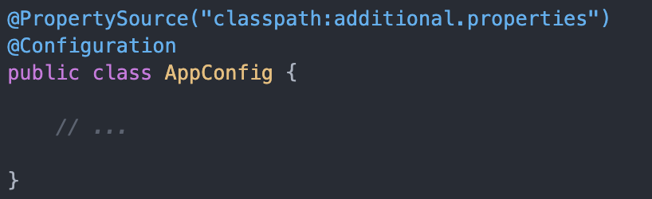

# Core (Spring) annotations

This page lists the most common annotations of the Spring (MVC) framework.

The Component scan process is central to all annotations. Annotated classes, methods and fields will only be found and processed if they are included in the component scanning process. Spring Boot automatically includes all source folders in this scan. Many annotations are actually subtypes of each other. In particular, `@Component` is the supertype for many other class-level annotations such as `@Controller`, `@Service`. For instance, if you look up class `Controller` by pressing `Cmd (Ctr) + B` when the cursor is on the name where it is used, you can see it is itself annotated with `@Component`:

```java
/**
 * Indicates that an annotated class is a "Controller" (e.g. a web controller).
 *
 * <p>This annotation serves as a specialization of {@link Component @Component},
 * allowing for implementation classes to be autodetected through classpath scanning.
 * It is typically used in combination with annotated handler methods based on the
 * {@link org.springframework.web.bind.annotation.RequestMapping} annotation.
 *
 * @author Arjen Poutsma
 * @author Juergen Hoeller
 * @since 2.5
 * @see Component
 * @see org.springframework.web.bind.annotation.RequestMapping
 * @see org.springframework.context.annotation.ClassPathBeanDefinitionScanner
 */
@Target({ElementType.TYPE})
@Retention(RetentionPolicy.RUNTIME)
@Documented
@Component
public @interface Controller {

	/**
	 * The value may indicate a suggestion for a logical component name,
	 * to be turned into a Spring bean in case of an autodetected component.
	 * @return the suggested component name, if any (or empty String otherwise)
	 */
	@AliasFor(annotation = Component.class)
	String value() default "";
}
```

Note that by looking these up you can also see which properties can be set, and what the default is when they are not required. Also note that the Javadoc section is highly informative!

## Generic annotations


- **`@Configuration`** -- tells the Spring container that this class published components, i.e. Beans
- **`@Bean`** -- annotated on methods, telling the container that the method serves a component. The bean will have the name of the method by default.
    - Use `@Bean(initMethod = "someMethod")` to hook into init.  
    - Use `@PostConstruct` to hook into init (this alternative adds extra dependencies in your Bean).
- **`@Scope`** -- annotated on Beans. There are six types of bean scopes in Spring:
    - `singleton` - with this scope, the container creates a single instance of a bean. All requests for such a bean will return the same object, which is cached. This is the default scope if no other scope is specified.
    - `prototype` - with this scope, the container will create a new instance every time it is requested.
    - `request`, `session`, `application`, `websocket` - these scopes are available only in a web-aware application context and are less often used in practice. 
- **`@Component`** -- annotated on classes. Tells the Spring container the class models a component of the system and should be instantiated by it. 
- **`@Repository`** -- subclasses `@Component` and adds a semantic layer: publishes a data repository.
- **`@Service`** -- subclasses `@Component` and adds a semantic layer: publishes a service conponent.
- **`@Primary`** -- used to indicate this bean is a primary choice when multiple candidates exist (multiple implementers of the same interface). Related to `@Qualifier`, but used in the service instead of the consumer.
- **`@Qualifier`** -- Used to indicate which of several implementers (Bean interfaces) should be taken. Can be used on constructor fields, setters (below `@Autowired`) and fields (same) . Related to `@Primary`, but this done in the consumer instead of the service. 
- **`@SpringBootApplication`** -- entry / start point of the application. Can be used to configure several aspects of the app config.
-	**`@PostConstruct`** & **`@PreDestroy`** -- annotation on Components, to be used as lifecycle hooks.
- **`@Profile`** -- used to instantiate and serve Beans in a profile-dependent manner.
- **`@PropertySource`** and **`@TestPropertySource`** -- used to configure additional sources of properties. E.g., this 

	
	Will look under /src/main/resources for the given properties file.

## Web oriented annotations  

- **`@Controller`** -- tells the framework this class deals with http requests.
- **`@RestController`** -- See `@Controller`, but for REST endpoints and will return json by default.
- **`@GetMapping`** -- A method that listens to an http Get request url.
- **`@PostMapping`** -- idem, for Post requests.
- **`@RequestMapping`** -- maps a URL to a class or method.  In the example below, the url `/projects` maps to the entire class as base url for the methods contained therein. So, `@GetMapping("/1")` maps to `/projects/1`.

    ```java
    @RestController
    @RequestMapping(value="projects")
    public class ProjectController {
        @GetMapping("/1")
        public Project findOne() {
            return new Project("test", LocalDate.now())
        }
    }
    ```
	
- **`@PathVariable`** -- Used within the method signature of `@xxxMapping` methods to indicate the value of this variable should be obtained from the url. Used in combination with the `value = ""` attribute of the mapping, as in this example:

	```java
	@GetMapping(value = {/"id"})
	public Project findOne(@PathVariable() Long id) {
	    return projectsService.fid=ndById(id);
	}
	```
	
- **`@RequestBody`** -- Annotation used when in the body of a Post request a Json literal is sent that can be mapped onto a Java class.
	
	```java
	@PostMapping
	public void create(@RequestBody Project project) {
	    projectService.save(project);
	}
	```


