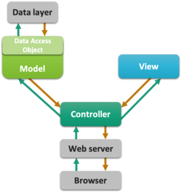

# A refresher

## Introduction

Here starts the contents of the course Web-based Information Systems.  
In this course, we will investigate the power of dynamic web pages using server-side and client-side technology, and the ways they interact

Before embarking on the technological aspects of web app development, some very useful guidelines should be taken in \(source: PLoS Computational Biology, Volume 7, Issue 5\).  

1. Plan Your Resource
2. Discuss Responsibilities
3. Know Your User Base
4. Use Services Available to You during Development
5. Ensure Portability
6. Create an Open Source Project
7. Provide Ample Documentation and Listen to Feedback
8. Facilitate Reproducibility
9. Plan Ahead: Long-Term Maintenance
10. Switch off an Unused Resource

## The basics of web 

When you click a simple link in a web page (the client), you **_request_** a resource.
The web server receives the request, locates the resource and returns something to the user: a **_response_**.


### The players

#### The client

The client (usually a web browser) formats a request and sends it to the server.
The client receives the response and processes it
when the response is html, the response is **_rendered_** by the browser into a web page **_view_**.

#### The server

The server receives the request, locates the correct resource and formats the response before sending it to the client.
The server can not:
- save anything
- generate dynamic content
- remember you or your previous requests

These tasks have to be delegated 

#### Request types

Http requests come in 7 flavors. In 99.99999% of the use cases, it will be one of these two:
- **get** a simple resource fetch request
- **post** a request that sends data to the server or requests to change its data

There are others, not often used and not always supported because of security issues:
- delete
- head
- options
- put
- trace

We will deal only with the first two.

### A simple html request form

Below you see a very simple html request form. The request will be send to `/birdpic` on the root of the current application context.

```html
<html>
  <head>
    <title>a page with a form</title>
  </head>
  <body>
    <h1>request bird pictures</h1>
    <form action="birdpic">
      Species name: <input type="text" name="species">
      <br />
      Minimum rating: <input type="text" name="rating">
      <br />
      <input type="submit" value="find">
    </form>
  </body>
</html>
```

The form will be rendered into the page below. Note that with the absence of a `method=...` attribute to the `form` tag, it will default to GET. 


### A GET request

Filling out the form and clicking find generates this location (URL) in your browsers' location bar (only with GET requests).


An http GET request will be formed, looking like this:

```
GET ~michiel/WebBased/birdpic?species=Roodborst&rating=4 HTTP/1.1 
Host: www.bioinf.nl
User-Agent: Mozilla/5.0(...)
Accept: text/xml.application/xml,(...)
Accept-Language: en-us,en;q=0.5
Accept-Encoding: gzip,deflate
Accept-Charset: ISO-8859-1,utf-8,q=0.7,*;q=0.7
Keep-Alife: 300
Connection: keep-alife
```

You can look at this request with for instance you web browsers developer toolbox (discussed later).

Note that the parameters of your request have been put at the top of the request. Some other parameters have been added as well, as `key: value` pairs.

### A POST request

Adding the `method=POST` attribute to the `<form>` tag, 

```html
<form action="birdpic" method="POST" >
  Species name: <input type="text" name="species">
  Minimum rating: <input type="text" name="rating">
  <input type="submit" value="find">
</form>
```

will make the url-appended parameters disappear, 


And the parameters are now located at the end of the http request:

```
POST ~michiel/WebBased/birdpic HTTP/1.1 
Host: www.bioinf.nl
User-Agent: Mozilla/5.0(...)
Accept: text/xml.application/xml,(...)
Accept-Language: en-us,en;q=0.5
Accept-Encoding: gzip,deflate
Accept-Charset: ISO-8859-1,utf-8,q=0.7,*;q=0.7
Keep-Alife: 300
Connection: keep-alife

species=Roodborst&rating=4
```

### The HTTP response

The response coming back from the server will look like this:

```
HTTP/1.1 200 OK
Set-Cookie: JSESSIONID=0AAB6CGSTGGC56DS3FF78; Path=/WebBased
Content-Type: text/html
Content-Length: 397
Date: Sun, 9 Nov 2018 02:50:40 CET
Server: Apache-Coyote/1.1
Connection: close

<html>
  <head>
  ...
</html>
```

At the top, there is the HTTP response header with a status code (200 / OK), a cookie and other important information about the response. Below the header is the HTTP response body, with the HTML that the browser is going to display.

### GET or POST?

Use GET for (simple) requests that do not alter the data on the server side. These are called **_idempotent_** because they can be made over and over again without any effect on the server.
Use POST for complex requests and requests that alter the data on the server side, and always if you are going to send sensitive data (passwords, usernames).

### The URL

URL stands for **_Uniform Resource Locator_**.
Every web resource has its own unique address in the URL format:

<pre style="color:darkblue;font-weight:bold;font-family:courier;font-size:1.2em;">
http://<span style="color:darkred;">www.bioinf.nl</span><span style="color:darkgreen;">:80</span><span style="color:purple;">/WebBased/</span><span style="color:orange;">index.hml</span>
</pre>

<pre style="color:darkblue;font-weight:bold;font-family:courier;font-size:1.2em;">
http://         protocol
<span style="color:darkred;">www.bioinf.nl   server</span>
<span style="color:darkgreen;">:80             TCP port</span> 
<span style="color:purple;">/WebBased/      path</span>
<span style="color:orange;">index.hml       resource</span>
</pre>

If you don’t specify a port, it will default to the HTTP port which is 80. 

### TCP ports

The TCP port is a 16-bit number that identifies a specific software program on the server hardware. 
A server can have up to 65536 different server apps running
TCP port numbers from 0 to 1023 are reserved for well-known services:
- **`21`** FTP (file transfer protocol)
- **`22`** SSH (secure shell)
- **`25`** SMTP (mail)
- **`80`** HTTP (Hypertext Transfer Protocol)
- **`443`**	HTTPS

Don’t use these ports for your own server programs!

Tomcat usually runs on port 8080

### Static versus dynamic content

Web servers can ONLY serve static content (html pages, pictures, xml documents etc).
If you want dynamic content, you have to delegate this to another application. A web server can't help you with this:

```html
<html>
  <body>
    The current time is [insertTimeOnServer]
  </body>
</html>
```
Non-Java programs that can do this are often called CGI (Common Gateway Interface) scripts. Examples of languages used to write these are Perl, PHP, Python etc

This is a PHP script printing current time:

```html
<html>
  <body>
    The current time is 
      <?php
        //Prints something like: Wednesday 29th of May 2019 03:12:46 PM  
        echo date('l jS \of F Y h:i:s A'); 
      ?>
  </body>
</html>
```

### Why use Java?

Although Java is more of a fuss to get up and running, it is much better in serving heavy-duty analysis tools.
If you want a simple interface with forms accessing database data and presenting them, use Python.
If you want a real analysis tool running behind a web application, use Java
But always...   

Always separate the responsibilities of the view, the data and the model!
Avoid mixing html, styling, scripting, database access and application logic at all costs!
This is the essence of the Model View Controller (MVC) design pattern (or paradigm). In this course, we'll only skim the essence of this principle. Here is a schematic representation of the top-level application components and how they should interact - and be separated.



MVC can be applied on different levels
- at the server for whole-application architecture (Servlet control – Thymeleaf view – Java model)
- In a single web page DOM element: A Form HTML/css view, its Javascript controller and a Javascript model (vue.js has this principle at its core).

### "old" versus "modern" web apps

In the old days, almost every action or resource requested from the server resulted in a completely new page. 
Now, single-page web apps are becoming the standard. 
The key to this is Javascript and Ajax: it lets you load and update only those parts of the page where this is required.
Also, Javascript can take  a LOT of logic away from the server


