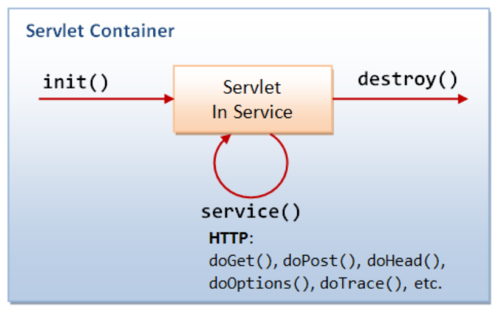

# Servlet details and lifecycle hooks

In this post, some details of servlet configuration are discussed, as well as techniques that you can use to hook into life cycle events, the main ones being application startup and -shutdown, and first request on a servlet.

## Servlet configuration

The `@WebServlet` annotation offers several possibilities for configuration. Here are the interesting ones:


| Name                 | Type           | Required | Description                                                                                                                 |
|----------------------|----------------|-----------|-----------------------------------------------------------------------------------------------------------------------------|
| urlPatterns or value | String[]       | y         | Specify one or more URL patterns of the servlet. Either of attribute can be used, but not both                              |
| asyncSupported       | String         | n         | Specify whether the servlet supports asynchronous operation mode. Default is false.                                         |
| initParams           | WebInitParam[] | n         | Specify one or more initialization parameters of the servlet. Each parameter is specified by \@WebInitParam annotation type. |
| loadOnStartup        | int            | n         | Specify load-on-startup order of the servlet. Default is -1                                                                 |

### \@Webservlet - urlPatterns

The `urlPatterns` parameter specifies which urls will map on your servlet.
This configuration:

```java
@WebServlet(name = "WelcomeServlet", 
            urlPatterns = {"/welcome", "/index", "/home"})
public class WelcomeServlet extends HttpServlet { ... }
```

maps all these requests to `WelcomeServlet`:
- http://localhost:8080/index
- http://localhost:8080/welcome
- http://localhost:8080/home

### \@Webservlet - loadOnStartup

The `loadOnStartup` parameter is an integer which specifies the servlet load order. 
The container loads servlets with lower values before servlets with higher values.
If `loadOnStartup` is negative (it defaults to -1), the servlet will be loaded when the container decides to - typically on first access.

```java
@WebServlet(urlPatterns = {"/welcome"},
     loadOnStartup = 1) 
     //guarantees first loading at deployment
public class WelcomeServlet extends HttpServlet { ... }
```

### \@Webservlet – initParams

Servlet initialization parameters are defined as instances of `@WebInitParam`.

```java
@WebServlet(urlPatterns = {"/welcome"},
    initParams = {
        @WebInitParam(name = "tempDir", value = "/tmp"),
        @WebInitParam(name = "allowedFileTypes", value = "jpg,png")
    })
public class WelcomeServlet extends HttpServlet { 
    @Override
    public void init() throws ServletException {
        final String tempDir = getInitParameter("tempDir");
        System.out.println("tempDir = " + tempDir);
        System.out.println("admin_email = " + getServletContext().getInitParameter("admin_email"));
    }
    //more code
}
```

will output to the console

<pre class="console_out">
tempDir = /tmp
admin_email = admin\@example.com
</pre>

You can specify the same information in web.xml, which seems a bit more logical:

```xml
    <servlet-mapping>
        <servlet-name>WelcomeServlet</servlet-name>
        <url-pattern>/welcome</url-pattern>
    </servlet-mapping>
    <servlet>
        <servlet-name>WelcomeServlet</servlet-name>
        <servlet-class>nl.bioinf.wis_on_thymeleaf.servlets.WelcomeServlet</servlet-class>
        <init-param>
            <param-name>tempDir</param-name>
            <param-value>/some/location</param-value>
        </init-param>
    </servlet>
```

### \@Webservlet versus web.xml configuration

When configuration is done in both `web.xml` ánd in `@WebServlet` annotations, the `web.xml` configuration takes precedence.

A use case for this behaviour would be: development mode versus production mode.

With these two "conflicting" configurations, the url will become `/extra` and tempDir `/some/location`. The url `/welcome` will return a 404 not found!

```java
@WebServlet(name = "WelcomeServlet",
  urlPatterns = {"/welcome", "/home"},
    initParams = {@WebInitParam(name = "tempDir", value = "/tmp")}
public class WelcomeServlet extends HttpServlet { }
```

```xml
<servlet-mapping>
    <servlet-name>WelcomeServlet</servlet-name>
        <url-pattern>/extra</url-pattern>
</servlet-mapping>
<servlet>
    <servlet-name>WelcomeServlet</servlet-name>
    <servlet-class>nl.bioinf.wis_on_thymeleaf.servlets.WelcomeServlet</servlet-class>
    <init-param>
        <param-name>tempDir</param-name>
        <param-value>/some/location</param-value>
    </init-param>
</servlet>
```

### \@Webservlet – asyncSupported

This allows the servlet to store incoming requests for later response. 
For practical purposes, with this configuration you can set up a servlet that will (in effect) push data to the client (after the client sends the initial request to the server).
This is very interesting, but outside the scope of this course.

## Hooks

Hooks are pieces of code that let you write code that will run at application life cycle events.
The ones we will look at here are:
- Application startup/shutdown hook
- Servlet initialization/cleanup hooks

### Application startup & shutdown

If you want to do something at 
- startup – e.g. create a single template engine to service all servlets
- shutdown – e.g. free DB resources
you annotate a class with `@WebListener` and have it 
implement the `ServletContextListener` interface.

Here is an implementation. It uses the startup hook to create a single `TemplateEngine` instance that can be served to all servlets, guaranteeing that this code will have run first and only once.

```java
package nl.bioinf.wis_on_thymeleaf.config;

//imports removed

@WebListener
public class WebConfig implements ServletContextListener {
    private static TemplateEngine templateEngine;

    @Override
    public void contextInitialized(ServletContextEvent servletContextEvent) {
        System.out.println("[WebConfig] Initializing template engine");
        createTemplateEngine(servletContextEvent.getServletContext());
    }

    @Override
    public void contextDestroyed(ServletContextEvent servletContextEvent) {
        System.out.println("Shutting down!");
    }

    private static void createTemplateEngine(ServletContext servletContext) {
        ServletContextTemplateResolver templateResolver =
                new ServletContextTemplateResolver(servletContext);
        templateResolver.setTemplateMode("XHTML");
        templateResolver.setPrefix("/WEB-INF/templates/");
        templateResolver.setSuffix(".html");
        templateResolver.setCacheTTLMs(3600000L);
        // Cache is set to true by default.
        // Set to false if you want templates to be automatically
        // updated when modified.
        templateResolver.setCacheable(true);

        TemplateEngine templateEngine = new TemplateEngine();
        templateEngine.setTemplateResolver(templateResolver);
        WebConfig.templateEngine = templateEngine;
    }

    /**
     * serves the template engine that was created at application startup.
     * @return
     */
    public static TemplateEngine getTemplateEngine() {
        return templateEngine;
    }

    //method omitted
}
```


### Servlet initialization and destroy

When a first request is received for a servlet after application startup, the servlet container (Tomcat) will call 
the `init()` methods, if present. Method `init()` is guaranteed to be called before the first call to `service()`.



- `init(ServletConfig config)` is called by the servlet container to indicate to a servlet that the servlet is being placed into service.
- `init()` is a convenience method which can be overridden so that there's no need to call super.init(config).
- `destroy()` is called by the servlet container to indicate to a servlet that the servlet is being taken out of service

There are two overloaded variants defined in class `GenericServlet` that you can hook into to handle your startup actions:

```java
    public void init(ServletConfig config) throws ServletException {
        this.config = config;
        this.init();
    }

    public void init() throws ServletException {
    }
```

As you can see the first one calls the second one. Depending on your need for the `ServletConfig` object -which gives access to application-scoped variables-, you can choose either one of them to override. Here are all three (in class `PhraseServlet`, for demo purposes):

```java
    @Override
    public void init() throws ServletException {
        //no super.init() required
        System.out.println("[PhraseServlet] Running no-arg init()");
        this.templateEngine = WebConfig.getTemplateEngine();
    }

    @Override
    public void init(ServletConfig config) throws ServletException {
        super.init(config); //required in this implementation
        System.out.println("[PhraseServlet] Running init(ServletConfig config)");
        config.getServletContext().getInitParameter("admin_email");
    }

    @Override
    public void destroy() {
        super.destroy();
        System.out.println("[PhraseServlet] Shutting down servlet service");
    }
```

In general, you use these init() methods to initialize "expensive" resources that you only want to create once. Good examples are importing config files, creating database connections (although there may be better solutions for that) or getting template engines, as in this example. Likewise, the `destroy` method can be used to elegantly shut down resources.

